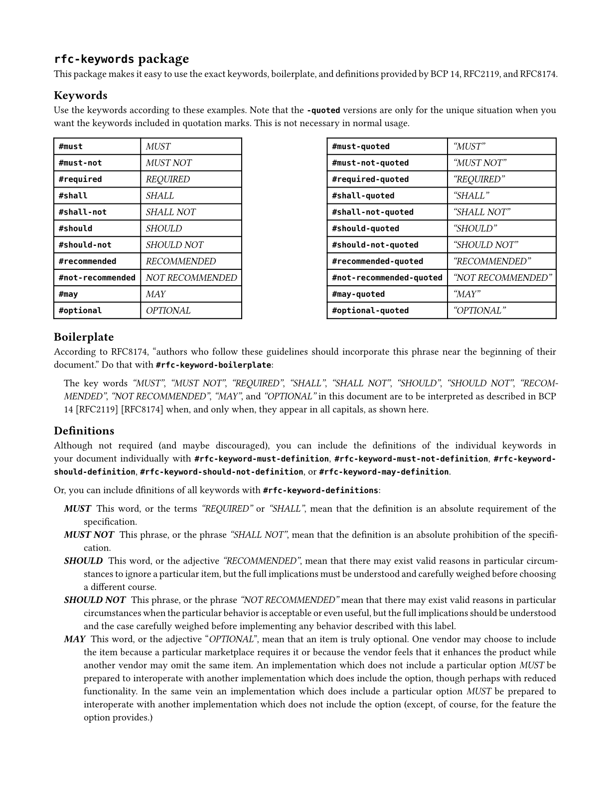

# `rfc-vibe` package

Bring that RFC lingo to your everyday documents.

A [Typst](https://typst.app/) package that makes it easy to use the exact
keywords, boilerplate, and definitions provided by BCP 14, RFC2119, and RFC8174.
See the end of this README for an example of the output.

In the future, this package may include other RFC-related patterns which are
applicable to a wide variety of everyday documents.

## Usage

Import the package in your Typst document:

```typst
#import "@preview/rfc-vibe:0.1.0": *
```

### Keywords

Use the keywords according to these examples:

```typst
#must              // renders as: MUST
#must-not          // renders as: MUST NOT
#required          // renders as: REQUIRED
#shall             // renders as: SHALL
#shall-not         // renders as: SHALL NOT
#should            // renders as: SHOULD
#should-not        // renders as: SHOULD NOT
#recommended       // renders as: RECOMMENDED
#not-recommended   // renders as: NOT RECOMMENDED
#may               // renders as: MAY
#optional          // renders as: OPTIONAL
```

For the rare situation when you want the keywords included in quotation marks,
use the `-quoted` versions:

```typst
#must-quoted              // renders as: "MUST"
#must-not-quoted          // renders as: "MUST NOT"
#required-quoted          // renders as: "REQUIRED"
#shall-quoted             // renders as: "SHALL"
#shall-not-quoted         // renders as: "SHALL NOT"
#should-quoted            // renders as: "SHOULD"
#should-not-quoted        // renders as: "SHOULD NOT"
#recommended-quoted       // renders as: "RECOMMENDED"
#not-recommended-quoted   // renders as: "NOT RECOMMENDED"
#may-quoted               // renders as: "MAY"
#optional-quoted          // renders as: "OPTIONAL"
```

### Boilerplate

According to RFC8174, _authors who follow these guidelines should incorporate a
specific phrase near the beginning of their document_. Include this boilerplate
text with:

```typst
#rfc-keyword-boilerplate
```

This will render as:

```text
The key words "MUST", "MUST NOT", "REQUIRED", "SHALL", "SHALL NOT", "SHOULD",
"SHOULD NOT", "RECOMMENDED", "NOT RECOMMENDED", "MAY", and "OPTIONAL" in this
document are to be interpreted as described in BCP 14 [RFC2119] [RFC8174] when,
and only when, they appear in all capitals, as shown here.
```

### Definitions

Although not required (and maybe discouraged), you can include definitions of
individual keywords in your document:

```typst
#rfc-keyword-must-definition
#rfc-keyword-must-not-definition
#rfc-keyword-should-definition
#rfc-keyword-should-not-definition
#rfc-keyword-may-definition
```

Or include all keyword definitions at once with:

```typst
#rfc-keyword-definitions
```

## Example Output



## License

This project is licensed under the MIT License. See the [LICENSE](LICENSE) file
for details.
