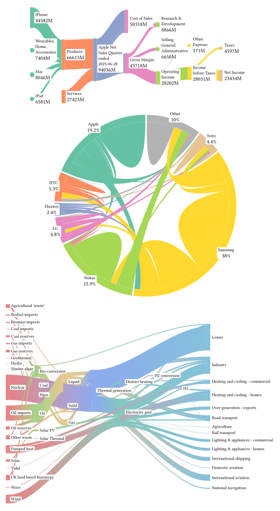

# typst-ribbony

A library for creating ribbon diagrams, such as Sankey and Chord diagrams, in Typst.

typst-ribbony is based on [cetz](https://github.com/cetz-package/cetz).

More diagrams (layouts) are planned to be added in the future.

## Manual

Read [manual](docs/manual.pdf) for documentation and examples.

## Demo

Demo code is available in [gallery/demo.typ](gallery/demo.typ).

Demo data source can be found in the [manual](docs/manual.pdf).