# Ribon

**Ribon** visualizes and analyzes RNA secondary structures in Typst. It accepts sequences and extended dot-bracket notation, predicts structures from sequence alone, and turns analysis results into editable diagrams and quantitative plots.

## Usage

Draw a known sequence and extended dot-bracket structure:

```typst
#import "@preview/ribon:0.1.0": *

#draw(
  "CGCUUCAUAUAAUCCUAAUGACCUAU",
  structure: "((..((....)).(((....))).))",
  method: "naview",
  width: 13.6cm,
  height: 6.6cm,
  theme: varna-theme,
  numbering: none,
  show-ends: false,
)
```

<p align="center"><a href="examples/secondary-structure.typ">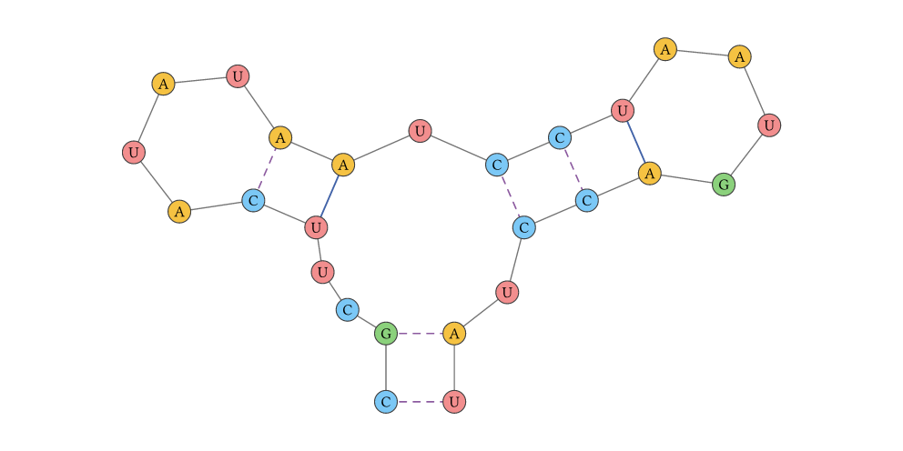</a></p>

Or predict a structure and send the same result to drawing and probability plots:

```typst
#let sequence = "GGGAAACCCGGGAAACCC"
#let result = analyze(sequence)

#render(
  result,
  which: "mea",
  width: 9.6cm,
  height: 6.6cm,
  theme: varna-theme,
  numbering: none,
  show-ends: false,
)
```

<p align="center"><a href="examples/predicted-structure.typ">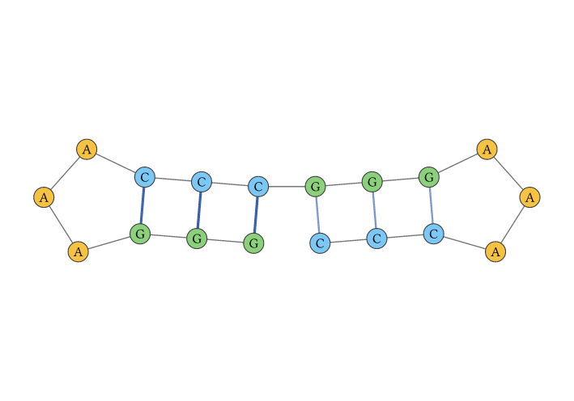</a></p>

```typst
#dot-plot(
  sequence,
  probabilities: result,
  width: 10cm,
  height: 10cm,
  legend: false,
  x-label: none,
  y-label: none,
  x-axis: axis-style(label: none, show-labels: false),
  y-axis: axis-style(label: none, show-labels: false),
)
```

<p align="center"><a href="examples/dot-plot.typ">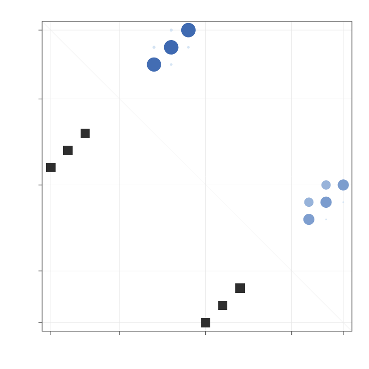</a></p>

```typst
#mountain-plot(
  sequence,
  probabilities: result,
  reference-structures: (),
  width: 14.6cm,
  height: 5.4cm,
  legend: false,
  x-label: none,
  y-label: none,
  x-axis: axis-style(label: none, show-labels: false),
  y-axis: axis-style(
    label: none,
    show-labels: false,
    minor-tick-step: 0.5,
    grid: "both",
  ),
  layout: plot-layout(aspect: 2.7),
)
```

<p align="center"><a href="examples/mountain-plot.typ">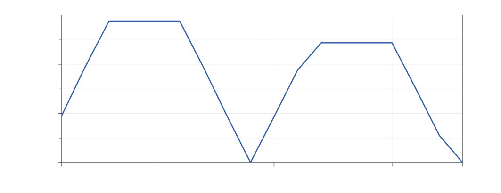</a></p>

The [complete reference manual](docs/documentation.pdf) covers installation, data conventions, models, constraints, every analysis operation, all renderer controls, annotations, plots, errors, performance, validation, and figure-export guidance.

## Drawing known structures

Ribon accepts sequence plus extended dot-bracket notation. Positions are one-based. Use `&` in both strings for a strand break; it does not consume a nucleotide index.

```typst
#draw(
  "GGGG&CCCC",
  structure: "((((&))))",
  method: "linear",
  width: 11.6cm,
  height: 4.1cm,
  theme: varna-theme,
  numbering: none,
  show-ends: false,
  show-direction: true,
)
```

<p align="center"><a href="examples/multi-strand.typ">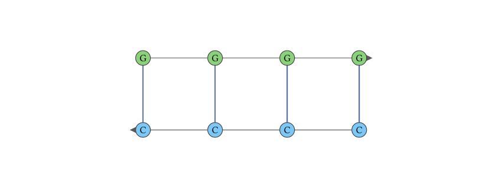</a></p>

Crossing pairs can use additional bracket alphabets and are rendered directly:

```typst
#draw(
  "GCGCAAAAGCGC",
  structure: "(([[..))..]]",
  method: "circular",
  width: 7.8cm,
  height: 7.2cm,
  theme: varna-theme,
  numbering: none,
  show-ends: false,
)
```

<p align="center"><a href="examples/pseudoknot.typ">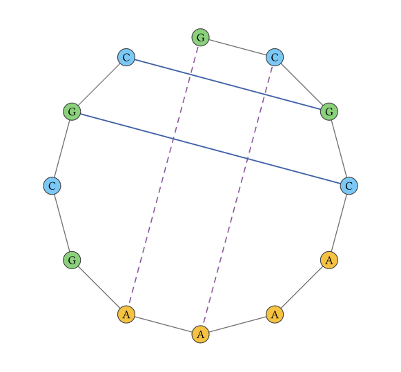</a></p>

### Layout methods

| Method | Intended use |
|---|---|
| `naview` | General secondary-structure diagrams with balanced stems and loops |
| `simple` | RNAplot-like regular-bond radial diagrams |
| `circular` | Crossing structures and global topology |
| `linear` | Antiparallel multi-strand ladders, strand interactions, and long single-strand arc diagrams |
| `turtle` | Affine loop/stem construction |
| `puzzler` | Collision-reduced loop layout for crowded structures |

All layouts support aspect-preserving fit, explicit width and height, rotation, reflection, clipping, long-RNA level of detail, and editable coordinates.

```typst
#let scene = data(layout(sequence, structure, method: "naview"))
#let revised = scene.points.enumerate().map(((index, point)) => {
  if index == 3 { (x: point.x - 0.15, y: point.y - 0.12) }
  else { point }
})
#scene.insert("points", revised)

#render-scene(
  scene,
  width: 13.6cm,
  height: 6.6cm,
  theme: varna-theme,
  numbering: none,
  show-ends: false,
)
```

<p align="center"><a href="examples/edited-scene.typ">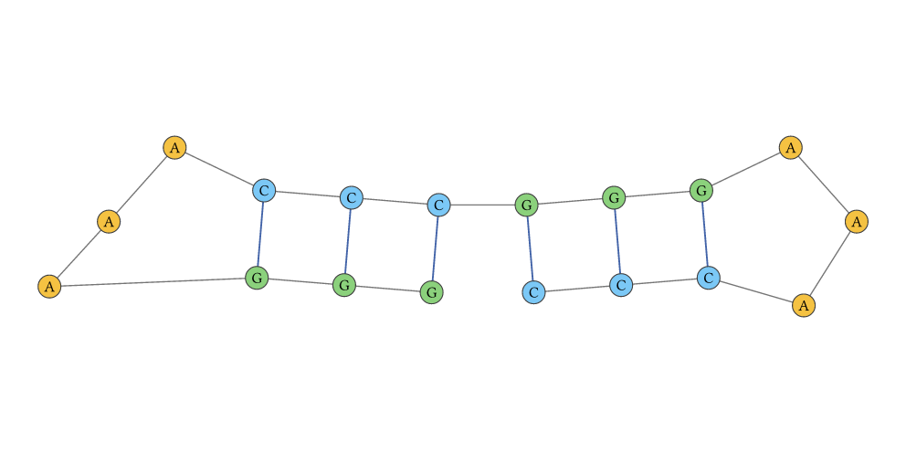</a></p>

## Prediction and analysis

`analyze` runs the integrated secondary-structure workflow:

- minimum-free-energy structure and energy;
- log-domain partition function and ensemble free energy;
- base-pair and unpaired probabilities;
- centroid and maximum expected accuracy structures;
- ensemble diversity and positional entropy summaries.

```typst
#let response = analyze(
  "GGGAAACCC",
  model: analysis-model(
    temperature: 37,
    dangles: 2,
    salt: 1.021,
    mea-gamma: 1,
  ),
)

#let result = data(response)
#result.mfe_structure
#result.mfe_energy_kcal_mol
#result.centroid_structure
#result.mea_structure
```

Use `fold` when only the MFE is needed and `evaluate` for a supplied planar structure. The same versioned response envelope connects directly to `render`.

### Thermodynamic models

Ribon ships the standard RNA and DNA parameter families generated from the official RNAstructure 6.6 tables. Both families support temperature interpolation and explicit dangle models; the RNA family additionally supports the published monovalent-salt correction. Model identifiers and parameter fingerprints are explicit.

```typst
#let rna = analysis-model(temperature: 25, salt: 0.15)
#let dna = dna-model(temperature: 25)
#let provenance = data(parameters())
```

`thermodynamic-parameter-overrides` and `custom-model` accept a named, SHA-256-fingerprinted normalized table overlay while inheriting omitted tables from a built-in family.

### Constraints and probing

One constraint dictionary is shared by MFE, partition, decoding, evaluation, sampling, suboptimal, and accessibility operations.

```typst
#let constraints = folding-constraints(
  force-unpaired: (4, 5, 6),
  force-pairs: (constraint-pair(1, 9),),
  forbid-pairs: (constraint-pair(2, 8),),
  no-lonely-pairs: true,
  soft: soft-constraints(
    unpaired: (position-energy(5, -0.8),),
    pairs: (pair-energy(1, 9, -1.2),),
  ),
  probing: probing-data(
    (0.1, 0.2, 0.8, 0.9, 0.7, 0.2, 0.1, 0.1, 0.0),
    kind: "shape",
    method: "deigan",
  ),
)

#analyze("GGGAAACCC", constraints: constraints)
```

## Ensemble and specialized analysis

The stable public API also includes:

| Function | Analysis |
|---|---|
| `sample` | Reproducible stochastic backtracking |
| `suboptimal` | Deterministic k-best structures in an energy band |
| `accessibility` | Exact joint-unpaired probabilities and opening energies |
| `local` | Sliding-window pair and accessibility probabilities |
| `duplex` | Connected intermolecular duplex ensemble |
| `cofold` | Unrestricted two-strand ensemble and mass-action solution |
| `circular` | Circular-RNA MFE, partition, centroid, and MEA |
| `modified` | Position-specific modified-nucleotide energetics |
| `gquad` | Integrated secondary-structure/G-quadruplex ensemble |
| `comparative` | Gap-aware alignment folding with covariation |
| `pseudoknot` | Crossing-pair prediction and matching decoders |
| `conditional-density2` | Fixed-seed density-2 pseudoknot ensemble |
| `fatgraph-topology` | Genus, boundaries, Euler characteristic, crossings |
| `landscape` | Global minimum-saddle path over planar structures |
| `inverse-design` | Exhaustive IUPAC-template target design |
| `ligand` | Joint structure/ligand microstate ensemble |

Sampling, conditional suboptimal structures, pseudoknot outputs, circular results, comparative results, modified-base results, G-quadruplex results, and ligand results all connect to `render` without an adapter.

## Annotations

Ribon provides renderer-native layers for regions, bases, pair edges, secondary-structure motifs, interactions, coaxial stacks, free labels, strand names, numbering, and quantitative tracks.

Nucleotide labels automatically use the black or white text color with the highest WCAG contrast against each solid node fill. The default `"aa"` mode requires 4.5:1. Select strict 7:1 contrast globally with `node-text-contrast: "aaa"`, or per nucleotide with `base-annotation(text-contrast: "aaa")`; an explicit `text-fill` always takes priority. Use `contrast-on-failure: "best"` only when a mid-luminance fill must be retained even though AAA is mathematically unattainable.

```typst
#draw(
  sequence,
  structure: structure,
  width: 13.6cm,
  height: 6.6cm,
  theme: varna-theme,
  numbering: none,
  show-ends: false,
  annotations: (
    highlight(4, 6, fill: rgb("#ffe082").transparentize(25%)),
    base-annotation(13, fill: rgb("#313695"), text-contrast: "aaa"),
    pair-annotation(10, 18, stroke: (paint: red, thickness: 1.2pt)),
    interaction-annotation(5, 14),
  ),
)
```

<p align="center"><a href="examples/annotations.typ">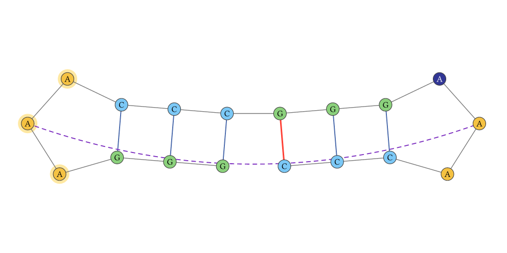</a></p>

Continuous annotations retain their scale, so `draw` creates the exact matching legend automatically:

```typst
#let scale = color-scale(
  minimum: 0,
  maximum: 1,
)

#draw(
  sequence,
  structure: structure,
  width: 13.6cm,
  height: 6cm,
  numbering: none,
  show-ends: false,
  annotations: value-annotations(values, scale: scale),
  legend: legend-style(stroke: none),
)
```

<p align="center"><a href="examples/continuous-annotation.typ">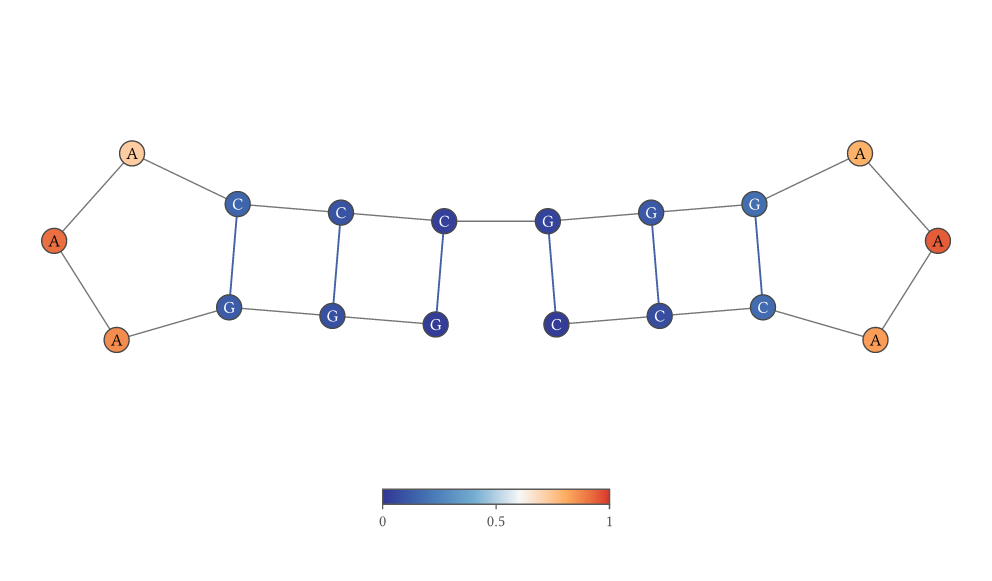</a></p>

Specialized helpers include `reactivity-annotations`, `accessibility-annotations`, `local-accessibility-annotations`, `entropy-annotations`, `topology-annotations`, and `coaxial-annotations`.

## Comparative and quantitative figures

`compare-structures` overlays shared, removed, and added base pairs on common coordinates. `dot-plot` displays one ensemble with an inferred reference structure or compares two ensembles across the diagonal. `mountain-plot` combines the expected profile with supplied discrete structures; `mountain-profile` exposes the same numerical series. Multiple decoder or collection results can be composed with Typst's native layout primitives.

Quantitative figures use four independent configuration values. `plot-theme` controls visual styling; `axis-style` controls domains, linear or logarithmic transforms, reversed axes, major and minor ticks, formatters, labels, and grids; `plot-layout` controls padding, aspect ratio, frame, and clipping; `legend-style` controls four outer positions, nine inner anchors, explicit plot coordinates, anchors, offsets, direction, columns, width, and spacing. Mountain series can be assigned to primary or `x2`/`y2` secondary axes. Legends may be local to one plot or shared across a composed figure.

```typst
#compare-structures(
  sequence,
  reference,
  alternative,
  width: 13.6cm,
  height: 6.6cm,
  legend: false,
  numbering: none,
  show-ends: false,
)
```

<p align="center"><a href="examples/structure-comparison.typ">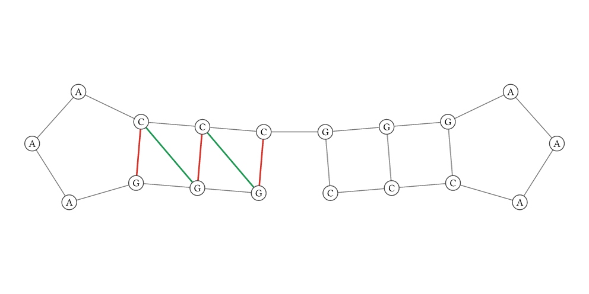</a></p>

```typst
#let untreated = analyze(sequence)
#let treated = analyze(
  sequence,
  constraints: folding-constraints(force-unpaired: (1, 2)),
)

#dot-plot(
  sequence,
  probabilities: untreated,
  comparison: treated,
  width: 10cm,
  height: 10cm,
  threshold: 0.005,
  legend: false,
  x-label: none,
  y-label: none,
  x-axis: axis-style(label: none, show-labels: false),
  y-axis: axis-style(label: none, show-labels: false),
)
```

<p align="center"><a href="examples/comparison-dot-plot.typ">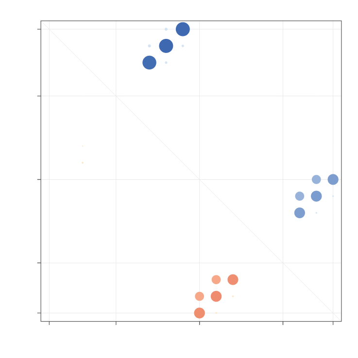</a></p>

```typst
#mountain-plot(
  sequence,
  probabilities: untreated,
  reference-structures: (),
  width: 14.6cm,
  height: 5.4cm,
  legend: false,
  x-label: none,
  y-label: none,
  x-axis: axis-style(
    label: none,
    show-labels: false,
  ),
  y-axis: axis-style(
    label: none,
    show-labels: false,
    minor-tick-step: 0.5,
    grid: "both",
  ),
  layout: plot-layout(aspect: 2.7),
)
```

<p align="center"><a href="examples/mountain-plot.typ"></a></p>

```typst
#let decoder-sequence = "GCGCCUUGAAAGUCCAGAGGACUUGGUUUUAUUGGGUAGUUGAGGUUGGUGGCCCAUCUC"
#let decoder-result = analyze(decoder-sequence)

#grid(
  columns: 3,
  gutter: 4mm,
  ..("mfe", "centroid", "mea").map(which => render(
    decoder-result,
    which: which,
    width: 4.6cm,
    height: 5.4cm,
    node-radius: 2.2pt,
    font-size: 3pt,
    detail: "full",
    numbering: none,
    show-ends: false,
  )),
)
```

<p align="center"><a href="examples/decoder-comparison.typ">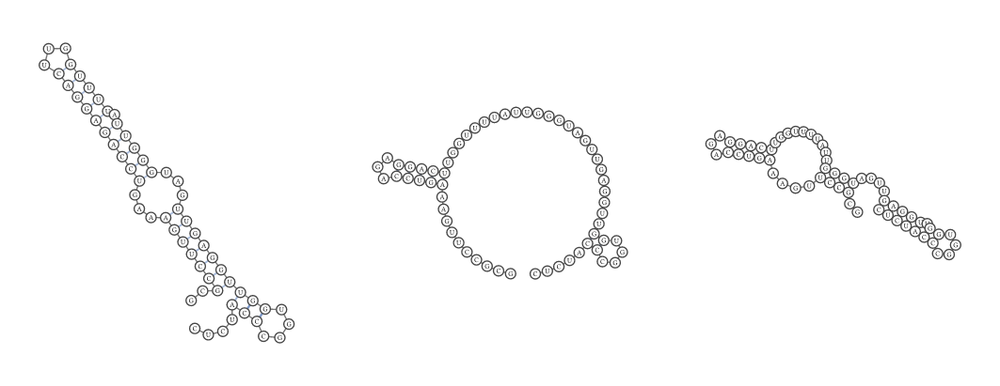</a></p>

## Stable protocol and errors

Every operation uses the `ribon.analysis/1` response envelope. Normal code uses typed wrappers and `data(response)`. Low-level integrations can call `request`; input-facing documents can call `try-request` and inspect `ok` plus `error.(code, message)`.

```typst
#let response = try-request(
  "validate",
  (sequence: "GGG", structure: "((."),
)

#if not response.ok {
  [#response.error.code: #response.error.message]
}
```

Default document-time limits reject unexpectedly expensive requests with the stable `resource_limit` code. Explicitly bounded work can opt in:

```typst
#let exact = execution-policy(allow-expensive: true)
```

Ribon does not silently substitute an approximate state space.

## Figure and export guidance

- Keep the package version, parameter model, temperature, salt, dangles, constraints, and probing conversion with the archived analysis.
- Use legends for continuous tracks and describe whether structures are predicted, comparative, or experimentally constrained.
- Fix seeds for sampled structures.
- Select the final page size before checking label placement.
- Export PDF or SVG directly; the renderer produces native vectors.
- Treat pseudoknot decoders and thermodynamic ensembles as different scientific objects.

## Validation

The release suite covers both numerical output and rendered images:

- 24 diverse Rfam families across the analysis operations and all six layouts;
- 24 published pseudoknot records;
- exhaustive short-input checks, mass balance, finite differences, MFE re-evaluation, sampling, and k-best ordering;
- numerical comparisons against the official RNAstructure 6.6 CLI;
- exact-value and pixel-golden plot contracts covering all legend anchors, shared legends, custom/logarithmic/reversed/secondary axes, and continuous scales;
- a 72-page real-RNA vector PDF checked for blank pages, clipping, text, raster contamination, and pixel-exact hashes;
- a rendering contract covering annotations, comparisons, plots, long-RNA detail, and all result-to-render connections.

See the repository's [validation methods](https://github.com/rice8y/ribon/blob/v0.1.0/docs/VALIDATION.md), [model boundary](https://github.com/rice8y/ribon/blob/v0.1.0/docs/MODEL.md), and [reference index](https://github.com/rice8y/ribon/blob/v0.1.0/docs/REFERENCES.md) for exact methods and measured results.

## Build and test

From the `package` directory:

```sh
just plugin
just test
just docs
just images
just check
```

The `docs` recipe builds the manual with the pinned Typst 0.14.2 toolchain through Nix. `docs-current` uses the Typst executable already on `PATH`.

## License and provenance

Ribon is licensed under [GPL-2.0-only](LICENSE). The bundled parameter tables require the same license.

See [NOTICE.md](NOTICE.md) and [THIRD_PARTY.md](THIRD_PARTY.md) for bundled-data provenance, dependency notices, hashes, and licensing details.
