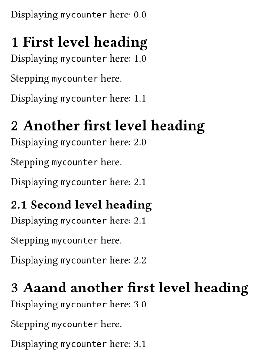

# `rich-counters`

This package allows you to have **counters which depend on other counters**.

Concretely, it implements `richcounter`, which is a counter that can _inherit_ one or more levels from another counter.

The interface is similar to the [usual counter](https://typst.app/docs/reference/introspection/counter/).
It provides a `display()` and a `step()` method.

## Typical Showcase

In the following example, the `mycounter` inherits the first level from `heading` (but not deeper levels).
```typ
#import "@preview/rich-counters:0.1.0": *

#set heading(numbering: "1.1")
#let mycounter = richcounter(identifier: "mycounter", inherited_levels: 1)

// DOCUMENT

Displaying `mycounter` here: #context (mycounter.display)("1.1")

= First level heading

Displaying `mycounter` here: #context (mycounter.display)("1.1")

Stepping `mycounter` here. #(mycounter.step)()

Displaying `mycounter` here: #context (mycounter.display)("1.1")

= Another first level heading

Displaying `mycounter` here: #context (mycounter.display)("1.1")

Stepping `mycounter` here. #(mycounter.step)()

Displaying `mycounter` here: #context (mycounter.display)("1.1")

== Second level heading

Displaying `mycounter` here: #context (mycounter.display)("1.1")

Stepping `mycounter` here. #(mycounter.step)()

Displaying `mycounter` here: #context (mycounter.display)("1.1")

= Aaand another first level heading

Displaying `mycounter` here: #context (mycounter.display)("1.1")

Stepping `mycounter` here. #(mycounter.step)()

Displaying `mycounter` here: #context (mycounter.display)("1.1")
```


## Construction of a `richcounter`

To create a `richcounter`, you have to call the `richcounter(...)` function.
It accepts three arguments:

- `identifier` (required)

  This must be a `string` which identifies the counter. The string must be unique.

- `inherited_levels`

  This specifies how many levels should be inherited from the parent counter.

- `inherited_from` (Default: `heading`)

  This specifies the parent counter. Can be a `richcounter`, a `counter`, or anything that is accepted by the `counter(...)` constructor.
  If not specified, defaults to `heading` (and hence it will inherit from the counter of the headings).

  If it's a `richcounter` and `inherited_levels` is _not_ specified, then `inherited_levels` will default to one level higher than the given `richcounter`.

For example, the following creates a `richcounter` `foo` which inherits one level from the headings, and then another `richcounter` `bar` which inherits two levels (implicitly) from `foo`.

```typ
#import "@preview/rich-counters:0.1.0": *

#let foo = richcounter(identifier: "foo", inherited_levels: 1)
#let bar = richcounter(identifier: "bar", inherited_from: foo)
```

## Usage of a `richcounter`

You use your constructed `richcounter` through its `step` and `display` functions.

- `display(numbering_style)` (needs `context`)

  This displays the current value of the counter

- `step(depth: 1)`

  This steps the counter at the specified `depth` (default: `1`).
  That is, it steps the `richcounter` at level `inherited_levels + depth`.

**Due to a Typst limitation, you have to put parentheses before you put the arguments. (See below.)**

For example, the following displays `mycounter` and then steps it (at depth 1).
```typ
#import "@preview/rich-counters:0.1.0": *
#let mycounter = richcounter(...)

#context (mycounter.display)("1.1")
#(mycounter.step)()
```

## Roadmap

- use Typst custom types as soon as they become available
- adopt native Typst implementation of dependent counters as soon it becomes available
