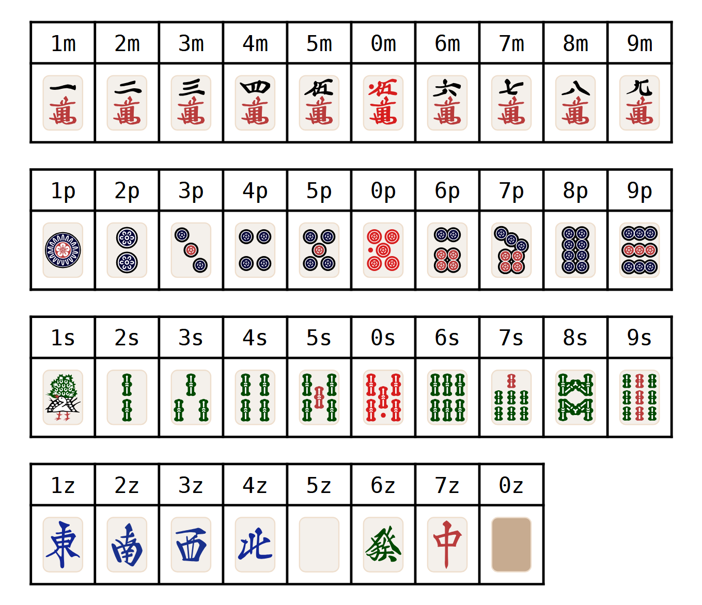
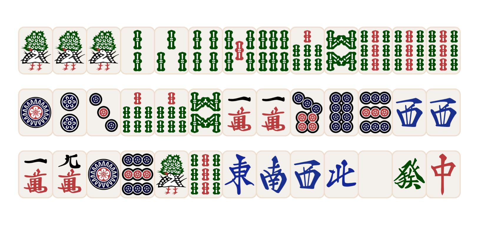
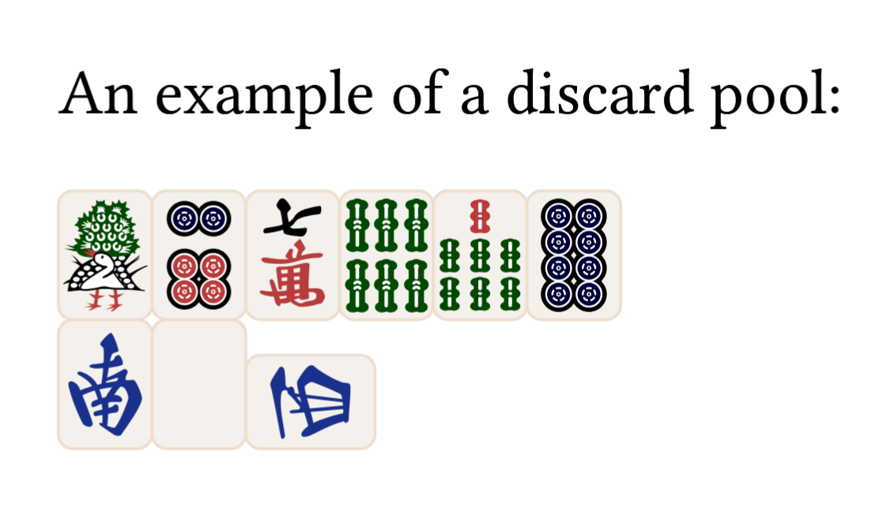
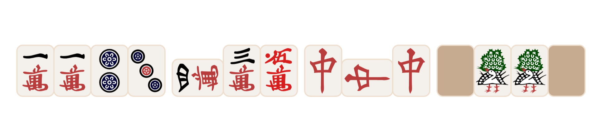
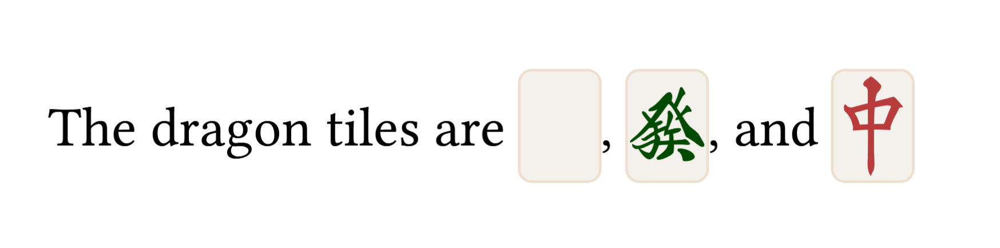
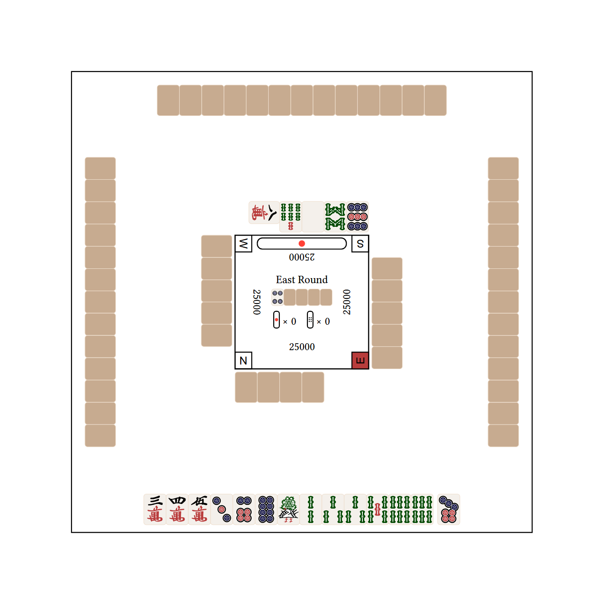
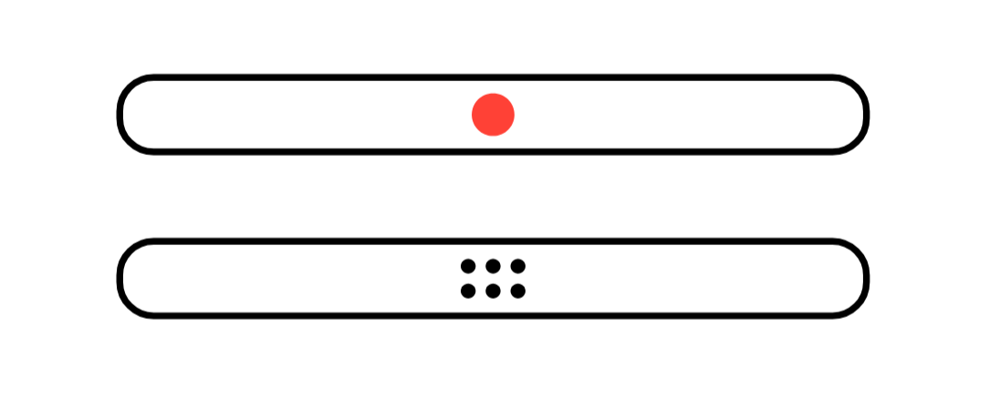

# Riichinator

Riichi Mahjong hand and board state renderer.

## Notation

This library uses mpsz notation, where m = Manzu (Character suit), p = Pinzu (Circle suit), s = Souzu (Bamboo suit) and z = Honor tiles and others. Here is every available tile:


### Concatenation of tiles

For ease of typing, for inputs that accept more than 1 tile, if multiple tiles have the same suit, the suit indicator can be placed at the end of the sequence.

For example, instead of inputting `1s1s1s2s3s4s5s6s7s8s9s9s9s`, we can instead input `1112345678999s`.

Other examples includes `123p778s11m789p33z` and `19m19p19s1234567z`
```typ
#hand("1112345678999s")\
#hand("123p778s11m789p33z")\
#hand("19m19p19s1234567z")
```


### Tile modifiers

Currently, this library only supports rotation, like when the riichi declaration tile is rotated, or when *chi* or *pon* is called.

To rotate a tile, simply add `'` to the end of the number. For example, to show a rotated `3m`, use `3'm`.
```typ
An example of a discard pool:
#river("1s6p7m67s8p253'z")
```


### Spaces

This library also accepts `-` as a small spacer. This is useful for things like showing hands with the context of the most recently drawn tiles, or to show open calls:

```typ
#hand("11m23p-4'30m-77;7z-0z11s0z")
```



## Documentation
### `tile`
Displays an inline tile.

```typ
The dragon tiles are #tile("5z"), #tile("6z"), and #tile("7z")
```


#### Parameters
```typ
#let tile(
  tile_name,
  tile_height: INLINE_TILE_HEIGHT,
  rotation: 0deg,
)
```

**`tile_name`** : `str`\
The tile name specified using mpsz notation, so `1s`, `3z`, etc. Note that tile modifiers are not allowed here.

**`tile_height`** : `length`\
The size of the tile. Default is `INLINE_TILE_HEIGHT` which is `2em`

**`rotation`** : `angle`\
The rotation of the tile. Note that `reflow: true`.


### `hand`
Used to display a series of tiles.
```typ
#hand("11m23p-4'30m-77;7z-0z11s0z")
```

```typ
#let hand(
  hand, 
  tile_height: INLINE_TILE_HEIGHT
)
```
**`hand`** : `str`\
The tiles to display. Note that *Shouminkan* 「小明槓」 / extended kans / added kans are not supported yet.

**`tile_height`** : `length`\
The size of the tile. Default is `INLINE_TILE_HEIGHT` which is `2em`

### `board`
Shows a board state. Technically all arguments here are optional, so pick and choose what you want to show.
```typ
#board(
    hands: "345m368p1233566s-7p",
    discards: ("0000z", "00000z", "9p8s5z7s8'm", "00000z"),
    current_round: "East Round",
    hero_wind: "N",
    riichied_players: (false, false, true, false),
    dora_indicators: "4p0000z",
    pot: (riichi: 0, honba: 0),
    scores: (25000, 25000, 25000, 25000)
)
```

```typ
#let board(
  hands: (
    "0000000000000z",
    "0000000000000z",
    "0000000000000z",
    "0000000000000z",
  ),
  hero_wind: "E",
  discards: ("", "", "", ""),
  current_round: none,
  dora_indicators: none,
  riichied_players: (false, false, false, false),
  scores: none,
  pot: none,
  use_cjk_wind: false,
  wind_font: "Arial",
)
```
> note: for inputs that take in all 4 players, the order is yourself -> right -> across -> left in a counter-clockwise manner.
**`hands`** : `str` or `array`\
Input the hands of the players. In most scenarios you simply just put in your hand, but if you want to you can input everyone's hand (e.g. if an opponent called)

**`hero_wind`** : `"E"`, `"S"`, `"N"`, or `"W"`\
The seat wind of the "hero" i.e. yourself

**`discards`** : `array`\
The discard pools of all 4 players.

**`current_round`** : `str`\
Any text you wish that indicated the current round (e.g. South 4)

**`dora_indicators`** : `str`\
Shows the flipped dora indicators on the dead wall. Same notation as a hand. 
In most scenarios only 1 dora indicator will be flipped so you would usually input something like `6s0000z`

**`riichied_players`** : `array`\
An array of booleans to indicated which players have declared riichi.

**`scores`** : `array`\
An array of numbers to show players' scores.

**`pot`** : `pot`\
Used to show what is in the "pot", i.e. leftover riichi sticks and honba. You input an object like `(riichi: 0, honba: 1)`. Both `riichi` and `honba` fields must be present.

**`use_cjk_wind`** : `boolean`\
Whether or not to use "東","南","西","北" instead of "E", "S", "W", "N" for the seat winds.

**`wind_font`**\
The font to be used for the seat wind indicators.

### `river`
Shows a discard pool. Very similar in functionality to `hand()`, but formats it such that there are only 6 tiles in the first and second rows.
```typ
An example of a discard pool:
#river("1s6p7m67s8p253'z")
```

```typ
#let river(
  river, 
  tile_height: INLINE_TILE_HEIGHT
)
```
**`river`** : `str`\
The tiles in the discard pool to display.

**`tile_height`** : `length`\
The size of the tile. Default is `INLINE_TILE_HEIGHT` which is `2em`

### `riichi_stick` and `honba_stick`
Shows a riichi stick/honba stick.
```typ
#riichi_stick(10em, 1em)
#honba_stick(10em, 1em)
```

```typ
#let riichi_stick(width, height) = { .. }
#let honba_stick(width, height) = { .. }
```
**`width`** : `length`\
The horizontal length of the stick

**`height`** : `length`\
The vertical width of the stick

## Future features

### Tile modifier
- Allow the display of extended kans
- Allow for shading of tiles to indicate tsumogiri / tedashi or whatever other purposes
### Board state
- Make the board state more robust to allow for hands with more than 15 tiles
### Customization
- Allow usage of other tilesets

## Credits

The tile assets are taken from https://github.com/FluffyStuff/riichi-mahjong-tiles/
