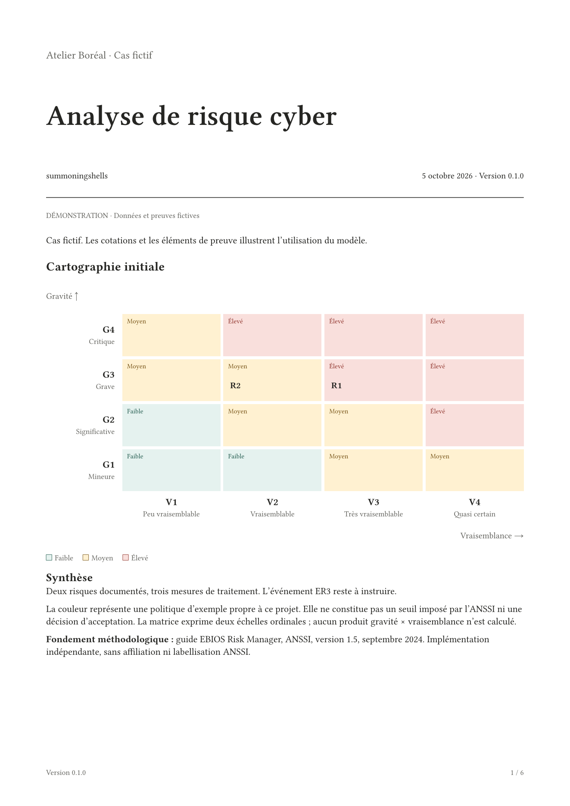

# risk-matrix

Compose risk assessments with reusable EBIOS Risk Manager components: risk
matrices, workshop tables, scenario traceability and treatment plans. Written in
pure Typst, with no third-party packages, network calls or external assets.

**Version 0.1.0 · Author: summoningshells · Typst 0.15.1+ · MIT**

Independent implementation based on ANSSI's official guidance. This package is
not an official ANSSI product and has not received an ANSSI label.

[Source code](https://github.com/summoningshells/risk-matrix)



## Démarrage local

Depuis le dépôt source, avec le compilateur [Typst](https://github.com/typst/typst)
installé :

```sh
git clone https://github.com/summoningshells/risk-matrix.git
cd risk-matrix
typst compile --root . examples/minimal.typ
python3 scripts/build.py
python3 scripts/check.py
```

Le premier fichier utilise l'import relatif `../lib.typ`. Le script de build
installe une copie **temporaire et locale** du package, initialise le modèle avec
`typst init`, puis produit `output/pdf/ebios-demo.pdf` et `thumbnail.png`.
Les scripts acceptent `--typst /chemin/vers/typst` et nécessitent Python 3.11+.
Ils ne téléchargent rien.

## Import Universe

Cet import fonctionnera après acceptation et publication, ou avec une copie
locale installée sous l'espace `preview`. Il est déjà testé localement par les scripts.

```typst
#import "@preview/risk-matrix:0.1.0": risk, risk-matrix, example-policy

#let risks = (
  risk("R1", "Interruption des commandes", 3, 3),
  risk("R2", "Divulgation de données", 4, 2),
)

#risk-matrix(risks, policy: example-policy)
```

`example-policy` est une politique illustrative du package, à remplacer par celle
de votre organisation. Sans `policy`, la matrice reste neutre et positionne les
risques sans attribuer de classe. L'axe vertical est la **gravité**, croissante
vers le haut ; l'axe horizontal est la **vraisemblance**, croissante vers la droite.
Les identifiants de plusieurs risques dans une même case restent visibles.

## Cible et risque résiduel

Une mesure planifiée ne réduit pas automatiquement le risque. Le statut
`target` représente une cible ; `assessed` représente une réévaluation documentée
et exige une date et une référence de preuve. L'acceptation reste une décision humaine.

```typst
#import "@preview/risk-matrix:0.1.0": risk, risk-matrix, risk-register, example-policy

#let risks = (
  risk("R1", "Arrêt des commandes", 3, 3,
    owner: "Direction des opérations",
    decision: "Réduire ; réévaluer après test de reprise.",
    residual: (
      gravity: 3, likelihood: 1,
      status: "target",
      rationale: "Niveau visé après mise en œuvre et vérification des mesures.",
    ),
  ),
)

#risk-matrix(risks, stage: "residual", policy: example-policy)
#risk-register(risks, policy: example-policy)
```

Les risques sans cotation cible/résiduelle sont listés sous la matrice, sans
réutilisation silencieuse de leur cotation initiale. Les repères **C** et **E**
différencient les cibles des résiduels évalués.

## Composants disponibles

| Usage | Fonctions |
| --- | --- |
| Matrices et registre | `risk-matrix`, `risk-comparison`, `risk-register` |
| Cadrage | `scope-card`, `assets-table`, `events-table`, `baseline-table` |
| Sources et objectifs | `sources-table` |
| Écosystème et scénarios stratégiques | `stakeholders-table`, `strategic-table` |
| Scénarios opérationnels | `operational-table`, `attack-path` |
| Traitement et couverture | `treatment-table`, `coverage-table` |
| Mise en page | `risk-report`, `workshop`, `data-table` |
| Données et contrôles | `risk`, `risk-level`, `validate-risks`, `validate-study`, `coverage` |

L'import n'applique aucun style global. `risk-report` est une règle `show`
facultative. Les tableaux ont des en-têtes répétés sur les pages suivantes.
Le modèle fourni est en français ; le code expose une API en anglais.
Le rapport utilise Libertinus Serif, des titres numérotés et des tableaux à
traits fins. La couleur est réservée aux niveaux de risque. Le paramètre `font`
permet de choisir une autre police.

## Modèle complet

`template/main.typ` assemble les cinq ateliers à partir de `template/data.typ`.
Toutes les données et les preuves du cas « Atelier Boréal » sont **fictives**.
Le modèle contient volontairement un événement sans scénario pour montrer le
suivi de couverture. Il faut remplacer les données, les critères de cotation,
les seuils, les cycles de revue et les décisions avant un usage réel.

Le validateur contrôle les identifiants, les références entre ateliers, la
cohérence des cotations et les champs de justification des résiduels. Il ne
certifie ni la conformité méthodologique ni l'exhaustivité d'une étude.
Cette version représente des chemins séquentiels ; elle ne calcule pas de
graphes d'attaque ET/OU, de vraisemblances standard/avancées ni de dangerosités.

## Documentation et références

- [API et formats des données](docs/api.md)
- [Choix méthodologiques et sources ANSSI](docs/methodology.md)
- [Préparation de la soumission Universe](docs/publishing.md)
- [Guide officiel EBIOS Risk Manager et fiches méthodes](https://messervices.cyber.gouv.fr/guides/la-methode-ebios-risk-manager-le-guide)

Le guide consulté est la version **1.5, septembre 2024**, ANSSI-PA-048, sous
Licence Ouverte Etalab V1. La page de ressources et les fiches ont été consultées
le 5 octobre 2026. Le code, le style et les exemples originaux sont sous MIT ;
voir [LICENSE](LICENSE) et [NOTICE](NOTICE). EBIOS est une marque du SGDSN.
