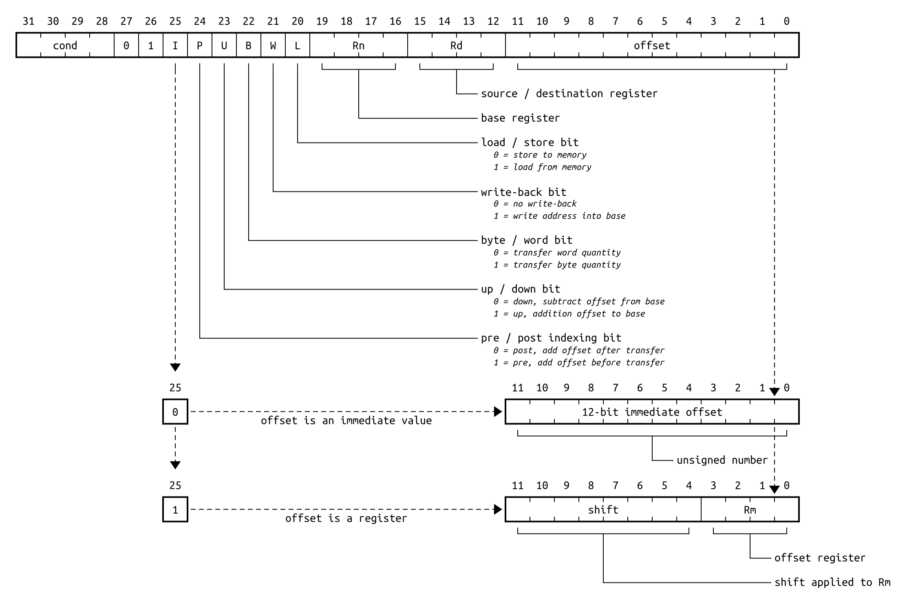
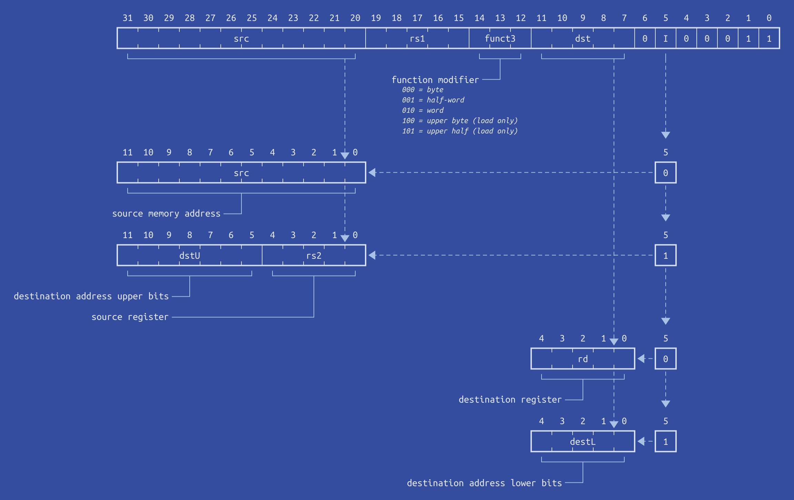

# rivet-typst

RIVET _(Register / Instruction Visualizer & Explainer Tool)_ is a [Typst](https://typst.app) package for visualizing binary instructions or describing the contents of a register, using the [CeTZ](https://typst.app/universe/package/cetz) package.

It is based on the [homonymous Python script](https://git.kb28.ch/HEL/rivet/)

## Examples
<table>
  <tr>
    <td>
      <a href="./gallery/example1.typ">
        
      </a>
    </td>
  </tr>
  <tr>
    <td>A bit of eveything</td>
  </tr>
  <tr>
    <td>
      <a href="./gallery/example2.typ">
        
      </a>
    </td>
  </tr>
  <tr>
    <td>RISC-V memory instructions (blueprint)</td>
  </tr>
</table>

*Click on the example image to jump to the code.*

## Usage
For more information, see the [manual](manual.pdf)

To use this package, simply import `schema` from [rivet](https://typst.app/universe/package/rivet) and call `schema.load` to parse a schema description. Then use `schema.render` to render it, et voilà !
```typ
#import "@preview/rivet:0.2.0": schema
#let doc = schema.load("path/to/schema.yaml")
#schema.render(doc)
```