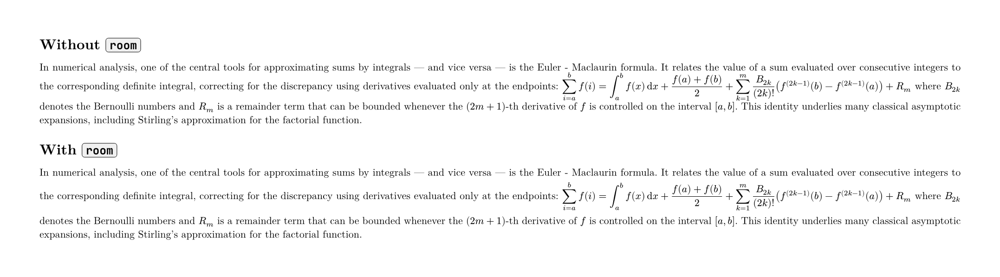

# roomy-math

A Typst package that fixes line overflow when math expressions are sized
as display while written inline.

## The problem

By default, Typst shrinks large math expressions (fractions, sums with
limits, nested radicals...) when they appear inline in a paragraph. To
make an inline expression render at full display size, you can wrap it
with `display(...)`, e.g. `$ display(frac(a,b)) $`. This does enlarge
the expression, but the surrounding line height does **not** grow enough
to match it — the enlarged expression ends up overlapping the lines of
text above and below it.
git add .
git commit -m "Add roomy-math:0.1.0"
git push

### Importing

Simply insert the following into your Typst code:

```typst
#import "@preview/roomy-math:0.1.0": room
```

After importing `room`, turn your inline expression into display style by
adding spaces around it — `$ ... $` instead of `$...$` — then wrap it with
`#room`:

```typst
In numerical analysis, one of the central tools for approximating sums by
integrals — and vice versa — is the Euler–Maclaurin formula. It relates the
value of a sum evaluated over consecutive integers to the corresponding
definite integral, correcting for the discrepancy using derivatives evaluated
only at the endpoints: #room($ sum_(i=a)^b f(i) = integral_a^b f(x) dif x + frac(f(a)+f(b), 2) + sum_(k=1)^m frac(B_(2k), (2k)!) (f^((2k-1))(b) - f^((2k-1))(a)) + R_m $) where $B_(2k)$ denotes the Bernoulli numbers and $R_m$ is a remainder term that can be bounded whenever the $(2m+1)$-th derivative of $f$ is controlled on the interval $[a,b]$. This identity underlies many classical asymptotic expansions, including Stirling's approximation for the factorial function.
```



## How it works

`room` uses Typst's `measure()` function (inside a `context` block) to get
the real rendered height of the display-style expression, then wraps the
content in a `box` set to that height. This lets Typst's line layout
algorithm account for the expression's true size when computing line
spacing, the same way it would for a genuine block-level display equation.

## Limitations

The limitations listed here are cases the package may not yet handle
perfectly. Please open an issue if you find any other limitations or
bugs while testing.

## License

MIT
