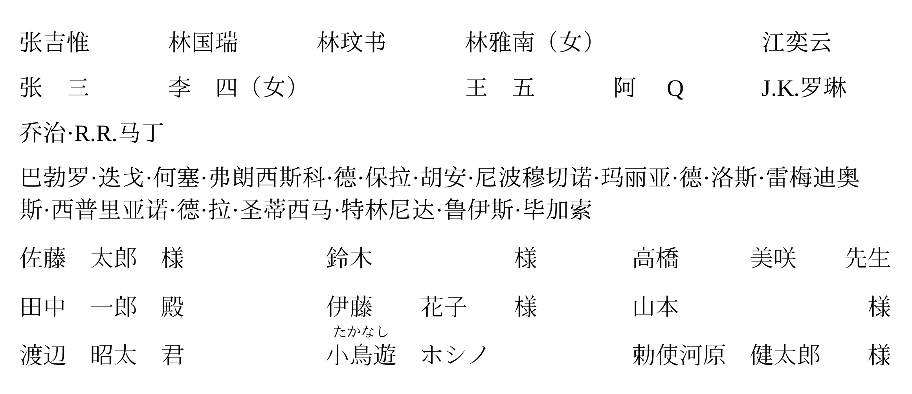

# roster-cjk

[](https://github.com/308K/roster-cjk)[](https://mozilla.org/MPL/2.0/)

A Typst package to lay out a list of CJK names into a tidy, column-aligned roster grid. It supports Chinese names (with optional bracketed suffixes such as `（女）`) and Japanese names (`姓 名 敬称`), the latter optionally annotated with furigana in parentheses.

这是一个用于将中日韩名字列表排版为整齐对齐的花名册网格的 Typst 包。它支持中文名字（带有可选的括号后缀，如`（女）`）和日文名字（`姓 名 敬称`），后者可以在括号中添加注音（振假名）。



## Usage (用法)

To use this package, import the `roster-cjk` function:

要使用此包，请导入 `roster-cjk` 函数：

```typst
#import "@preview/roster-cjk:0.1.0": roster-cjk

#let zh-names = (
  "张吉惟",
  "林国瑞",
  "林玟书",
  "林雅南（女）",
  "江奕云",
  "张三",
  "李四（女）",
  "王五",
  "阿Q",
  "J.K.罗琳",
  "乔治·R.R.马丁",
  "巴勃罗·迭戈·何塞·弗朗西斯科·德·保拉·胡安·尼波穆切诺·玛丽亚·德·洛斯·雷梅迪奥斯·西普里亚诺·德·拉·圣蒂西马·特林尼达·鲁伊斯·毕加索",
)

#roster-cjk(zh-names, cols: 7)

#let ja-names = (
  "佐藤 太郎 様",
  "鈴木 様",
  "高橋 美咲 先生",
  "田中 一郎 殿",
  "伊藤 花子 様",
  "山本 様",
  "渡辺 昭太 君",
  "小鳥遊(たかなし) ホシノ ",
  "勅使河原 健太郎 様",
)

#set text(lang: "ja")
#roster-cjk(ja-names, cols: 3, min-gap: 2em, inner-gap: 1em)
```

### Japanese Name Features (日文姓名特性)

- **Mixed Spaces:** Japanese name parts can be separated by either standard spaces or full-width spaces (`[ ]U+2003 Em Space`), and they can be mixed. (姓名各部分可以使用标准空格或日文环境常用的全宽空格（`[ ]U+2003 Em Space`）分隔，且支持混用。)
- **Omitting Honorifics:** If you only need the surname and given name without an honorific, add a space after the given name (e.g., `"Surname GivenName "`). (如果只需要姓和名而不需要敬称，请在名的后面加一个空格，例如 `"姓 名 "`。)

## Parameters (参数)

- `names`: An array of name strings. (名字字符串数组。)
- `cols` (default `8`): Number of columns in the grid. (网格的列数，默认为 8。)
- `zh-col-width` (default `4.8em`): Width of the column for Chinese names. (中文名字的列宽，默认为 `4.8em`。)
- `ja-inner-gap` (default `1em`): Gap between the surname / given name / honorific parts of a Japanese name. (日文名字中姓、名、敬称之间的间距，默认为 `1em`。)
- `min-gap` (default `1.5em`): Horizontal gap between columns. (列之间的水平间距，默认为 `1.5em`。)
- `row-gutter` (default `1.2em`): Vertical gap between rows. (行之间的垂直间距，默认为 `1.2em`。)
- `lang` (default `auto`): Force the layout mode. `auto` follows the current `text.lang` (`"ja"` selects the Japanese layout, anything else the Chinese one). (强制设置排版模式。`auto` 会跟随当前的 `text.lang`，如果为 `"ja"` 则选择日文排版，否则为中文排版。)
