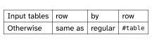
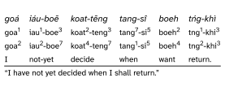

# `rowmantic`: Tables row by row
A Typst package for editing tables row-by-row.

The idea is a row-oriented way to input tables, with just a little less syntactical overhead than the usual `table` function in Typst.

The `rowtable` function works like the usual `table` function but takes one markup block (`[...]`) per row, and the markup is split internally on a delimiter which is `&` by default.

For example, given typst `[A & B & C]`, the effective table row is `..([A], [B], [C])`.

For improved table ergonomics, the table sizes the number of columns by the longest row. All rows are effectively completed so that they are of full length. This creates a better the editing experience, as rows can be filled out gradually.

## Getting Started

<p>
  <picture>
    <source media="(prefers-color-scheme: light)" srcset="docs/figures/readmepicture1.svg">
    <source media="(prefers-color-scheme: dark)" srcset="docs/figures/readmepicture1-dark.svg">
    
  </picture>
</p>

```typ
#import "@preview/rowmantic:0.1.1": rowtable

#rowtable(
  stroke: 0.5pt,
  [Input tables & row     & by      & row       ],
  [Otherwise    & same as & regular & `#table`  ],
)
```

---

<p>
  <picture>
    <source media="(prefers-color-scheme: light)" srcset="docs/figures/readmepicture2.svg">
    <source media="(prefers-color-scheme: dark)" srcset="docs/figures/readmepicture2-dark.svg">
    
  </picture>
</p>

```typ
#import "@preview/rowmantic:0.1.1": rowtable, expandcell

#{
  set table.hline(stroke: 0.08em)
  show regex("\d"): super.with(size: 0.8em, typographic: false)
  show table.cell: it => { set text(size: 0.9em) if it.y >= 1; it }
  show table.cell.where(y: 0): emph
  rowtable(
    separator: ",",   // configurable separator
    stroke: 0pt,      // pass through table arguments, hlines, cells et.c.
    inset: (x: 0em),
    column-gutter: 0.9em,
    // rows are filled to be equal length after collecting cells
    [goá   , iáu-boē    , koat-tēng   , tang-sî   , boeh  , tńg-khì    ],
    [goa1  , iau1-boe3  , koat2-teng3 , tang7-si5 , boeh2 , tng1-khi3  ],
    [goa2  , iau2-boe7  , koat4-teng7 , tang1-si5 , boeh4 , tng2-khi3  ],
    [I     , not-yet    , decide      , when      , want  , return.    ],
    table.hline(),
    // cell that fills remainder of row
    expandcell["I have not yet decided when I shall return."],
  )
}
```

This example [taken from Wikipedia](https://en.wikipedia.org/wiki/Interlinear_gloss)

<!--
### Installation

TBD
-->

## Function Documentation


### `rowtable`

```typ
/// Table which takes cell input row-by row
///
/// Each row is passed as one markup block (`[...]` syntax) which is split internally on
/// the separator. Rows that are shorter than the longest row (or the configured `columns`)
/// will be filled to be the same length as all other rows.
///
/// Leading/trailing spaces are removed from each table element in a row.
/// To preserve such spaces, use `~`.
///
/// This function wraps the standard `table` function and passes through all its regular arguments.
///
/// Passing `table.cell` outside rows is possible but not recommended. Passing `#table.cell[]`
/// inside a row, between separators, is supported and can be used with `colspan` > 1.
///
/// It is supported to input rows inside `table.header` and `table.footer`.
///
/// - args (arguments): Rows like `[A & B & C]` and other positional or named table function parameters.
///   Arguments to `table` pass through. A `columns` argument to the table is possible but not
///   mandatory.
/// - separator (str): configurable cell separator in a row. Good choices are `&`, `,`, or `;`.
///   Escape the separator using e.g. `\&`
/// - row-filler (any): object used to fill rows that are too short
/// - table (function): Table function to use to build the final table. Intended for use with
///   table wrappers from other packages. (The function `{arguments}` can be used for
///   argument pass-through.)
#let rowtable(..args, separator: "&", row-filler: none, table: std.table) = { [...] }
```

### `expandcell`

```typ
/// An expandcell is a `table.cell` that expands its colspan to available width
/// The expandcell can be passed alone as a row, or should be placed inside a row markup block.
///
/// - args (arguments): table.cell arguments. colspan and rowspan are not permitted.
/// - body (content): cell body
#let expandcell(..args, body) = { [...] }

```

### `row-split`

```typ
/// Take a sequence (content) and split it into an array by the given separator.
/// It's split only shallowly, not deeply; the separators must exist in the uppermost sequence's
/// content.
///
/// - it (content): text or sequence or other content
/// - sep (str): separator
/// - strip-space (bool): Remove leading/trailing spaces from split sequences
/// -> array
#let row-split(it, sep: "&", strip-space: true) = { [...] }
```


## License

The package is distributed under the terms of the European Union Public License v1.2 or any later version, which is an OSI-approved weakly copyleft license. The License is distributed with the package.
