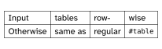

# `rowmantic`
**A Typst package for row-wise table editing**

The idea is a row-oriented way to input tables, with just a little less syntactical overhead than the usual `table` function in Typst.

The `rowtable` function takes a markup block `[...]` per row, and the markup is split internally on a delimiter which is `&` by default. In all other aspects it works like the usual `table` function, with `stroke`, `fill`, `hline` and so on.

For example, the following

```typ,notest
#rowtable(
  [A & B],
  [C & D & E])
```

is equivalent to this `table`:

```typ,notest
#table(columns: 3,
  [A], [B], [],
  [C], [D], [E])
```

For improved table ergonomics, the longest row determines the number of columns, and all rows are effectively completed so that they are of full length. This creates a better editing experience, as rows and columns can be filled out gradually.

## Getting Started

<p>
  <picture>
    <source media="(prefers-color-scheme: light)" srcset="docs/figures/readmepicture1.svg">
    <source media="(prefers-color-scheme: dark)" srcset="docs/figures/readmepicture1-dark.svg">
    
  </picture>
</p>

```typ
#import "@preview/rowmantic:0.4.0": rowtable

#rowtable(
  stroke: 0.5pt,
  [Input      & tables  & row-    & wise      ],
  [Otherwise  & same as & regular & `#table`  ],
)
```

---

<p>
  <picture>
    <source media="(prefers-color-scheme: light)" srcset="docs/figures/readmepicture2.svg">
    <source media="(prefers-color-scheme: dark)" srcset="docs/figures/readmepicture2-dark.svg">
    
  </picture>
</p>

```typ
#import "@preview/rowmantic:0.4.0": rowtable, expandcell

#{
  set table.hline(stroke: 0.08em)
  show regex("\d"): super.with(size: 0.8em, typographic: false)
  show table.cell: it => { set text(size: 0.9em) if it.y >= 1; it }
  show table.cell.where(y: 0): emph
  rowtable(
    separator: ",",   // configurable separator
    stroke: 0pt,      // pass through table arguments, hlines, cells et.c.
    inset: (x: 0em),
    column-gutter: 0.9em,
    // rows are filled to be equal length after collecting cells
    [goá,   iáu-boē,    koat-tēng,    tang-sî,    boeh,   tńg-khì   ],
    [goa1,  iau1-boe3,  koat2-teng3,  tang7-si5,  boeh2,  tng1-khi3 ],
    [goa2,  iau2-boe7,  koat4-teng7,  tang1-si5,  boeh4,  tng2-khi3 ],
    [I,     not-yet,    decide,       when,       want,   return.   ],
    table.hline(),
    // cell that fills remainder of row
    expandcell["I have not yet decided when I shall return."],
  )
}
```

This example [taken from Wikipedia](https://en.wikipedia.org/wiki/Interlinear_gloss)

<!--
### Installation

TBD
-->

## Function Documentation and Manual

Please <a href="docs/rowmantic-manual.pdf">see the manual</a> for more explanations, examples and function documentation.

## License

The package is distributed under the terms of the European Union Public License v1.2 or any later version, which is an OSI-approved weakly copyleft license. The License is distributed with the package.
