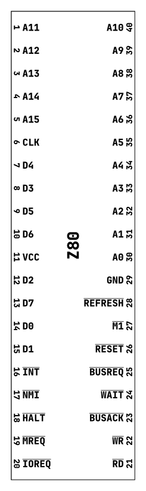
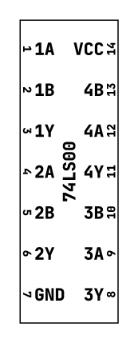

# Salsa Dip

Salsa Dip is a library for making [DIP](https://en.wikipedia.org/wiki/Dual_in-line_package) chip labels in Typst.

# Examples

```typst
#import "@preview/salsa-dip:0.1.0": dip-chip-label

#set text(font: ("JetBrains Mono", "Fira Code", "DejaVu Sans Mono"), weight: "extrabold")
#set page(width: auto, height: auto, margin: .125cm)

#let z80-labels = ("A11", ..., "A9", "A10")

#dip-chip-label(40, 0.54in, z80-labels, "Z80", settings: (pin-number-margin: 1pt, pin-number-size: 2.5pt, chip-label-size: 5pt))

```


```typst
#import "@preview/salsa-dip:0.1.0": dip-chip-label

#set text(font: ("JetBrains Mono", "Fira Code", "DejaVu Sans Mono"), weight: "extrabold")
#set page(width: auto, height: auto, margin: .125cm)

#let labels = ("1A", "1B", "1Y", "2A", "2B", "2Y", "GND", "3Y", "3A", "3B", "4Y", "4A", "4B", "VCC")
#dip-chip-label(14, 0.24in, labels, "74LS00")
```


# Customization

The `dip-chip-label` function is called with four parameters, an integer number of pins for the chip, the width (usually `0.24in` or `0.54in`), the list of pin labels (if no labels are desired, an empty array can be passed), and the chip label.

There is an additional `settings` parameter which can be used to fine tune the apperance of the chip labels. The `settings` parameter is a dictionary optionally containing any of the setting keys:

- `chip-label-size`: Font size for the chip label
- `pin-number-margin`: Margin to give next to pin numbers
- `pin-number-size`: Font size for pin numbers
- `pin-label-size`: Font size for pin labels
- `include-numbers`: Boolean enabling pin numbers
- `pin-spacing`: Spacing of pins
- `vertical-margin`: Total margin to put into spacing above and below pin labels
