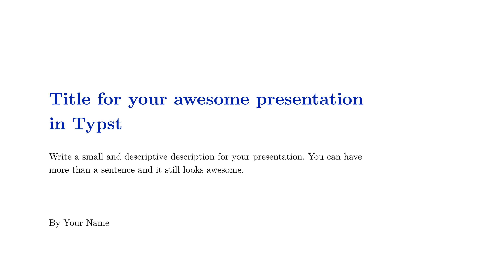

Sano Presentation Template
==========================

This template can be used to create presentations in [Typst](https://typst.app/docs/) with ease using the [Touying](https://touying-typ.github.io/) slide engine.

Usage
-----

Create a new typst project based on this template locally.

```bash
typst init @preview/sano-presentation-template
cd sano-presentation-template
```

Or create a project on the typst web app based on this template.

Showcase
----------

