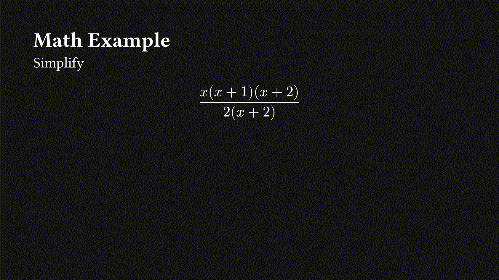
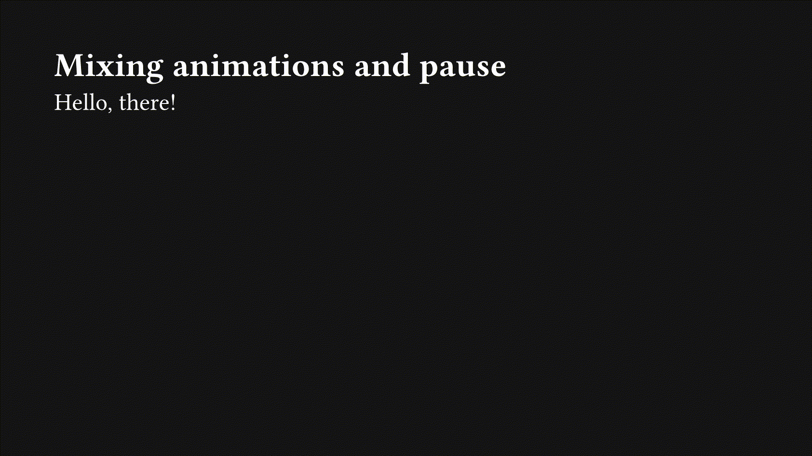
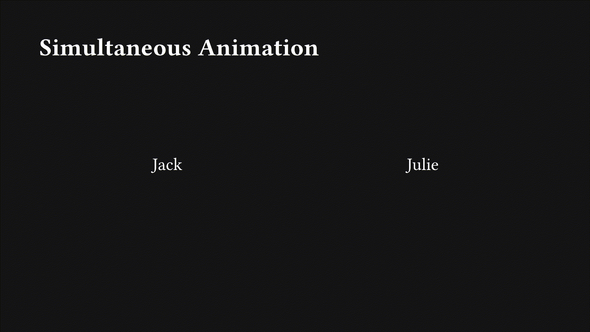
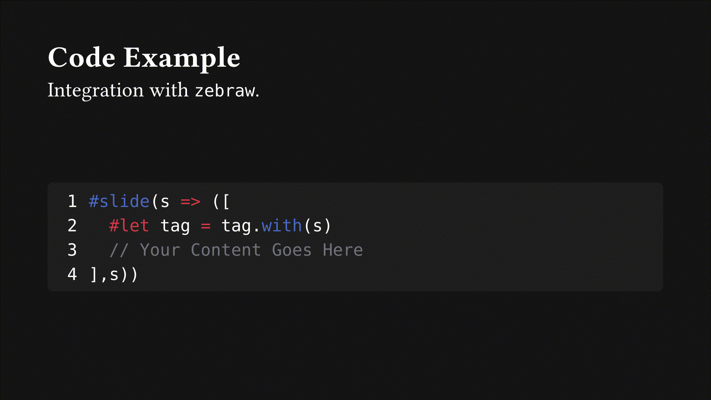

# Sanor

Fast, small, but powerful presentation framework in Typst.

## Examples
Click on the image to jump to the source code.
<table>
  <tr>
    <td><a href="./gallery/example-math.typ"></a></td>
    <td><a href="./gallery/example-case.typ"></a></td>
  </tr>
  <tr>
    <td><a href="./gallery/example-sync.typ"></a></td>
    <td><a href="./gallery/example-code.typ"></a></td>
  </tr>
</table>


Sanor provides a framework for creating highly animated PDF presentations by step-by-step reveal controls over each element in a Typst document. 

## Features

- **Step-by-Step Reveals**: Control content visibility with `pause()` for narrative flow or tagged animations for interactive elements
- **Content Tagging System**: Use `tag()` to mark elements that can be animated, revealed, or transformed
- **Animation Rules**: Apply transformations to the elements with `apply()` (persistent), `once()` (single step), `cover()` (hide), `revert()` (reset), or `clear()` (remove prior modifiers)
- **Reusable Objects**: Create components with `object()` that can have multiple visual states via named cases
- **Cases System**: Define semantic transformations with `case()` that can be referenced by name instead of repeating properties
- **Simultaneous Actions**: Coordinate animations across multiple elements by grouping rules in an array
- **Handout Support**: Generate static handouts from animated presentations with `set-option(handout: true)`

## Core Concepts

### Tags & Rules
A **tag** marks content for animation. Rules define what happens to tagged content at each step:
- `tag("name", content)` — Mark content with a unique identifier
- `apply("name", ...)` — Apply a transformation from now on (persists across steps)
- `once("name", ...)` — Apply a transformation for just this step
- `cover("name", ...)` — Hide content by applying a hidden case
- `revert("name", ...)` — Reset to a base state without inheritance
- `clear("name")` — Reset to base state and clear all previous modifiers to base case.

### Cases
A **case** is a named transformation that can be applied to content:
- `case(fill: red)` — Styling properties that modify content appearance
- `case(text.with(weight: "bold"))` — Wrapper functions that transform structure
- Cases can be defined when creating objects for reuse: `object(text, red: case(fill: red))`
- Reference cases by name: `apply("elem", "red")` instead of `apply("elem", text.with(fill: red))`

### Objects
An **object** is a reusable component with built-in state management:
- `object(func, case1: case(...), case2: case(...))` — Define multiple named cases
- Objects cache transformations, so multiple `apply()` calls accumulate effects
- Use `revert()` or `cover()` to change behavior between steps

### Animation Workflow
1. Define slide content using 
  ```typst
  #slide(s => ([
    #let tag = tag.with(s)
    // Your content goes here
  ], s))
  ```
2. Mark elements with `tag("name", content)` that you want to animate
3. Push animation rules with `s.push()`:
   - Single rule: `s.push(apply("name"))`
   - Multiple rules at once: `s.push((apply("left"), apply("right")))`
   - Advance without animation: `s.push(1)`
4. Each presentation step corresponds to one or more calls to `s.push()`

## Presentation Package Comparison

There are several Typst presentation packages, each with different strengths. Choose Sanor if you need fine-grained animation control and incremental content reveals.

- **Touying**: Sanor provides fine-grained animation controls that are applicable to *any* packages, not only CeTZ or Fletcher. Since Sanor does not inspect content, it can be used with any functions, even in `context` blocks.
- **Touying, Polylux**: You can arrange the steps of the animation of each element **without knowing the subslide index**. Unlike traditional PDF presentation packages that animate contents based on either the subslide index or the position where they are put in the source code, Sanor separates the *declaration* and *animation* of the content: put the content in the code wherever you think it's good, and then animate it later.
- **Presentate**: This functionality is closely related to Presentate's `motion` and `tag` functions. However, the framework provided there cannot interact well with `pause` and has less flexibility (e.g., managing the showing state of the element). So, I implemented it here in a separate package, created specifically for *animations*.

## Installation

Add the package to your Typst project:

```typst
#import "@preview/sanor:0.2.1": *
```

## Quick Start

```typst
#import "@preview/sanor:0.2.1": *

#slide(s => ([
  // A short hand to avoid repeating `s`.
  #let tag = tag.with(s)

  = Hello World
  // Tag an element with a name.
  #tag("title")[This is a presentation slide]
  // Apply it on your slide.
  #s.push(apply("title", text.with(fill: blue)))
], s))
```

## API Reference

### Core Functions

#### `slide(options: (:), func, hidden: auto, is-shown: false, defined-cases: (:))`

Creates a slide where content can be revealed or modified step by step via animation rules pushed with `s.push()`.

**Parameters:**
- `options` (dict): Slide configuration options
- `func` (function): Function receiving slide context `s` and returning `(content, s)`
- `hidden` (auto, case): The case used to hide content (default: `superhide`)
- `is-shown` (bool): Whether hidden elements are visible by default
- `defined-cases` (dict): Predefined named cases available on this slide

**Usage:**
```typst
#slide(s => ([
  #let tag = tag.with(s)
  = My Slide
  #tag("elem")[Content]
  #s.push(apply("elem"))
], s))
```

#### `tag(s, name, body, hidden: auto, ..defined-cases)`

Marks content for animation or state management. Tagged content can be modified by rules in `s.push()`.

**Parameters:**
- `s` (context): The slide context
- `name` (str): Unique identifier for this tagged element
- `body` (content): The content to tag
- `hidden` (auto, case): Case to use when content is hidden
- `..defined-cases` (cases): Additional named cases for this tag

**Returns:** The content with animation hooks applied

#### `pause(s, body, hidden: auto)`

Shows content after a certain number of presentation steps. Use `s.push(1)` to advance steps.

**Parameters:**
- `s` (context): The slide context
- `body` (content): Content to show after pause reaches this point
- `hidden` (auto, case): Case to use before pause reaches this point

**Usage:**
```typst
#pause(s, [Appears on step 1])
#s.push(1)
#pause(s, [Appears on step 2])
#s.push(1)
```

#### `set-option(..new-options)`

Sets global configuration options for all subsequent slides. Used before slides are defined.

**Parameters:**
- `..new-options` (named): Named options like `handout: true`

**Returns:** Updated exports with options applied

### Animation Rules

Rules define what happens to tagged content at each step. Use these in `s.push()`.

#### `apply(name, ..cases, inherit: true)`

Apply transformations from this step onward (persistent).

**Parameters:**
- `name` (str): Tag name to target
- `..cases` (any): Cases, properties, or wrapper functions to apply
- `inherit` (bool): Combine with previous active cases (default: true)

**Behavior:** Transformations accumulate across steps. Future steps continue with these transformations unless `revert()` is called.

**Note*:** You can use `s.push(name)` as a short hand for `s.push(apply(name))`.

#### `once(name, ..cases, inherit: true)`

Apply transformations for just this step (transient).

**Parameters:**
- `name` (str): Tag name to target
- `..cases` (any): Cases, properties, or wrapper functions
- `inherit` (bool): Combine with active cases from previous steps (default: true)

**Behavior:** Transformation applies only for this step. Next step reverts to previous state.

#### `cover(name, ..cases)`

Apply transformations without inheritance. Equivalent to `apply(name, ..cases, inherit: false)`.

**Parameters:**
- `name` (str): Tag name to target
- `..cases` (any): Cases to apply exclusively (ignoring previous active cases)

#### `clear(name)`

Reset a tagged element to its base state and clear all previous modifiers. Unlike `revert()`, the previous animation styles are completely lost.

**Parameters:**
- `name` (str): Tag name to target

**Behavior:** Resets the element to base state without preserving history. Subsequent transformations start fresh.

**Example:**
```typst
#let c1 = object(circle, hidden: hide)
#tag("c1", c1())

#s.push((apply("c1"), once("normal")))
#s.push((apply("c1", fill: red), once("red")))
#s.push((apply("c1", radius: 3cm), once("grow")))
#s.push((clear("c1"), once("normal")))  // Reset to base
#s.push((apply("c1"), once("back")))    // Apply will not preserve previous transforms
```

#### `revert(name, ..cases)`

Reset a tagged element to its base state while preserving animation history. Unlike `clear()`, previous animation styles can still be applied in future steps.

**Parameters:**
- `name` (str): Tag name to target
- `..cases` (any): Cases to apply (inherits from previous steps)

**Behavior:** Clears current applied transformations but maintains the object's internal state, allowing previous animations to be re-applied.

**Example:**
```typst
#let c1 = object(circle, hidden: hide)
#tag("c1", c1())

#s.push((apply("c1"), once("normal")))
#s.push((apply("c1", fill: red), once("red")))
#s.push((apply("c1", radius: 3cm), once("grow")))
#s.push((revert("c1"), once("normal")))  // Reset to base
#s.push((apply("c1"), once("back")))     // Apply will show as if previous animations weren't applied, but history is preserved
```

#### `force(name, ..cases)`

Shorthand for `apply(name, ..cases, inherit: false)`. Apply without combining with previous cases.

**Parameters:**
- `name` (str): Tag name to target
- `..cases` (any): Cases to apply exclusively

### Object System

#### `object(func, hidden: case(hide), ..defined-cases)`

Creates a reusable component with built-in state management and named cases.

**Parameters:**
- `func` (function): The base function (e.g., `rect`, `text`) used to create the object
- `hidden` (case): The case applied when the object is hidden (default: `case(hide)`)
- `..defined-cases` (named): Named cases (e.g., `red: case(fill: red)`) for reuse

**Returns:** An object function that can be called like `obj[content]` or `obj(property: value)`

**Usage:**
```typst
#let box = object(rect, red: case(fill: red), large: case(width: 4cm))
#tag("mybox", box[Text])
#s.push(apply("mybox", "red"))    // apply the `red` case
#s.push(apply("mybox", "large"))  // apply the `large` case
```

#### `case(..modifiers)`

Defines a reusable transformation for styling or wrapping content.

**Parameters:**
- `..modifiers` (named + positional): Named styling properties and positional wrapper functions

**Named arguments** become style properties:
```typst
#case(fill: red, weight: "bold")  // Apply fill and weight properties
```

**Positional arguments** must be functions that transform content:
```typst
#case(text.with(size: 14pt))      // Wrapper function
#case(it => block(it))            // Lambda wrapper
```

**Returns:** A case object that can be applied with `apply()` or referenced by name

### Simultaneous Actions

To apply multiple animations in the same step, group rules in a tuple or array:

```typst
#s.push((apply("left"), apply("right")))  // Both happen together
#s.push((once("a"), once("b"), once("c"))) // All three happen in this step
```

## PDF Presenter Console Integration

Sanor includes the `pdfpc` module for compatibility with [PDF Presenter Console](https://pdfpc.github.io/), enabling speaker notes, slide timing, and presenter features in your PDF presentations.

### pdfpc Module Functions

#### `speaker-note(text)`

Adds speaker notes to a slide, visible only in the presenter view.

**Parameters:**
- `text` (str or raw): Speaker notes as a string or raw code block

**Usage:**
```typst
#speaker-note[Remember to emphasize this point during the presentation]
```

#### `config(duration-minutes, start-time, end-time, last-minutes, ...)`

Configure presentation settings for pdfpc.

**Parameters:**
- `duration-minutes` (int): Total presentation duration in minutes
- `start-time` (str or datetime): Presentation start time in HH:MM format
- `end-time` (str or datetime): Presentation end time in HH:MM format
- `last-minutes` (int): Highlight final N minutes with visual alert
- `default-transition` (dict): Default slide transition settings
- `disable-markdown` (bool): Disable markdown in notes

**Usage:**
```typst
#pdfpc.config(
  duration-minutes: 30,
  start-time: "14:00",
  last-minutes: 5,
)
```

#### Other Metadata Functions

- `end-slide` — Mark the end of a slide
- `save-slide` — Save the current slide state
- `hidden-slide` — Mark a slide as hidden from the presentation

## Examples

### Basic Pause Example

Reveal bullet points one at a time:

```typst
#slide(s => ([
  = My Points
  #pause(s, [- First point])
  #s.push(1)
  #pause(s, [- Second point])
  #s.push(1)
  #pause(s, [- Third point])
  #s.push(1)
], s))
```

### Tagging and Animation

Mark content and apply transformations:

```typst
#slide(s => ([
  #let tag = tag.with(s)
  = Animated Content
  
  #tag("title")[Hello World!]
  #tag("subtitle")[Step-by-step animation]
  
  // Step 1: Show title
  #s.push(apply("title", text.with(size: 32pt)))
  
  // Step 2: Show subtitle and make title blue
  #s.push(apply("title", text.with(fill: blue)))
  #s.push(apply("subtitle", text.with(style: "italic")))
], s))
```

### Using Objects and Cases

Create a reusable component with named states:

```typst
#let fancy-box = object(
  rect,
  normal: case(width: 3cm, height: 2cm, fill: blue),
  highlight: case(width: 3cm, height: 2cm, fill: yellow, stroke: black),
  large: case(width: 5cm, height: 4cm),
)

#slide(s => ([
  #let tag = tag.with(s)
  #tag("box", fancy-box[Content])
  
  #s.push(apply("box", "normal"))
  #s.push(apply("box", "highlight"))
  #s.push(apply("box", "large"))
], s))
```

### Simultaneous Changes

Coordinate animations across multiple elements:

```typst
#slide(s => ([
  #let tag = tag.with(s)
  
  #grid(columns: 2fr, gap: 1em)[
    #tag("left")[Left item]
  ][
    #tag("right")[Right item]
  ]
  
  // Both appear together
  #s.push((
    apply("left", text.with(fill: red)),
    apply("right", text.with(fill: green)),
  ))
  
  // Both change together
  #s.push((
    once("left", text.with(weight: "bold")),
    once("right", text.with(weight: "bold")),
  ))
], s))
```

### Slide-Level Cases

Define global cases available throughout a slide:

```typst
#slide(
  defined-cases: (
    "error": case(text.with(fill: red, weight: "bold")),
    "success": case(text.with(fill: green, weight: "bold")),
    "highlight": case(block.with(fill: yellow.transparentize(80%))),
  ),
  s => ([
    #let tag = tag.with(s)
    
    #tag("msg1")[Operation completed]
    #tag("msg2")[Check the results]
    
    #s.push(apply("msg1", "success"))
    #s.push(apply("msg2", "highlight"))
  ], s),
)
```

### Handout Mode

Generate a static version showing all steps:

```typst
// Enable handout mode globally
#let (slide,) = set-option(handout: true)

// Now all slides generate multi-page handouts with all steps visible
#slide(s => ([
  #let tag = tag.with(s)
  #tag("content")[This content evolves]
  #s.push(apply("content", text.with(fill: red)))
  #s.push(apply("content", text.with(weight: "bold")))
], s))
```


## Inspiration and Possibilities

The inspiration for the Sanor package came from an amazing animation library for creating mathematical animations in Python called [Manim](https://www.manim.community/).
I always wanted to include such transformation of elements into Typst presentations. This is because Typst provides good defaults for laying out elements; I don't need to specify coordinates or calculate much where to put something on a slide, and Typst packages are awesome (don't you agree?). Moreover, animated PDF files can be opened *anywhere*. I just need a thumb drive and put it on any computer to present my slides. Therefore, based on the UI of Manim, I created this package.

Then, when I started creating some slides with it, I thought of a way to integrate this package with [Tanim](https://github.com/OrangeX4/tanim), a program that lets you create animations from Typst documents. Since the frame-by-frame specification is already implemented, the only remaining (VERY complex) task is to interpolate those discrete animations over a period of time. Since Typst HTML export is starting to mature, I think it is possible to upgrade this package into a tool for animated HTML presentations like [Manim-Slides](https://github.com/jeertmans/manim-slides). 

## Change Log
- **0.1.0** First Release
- **0.2.1** Refractored the whole animation control system.
  - The `slide` function is now accepting a function that returns an array of content and slide context `s => ([body], s)` **breaking change**.
  - The `slide` control is moved to a more favorable `#s.push(rule)` than the `controls` argument, thus `controls` argument is removed. **breaking change**.
  - The `hider` is now named as `hidden`, representing the modifier when the element is hidden **breaking change**.
  - Introduced `case` function that can accept more flexible modifiers.
  - Integrated with `pause` function to incrementally show content without tags and control the flow of animation with `#s.push(int)`.
  - Added `pdfpc` module from Polylux/Touying to support pdfpc integrations.
  - Arguments of `slide` function are renamed as follows:
    - `info` to `options` **breaking change**
    - `defined-states` to `defined-cases` **breaking change**.
  


## License

MIT License - see LICENSE file for details.

## Contributing

Contributions welcome! Please feel free to submit issues and pull requests.
