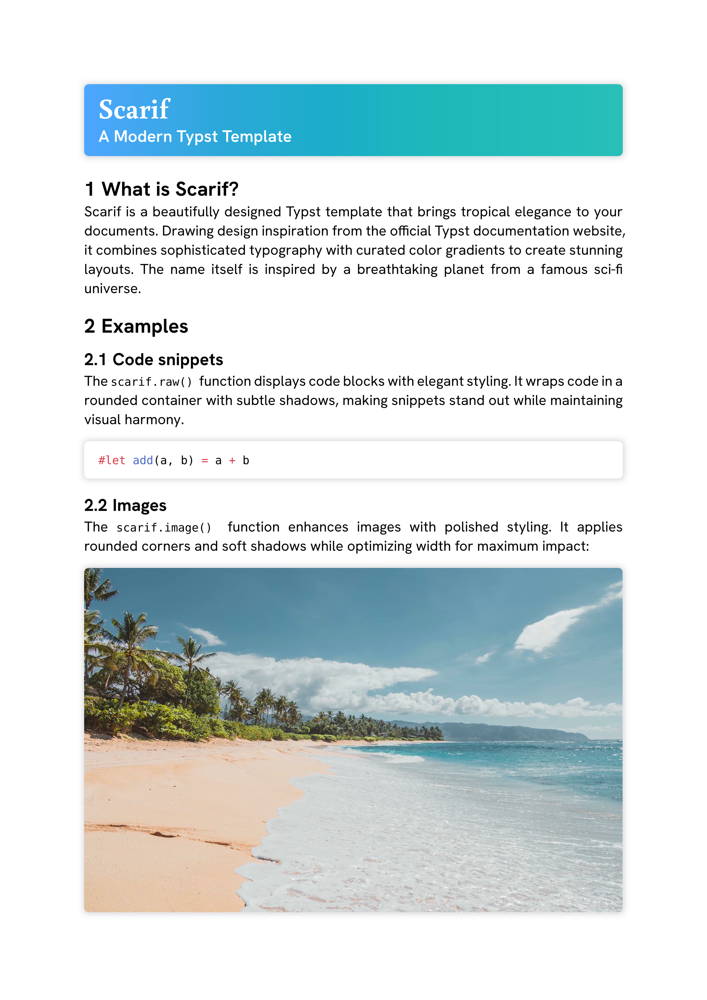
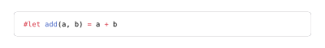
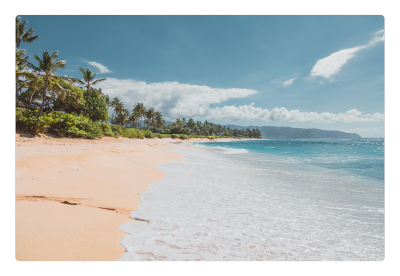

# Scarif

A beautifully designed [Typst](https://typst.app/) template that brings tropical elegance to your documents. Drawing design inspiration from the official Typst documentation website, Scarif combines sophisticated typography with curated color gradients to create stunning layouts.



## Installation

Add the package to your Typst document:

```typ
#import "@preview/scarif:0.1.0" as s

#show: s.template
```

Or use it with Typst CLI:

```sh
typst init @preview/scarif:0.1.0
```

**NOTICE:** Scarif requires the following fonts to be installed:

- [Buenard](https://fonts.google.com/specimen/Buenard)
- [Cascadia Mono](https://github.com/microsoft/cascadia-code)
- [HK Grotesk](https://hanken.co/products/hk-grotesk)

## Documentation

### Template

Apply Scarifs basic show rules with `template()`:

```typ
#show: scarif.template
```

To automaticly apply Scarifs show rules to `raw()` and `image()` enable them in the `template()` function:

```typ
#show: scarif.template.with(
  raw-show-rule: true,
  image-show-rule: true,
)
```

### Title

Create stunning title sections with optional subtitles and a fill:

```typ
#scarif.title(
  "This is a title",
  sub-title: "This is a sub title",
  fill: scarif.gradients.ruby,
)
```


#### Parameters

```typ
/// A document title
/// -> content
#let title(
  /// The title.
  /// -> content
  title,
  /// The optional sub title.
  /// none | content
  sub-title: none,
  /// How to fill the title header.
  /// color | gradient
  fill: gradients.lagoon,
) = { /* ... */ }
```

### Raw

Display code with elegant styling. You can either pass in the native arguments from `raw()` or a raw element.

```typ
#scarif.raw(```typ
#let add(a, b) = a + b
```)
```



#### Parameters

```typ
/// Raw text with optional syntax highlighting.
/// -> content
#let raw(
  /// The raw text or a raw element.
  ///
  /// If a raw element is supplied, its fields will override any fields set in
  /// this function.
  ///
  /// -> str | content
  text,
  /// Whether the raw text is displayed as a separate block.
  /// -> bool
  block: false,
  /// The language to syntax-highlight in.
  /// -> none | str
  lang: none,
  /// The horizontal alignment that each line in a raw block should have.
  /// -> alignment
  align: start,
  /// Additional syntax definitions to load.
  ///
  /// The syntax definitions should be in the sublime-syntax file format.
  ///
  /// -> str | bytes | array
  syntaxes: (),
  /// The theme to use for syntax highlighting.
  ///
  /// Themes should be in the tmTheme file format.
  ///
  /// -> none | auto | str | bytes
  theme: auto,
  /// The size for a tab stop in spaces.
  ///
  /// A tab is replaced with enough spaces to align with the next multiple of
  /// the size.
  ///
  /// -> int
  tab-size: 2,
) = { /* ... */ }
```

### Images

Enhance images with polished styling.

**NOTICE:** Currently the image can only be passed as `bytes`. This will change as soon as Typst 0.15 is released.

```typ
#scarif.image(read("beach.jpg", encoding: none))
```



#### Parameters

```typ
/// A raster or vector graphic.
/// -> content
#let image(
  /// Raw bytes making up an image in one of the supported formats.
  ///
  /// -> bytes
  source,
  /// The image's format.
  /// -> auto | str | dictionary
  format: auto,
  /// The width of the image.
  /// -> auto | relative
  width: auto,
  /// The height of the image.
  /// -> auto | relative
  height: auto,
  /// An alternative description of the image.
  /// -> none | str
  alt: none,
  /// The page number that should be embedded as an image.
  ///
  /// This attribute only has an effect for PDF files.
  ///
  /// -> int
  page: 1,
  /// How the image should adjust itself to a given area.
  /// -> str
  fit: "cover",
) = { /* ... */ }
```

## License

MIT License - see [LICENSE-MIT](LICENSE-MIT) for details.

Apache License 2.0 - see [LICENSE-APACHE](LICENSE-APACHE) for details.

## Credits

Inspired by the [Typst documentation website](https://typst.app/docs/) design.

Beach image by [Jess Loiterton](https://www.pexels.com/@jess-vide/) on [Pexels](https://www.pexels.com/) ([photo](https://www.pexels.com/photo/green-trees-on-brown-sand-beach-4608614/)), licensed under the [Pexels License](https://www.pexels.com/license/).
