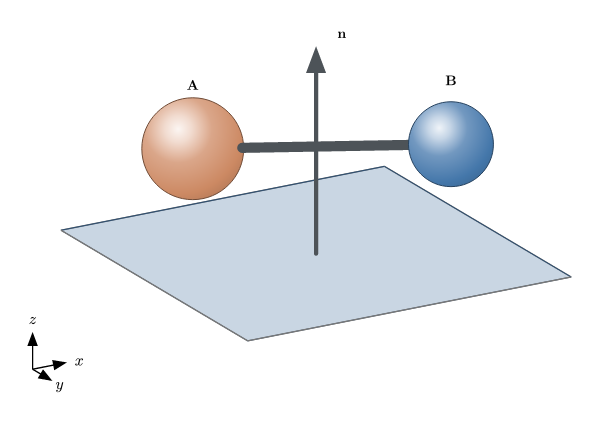
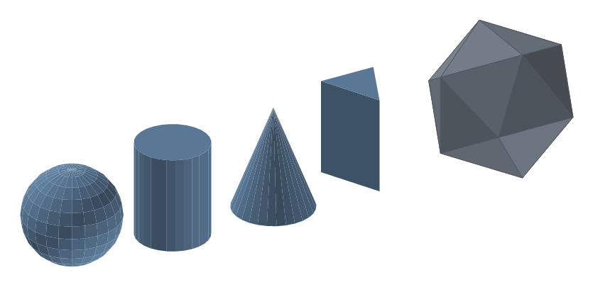
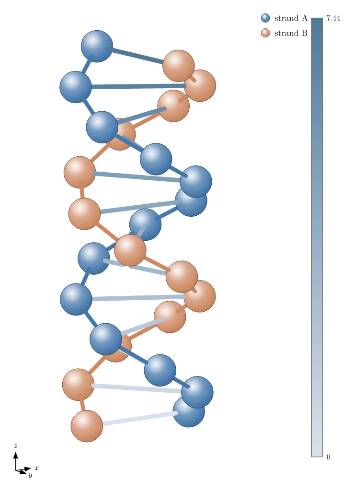
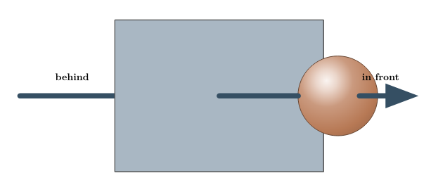
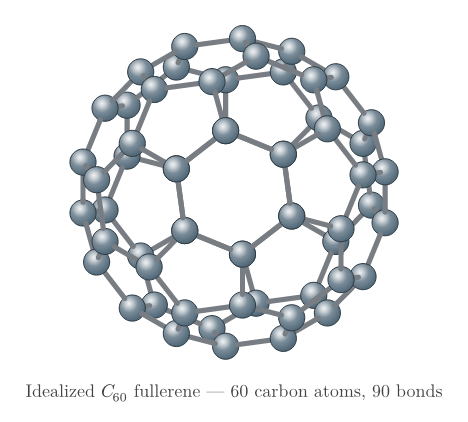

# scenery

[](https://github.com/GiggleLiu/scenery/actions/workflows/ci.yml)

Programmatic 3D (and 2D) scenes for [Typst](https://typst.app) — the missing 3D layer. Describe a figure as typed primitives (spheres, segments, arrows, faces, meshes, labels), choose an orthographic or perspective camera, and `scenery` projects, depth-sorts and paints the whole thing back-to-front with [CeTZ](https://typst.app/universe/package/cetz) — no external tools and no raster step. The same pipeline draws flat diagrams: `camera-2d()` passes coordinates straight through, so 2D figures and 3D scenes share one API.

The [manual source](manual.typ) is a comprehensive, example-driven showcase where each figure is generated by the exact code shown beside it. Build it with `make manual`; CI also publishes the compiled PDF as the `scenery-manual` artifact.

<table>
<tr>
<td align="center"><a href="examples/primitives.typ"></a><br>Primitive showcase — spheres, bonds, edges, an arrow, a translucent face, labels</td>
<td align="center"><a href="examples/solids.typ"></a><br>Parametric solids + a convex-hull icosahedron</td>
</tr>
<tr>
<td align="center"><a href="examples/flow.typ"></a><br>2D-mode flow graph via <code>camera-2d()</code></td>
<td align="center"><a href="examples/hero.typ"></a><br>Composite hero scene — axes triad, legend, colorbar</td>
</tr>
<tr>
<td align="center"><a href="examples/visibility.typ"></a><br>Visibility regression — an arrow correctly clipped by an opaque plane and sphere</td>
<td align="center"><a href="examples/c60.typ"></a><br>Idealized C<sub>60</sub> fullerene — 60 atoms and 90 bonds generated in Typst</td>
</tr>
</table>

The sources for these figures are in [`examples/`](examples/).

## Quick start

```typst
#import "@preview/scenery:0.1.0": build-scene, sphere, seg, camera, render-scene

#let scene = build-scene(
  sphere((0, 0, 0), 0.6),
  sphere((2, 0, 0), 0.6, color: rgb("#dd8452")),
  seg((0, 0, 0), (2, 0, 0)),
)

#render-scene(scene, camera(azimuth: 30deg, elevation: 20deg), width: 5cm)
```

`build-scene` collects primitives into pure scene data; `render-scene` resolves any named anchors, projects through a `camera`, and paints at the requested on-page `width`. That is the whole loop. (The examples in this repository import `/lib.typ` directly so they run against the working tree; in your own documents use the `@preview` import shown here.)

### Named objects and anchors

Give a primitive a unique `name:` and use CeTZ-style `"object.anchor"` references in primitive coordinate parameters (`center`, `a`/`b`, `from`/`to`, vertices, and label `at`):

```typst
#let scene = build-scene(
  sphere((0, 0, 0), 0.6, name: "a"),
  sphere((2, 0, 0), 0.6, name: "b"),
  seg("a", "b", name: "bond"),
  label("bond.mid", [d], text-anchor: "south"),
)
```

References may point forward because the complete scene registry is resolved at render time. A bare sphere name at a `seg`, `edge`, or `arrow` endpoint automatically attaches to the 3D surface facing the opposite endpoint; use an explicit anchor such as `"a.center"` or `"a.z+"` to override it.

Sphere compass anchors and angles such as `anchor-ref("a", anchor: 30deg)` are camera-relative points on the visible silhouette. The anchors `x+`, `x-`, `y+`, `y-`, `z+`, and `z-` are fixed world-space directions. `anchor-ref("a", anchor: (1, 1, 1))` normalizes an arbitrary 3D direction onto the sphere surface. `anchor-of(scene, camera, "bond.mid")` queries a concrete 3D point.

Shape-generator inputs and affine transform parameters remain concrete vectors; references belong to the primitives those APIs produce or transform. Automatic surface attachment is limited to direct references—use explicit anchors for deferred transformed references.

| Primitive | Default | Anchors |
| --- | --- | --- |
| `sphere` | `center` | `center`, compass directions, `x±`/`y±`/`z±`; angle or 3-vector via `anchor-ref` |
| `seg`, `edge`, `arrow` | `mid` | `start`, `mid`, `end` |
| `face` | `centroid` | `centroid`, `vertex-0`, `vertex-1`, … |
| `mesh` | bounding-box `center` | `center`, `vertex-0`, `vertex-1`, … |
| `label` | `center` | attachment-point `center` |

Inside a shared `cetz.canvas`, `scene-group` registers these logical anchors with CeTZ, so later draw commands can directly use `"a.east"` or `"bond.mid"`. Names stay stable even when the renderer splits a line for occlusion. Set `register-anchors: false` when a large composed scene does not need later CeTZ references; standalone `render-scene` does this automatically.

### Imports

**Import names explicitly — never `#import "@preview/scenery:0.1.0": *`.** scenery exports `scale`, `label` and `group`, which would shadow Typst built-ins (`scale`, `label`) or common variables if wildcard-imported. Name exactly what you use, as in the quick start above. If you want scenery's `scale`/`label` alongside the built-ins, rename on import: `#import "@preview/scenery:0.1.0": scale as sscale, label as slabel`.

## How it works

A scene is a flat array of typed primitives — plain dictionaries tagged by `kind`, e.g. `(kind: "sphere", center: (0,0,0), r: 0.6)`. Nothing in the data model touches CeTZ. At render time named coordinates are resolved for the selected camera, then each primitive is projected orthographically or with perspective foreshortening. Segments, edges, and arrows are split at opaque sphere silhouettes and planar face boundaries; intervals genuinely hidden by an opaque object are removed. Opaque meshes cull rear faces by default, while translucent meshes retain both sides with quieter rear strokes. The remaining primitives are keyed by camera depth (spheres by centre, line fragments by midpoint, faces by centroid), sorted far-to-near, and drawn. For intersecting geometry, `depth-key: "back"` or `"front"` anchors a primitive at its farthest or nearest support point instead of the default centre key. The optional `engine: "wasm"` backend additionally BSP-splits intersecting translucent faces. Spheres use radial-gradient shading, faces are flat-shaded from one world light, and labels stay on top. Styling is a pure three-layer merge — theme defaults, per-kind block, then each primitive's own hooks — so colours and widths are just named arguments on the constructors.

## API reference

Grouped by source module; every name below is exported from the package root.

`scenery-version` is the package version as a Typst `version` value.

### Scene construction — `sphere`, `seg`, `edge`, `arrow`, `face`, `mesh`, `label`

| Name | Description |
| --- | --- |
| `sphere(center, r, name:, ..style)` | Shaded ball at `center` with radius `r`. |
| `seg(a, b, name:, ..style)` | Thick round-capped segment (e.g. a bond); width `w` in scene units. |
| `edge(a, b, name:, ..style)` | Thin wireframe edge (absolute stroke width). |
| `arrow(from, to, name:, ..style)` | Arrow with a scaled head (`head`, `w`). |
| `face(pts, name:, ..style)` | Filled planar polygon; `fill-opacity`, optional `cull`, and `depth-key` (`"center"`/`"back"`/`"front"`). |
| `mesh(vertices, faces, name:, ..style)` | Indexed polygon mesh; adaptive back-face culling, `cull`, and `hidden-stroke`. |
| `label(at, text, name:, ..style)` | Text at a 3D point; `text-anchor` controls alignment. |
| `build-scene(..prims)` | Flattens primitives/groups and validates object names. |

### Named coordinates — `anchor-ref`, `resolve-scene`, `anchor-of`, `anchor-names`

| Name | Description |
| --- | --- |
| `anchor-ref(name, anchor:)` | Explicit named anchor, screen-plane angle, or world-space 3-vector direction. |
| `resolve-scene(scene, camera)` | Resolves every reference and camera-relative anchor to concrete geometry. |
| `anchor-of(scene, camera, reference)` | Returns one anchor as a concrete 3D point. |
| `anchor-names(scene, camera, name)` | Lists the named anchors available on an object. |

### Transforms — `affine`, `translate`, `scale`, `group`

| Name | Description |
| --- | --- |
| `affine(matrix:, offset:)` | Affine transform `p ↦ matrix·p + offset`. |
| `translate(v)` | Pure translation by `v`. |
| `scale(s)` | Uniform scale about the origin (positions only, not radii). |
| `group(transform, ..prims)` | Applies a transform to a bag of primitives/subgroups. |

### Camera — `camera`, `camera-2d`, `project`, `project-scale`

| Name | Description |
| --- | --- |
| `camera(azimuth:, elevation:, mode:, distance:)` | Orthographic (default) or perspective camera; `distance` controls perspective strength. |
| `camera-2d()` | Identity camera: `(x, y)` passes straight through. |
| `project(cam, point)` | Maps a 3-point to `(sx, sy, depth)`. |
| `project-scale(cam, depth)` | Screen-per-world scale at a projected depth; `1.0` outside perspective mode. |

### Shape generators — `hull-faces`, `uv-sphere`, `cylinder`, `cone`, `prism`

| Name | Description |
| --- | --- |
| `hull-faces(points)` | Convex-hull face records `(plane, vertices)`; `none` if degenerate. |
| `uv-sphere(center, r, segments:, rings:)` | UV-sphere mesh. |
| `cylinder(from, to, r, segments:, caps:)` | Cylinder mesh along an axis. |
| `cone(from, to, r, segments:, cap:)` | Cone mesh, base at `from`, apex at `to`. |
| `prism(base, extent, caps:)` | Polygon `base` extruded by `extent`. |

### Rendering — `render-scene`, `scene-group`, `sort-prims`

| Name | Description |
| --- | --- |
| `render-scene(scene, camera, width:, theme:, axes:, legend:, colorbar:, engine:)` | Renders a scene to Typst content; `engine` is `"typst"` (default) or `"wasm"`. |
| `scene-group(scene, camera, register-anchors:, engine:, ..)` | Raw CeTZ commands; optionally registers logical names and selects the geometry engine. |
| `sort-prims(prims, camera)` | Pure depth-sort (far-to-near) with meshes exploded to faces. |

### Styling — `default-theme`, `resolve-style`, `palette-color`

| Name | Description |
| --- | --- |
| `default-theme` | Built-in theme: qualitative palette, light direction, per-kind defaults. |
| `resolve-style(theme, prim)` | Effective style for a primitive (defaults ← per-kind ← hooks). |
| `palette-color(theme, i)` | Palette colour `i`, wrapping around. |

### Annotation — `axes-triad`, `legend`, `colorbar`

| Name | Description |
| --- | --- |
| `axes-triad(camera, vectors, names:, ..)` | Labelled orientation triad (CeTZ commands). |
| `legend(entries, ..)` | Stacked `(label, color)` swatches with shaded balls. |
| `colorbar(colormap, range, ..)` | Vertical scalar colorbar with min/mid/max ticks. |

`render-scene`'s `axes:` / `legend:` / `colorbar:` options place these three automatically (triad bottom-left, legend and colorbar on the right), so the [hero example](examples/hero.typ) wires all three with a few named arguments.

Adaptive culling assumes a closed, approximately convex mesh with its centre inside—the scientific solids generated here satisfy that convention. For an open or strongly concave custom mesh, use `cull: none` or provide an explicit face policy.

### Linear algebra — `vadd`, `vsub`, `vscale`, `vdot`, `vcross`, `vlen`, `vnorm`, `mvec`, `lerp`

Small pure vector/matrix helpers (`mvec` is matrix·vector, `lerp` interpolates) shared by the geometry code and available for building your own primitives.

## Limitations

- **Perspective has no near-plane clipping.** Every point must remain in front of the perspective camera; increase `distance` if rendering reports a point at or behind it.
- **The default engine uses a painter's algorithm.** Faces use one depth key, so intersecting translucent faces can layer incorrectly with `engine: "typst"`. The optional WASM engine BSP-splits those faces; neither backend provides a z-buffer.
- **The pure-Typst path has a practical size cap.** Compile time grows with primitive count. Use `engine: "wasm"` for larger scenes and for translucent BSP splitting.
- **Limited hidden-surface removal.** Opaque spheres and planar faces clip hidden line intervals, and opaque meshes cull rear faces. There is still no z-buffer; non-planar and cyclic intersections rely on painter ordering.

## Roadmap

Further scene-core enhancements are tracked in [issue #17](https://github.com/GiggleLiu/scenery/issues/17).

## Development

```bash
make test       # compile every test suite in tests/
make examples   # compile every example in examples/ (CI coverage)
make images     # render examples/*.typ to images/*.png at 144 ppi
```

From the monorepo root, `make test` and `make examples` fan out across all packages and resolve local `@preview` imports via `TYPST_PACKAGE_PATH`.

## License

MIT — see [LICENSE](LICENSE).
