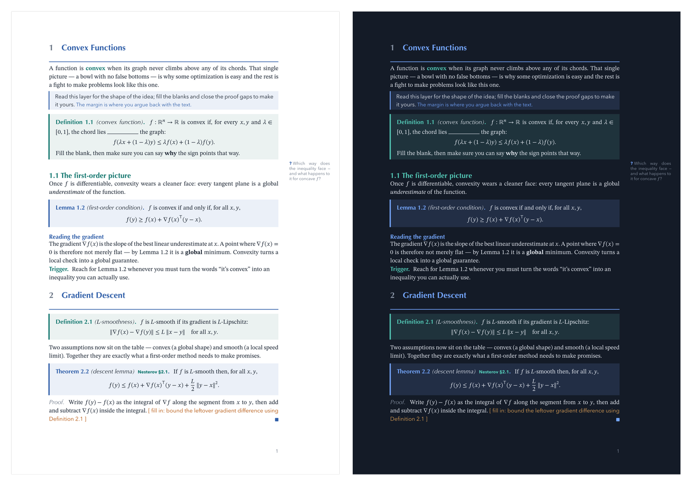
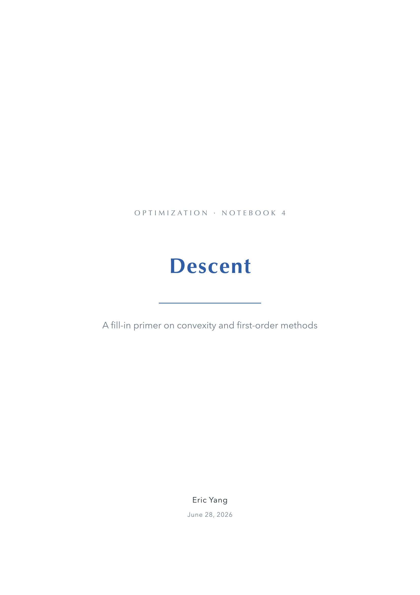
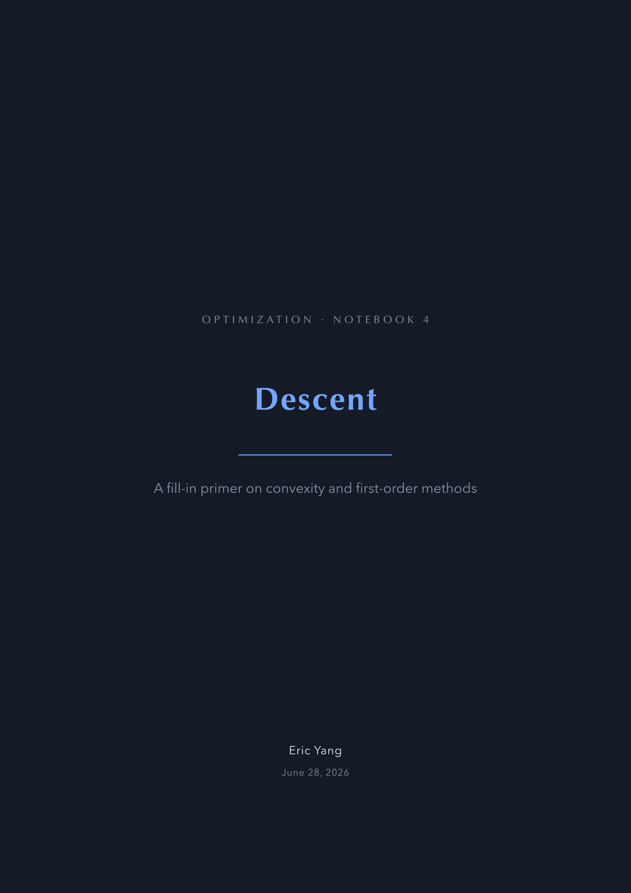

# Scholia

Fill-in study notes for STEM: read one layer, *fill* the other. Theorem **knots**,
intuition **notes**, margin **threads**, and `fillin` blanks — in light or dark.



Most notes are read-only and forgotten by the next page. Scholia typesets the
*active* layer too: statements and intuition to take in, blanks and proof-skeletons
to work out. The source is your answer key.

> Start a new notebook with `typst init @preview/scholia`, or import the library:

## Use

```typ
#import "@preview/scholia:0.1.0": *

// options: theme: "light" | "dark" · prose: "notes" | "book" · fonts: (…)
#show: scholia

#cover("Title", subtitle: "subtitle", author: "Your Name", date: "2026")

= First course

#note[The big idea, in your own words. The passive layer.]

#definition[a name][State the object, leave a clause blank: #fillin(width: 3cm).] <def:thing>

#theorem[attribution][State the result, then refer back to @def:thing.] <thm:main>
#proof[Skeleton: (i) … (ii) … #TODO[the step that makes it work]]

#yourturn[Restage it as your own computation. #workspace(n: 3)]
```

Knots are built on [`@preview/frame-it`](https://typst.app/universe/package/frame-it):
each is a `figure`, so they get **native `@label` cross-references** and shared,
section-tied numbering for free. The title is the first argument, the body the
last: `#theorem[title][body]` (omit the title with `#theorem[body]`). An optional
middle slot is a small **tag** — a source or claim-ID, styled by `label-it`:
`#theorem[title][GSM 211, Thm 2.16][body]`.

Compile [`examples/example.typ`](examples/example.typ) to see every device in one
mini-chapter. It defaults to the light `notes` theme; uncomment the `theme: "dark"`
or `prose: "book"` line at the top to see the other modes.

## The toolkit

| you want… | you write… |
|---|---|
| the cover | `cover(title, subtitle: …, author: …, date: …, kicker: …)` |
| a result (blue) | `theorem[t][b]` · `lemma` · `proposition` · `corollary` · `conjecture` · `claim` |
| a definition (teal) | `definition[t][b]` · `axiom` · `assumption` · `notation` |
| an example / remark (amber / plain) | `example[t][b]` · `remark[b]` |
| cross-reference a knot | label with `<thm:x>`, refer with `@thm:x` (native) |
| a source / claim-ID tag | a middle slot `theorem[t][tag][b]`, or `label-it[…]` inline |
| the intuition voice | `note[…]` · `whisper[…]` · `keyword[…]` |
| a blank to fill | `fillin(width: 2.2cm)` |
| a proof gap | `TODO[the missing step]` |
| a do-it-yourself box | `yourturn[…]` + `workspace(n: 3)` |
| a margin note | `sidenote[…]` · `recall[…]` (the `?` preset) |

## Options (`#show: scholia.with(…)`)

| option | values | effect |
|---|---|---|
| `theme` | `"light"` (default) · `"dark"` | swaps the whole colour card — page, text, knots, accents (dark = slate) |
| `prose` | `"notes"` (default) · `"book"` | notes = no indent + paragraph spacing; book = first-line indent + tight |
| `paper` | `"a4"` (default) · `"us-letter"` · … | page size |
| `fonts` | dict overriding `default-fonts` | e.g. `(heading: ("Gill Sans",))` |

| Light | Dark |
|:---:|:---:|
|  |  |

## Fonts

Every role is a **fallback list — the nice face first, an embedded face last** — so
output never breaks and degrades gracefully when a font is missing:

| role | default list |
|---|---|
| body | `("STIX Two Text", "Libertinus Serif")` |
| math | `("STIX Two Math", "New Computer Modern Math")` |
| heading | `("Optima", "Libertinus Serif")` |
| sans (intuition voice) | `("Avenir Next", "Libertinus Serif")` |
| mono | `("Menlo", "DejaVu Sans Mono")` |

A Typst package cannot ship fonts, so the universal baseline is Typst's four
embedded faces (Libertinus Serif, New Computer Modern + Math, DejaVu Sans Mono).
For the intended look install **STIX Two** (Text + Math, free/OFL); on macOS, Optima
and Avenir Next are already present. Override any role via `fonts:`, or retune the
defaults in [`src/fonts.typ`](src/fonts.typ).

## Known limitations

- Subsection / subsubsection are styled blocks, not true run-in headings.
- A `fonts:` override reaches body / math / heading; the `note` voice and knot labels
  still read `default-fonts` directly (full theming is a later pass).

## Internals

`src/` is modular: [`colors.typ`](src/colors.typ) (palettes + theme state) ·
[`fonts.typ`](src/fonts.typ) · [`visual.typ`](src/visual.typ) ·
[`theorems.typ`](src/theorems.typ) (frame-it knots) ·
[`lib.typ`](src/lib.typ) (pedagogy, margins, cover, wrapper).

## License & credits

MIT © Eric Yang. An independent Typst reimplementation, inspired by the design of the
[loom-notes](https://github.com/Polaris-Aeterna/loom-notes) XeLaTeX project (no source
code reused). Example notes restate cited results for educational use; the mathematics
belongs to its authors.
