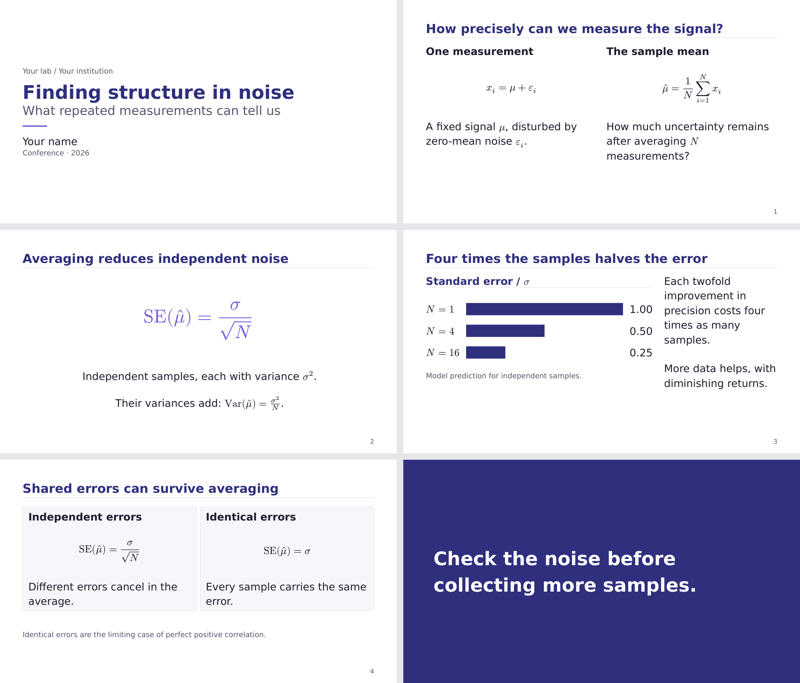

# sci-brain-slides

Scientific presentation slides for Typst, built on [Touying](https://typst.app/universe/package/touying/).
Five color themes, nine reusable layouts, and components for figures, equations,
tables, and conclusions. Extracted from the
[sci-brain](https://github.com/QuantumBFS/sci-brain) `write-slides` skill.



[Starter PDF](docs/starter.pdf) · [Full gallery PDF](docs/gallery.pdf) ·
[Layout guide](docs/layout-patterns.md) · [Style tokens](docs/style-tokens.md)

## Get started

Install Typst 0.13.1 or newer and [DejaVu Sans](https://dejavu-fonts.github.io/).
On Debian or Ubuntu, the font is in `fonts-dejavu-core`. Math and monospace fonts
are bundled with Typst.

```sh
typst init @preview/sci-brain-slides:0.1.0 my-talk
cd my-talk
typst compile main.typ
```

To try a theme or larger text, compile with
`--input theme=dark --input text-size=22`.

## Write a talk

```typst
#import "@preview/sci-brain-slides:0.1.0": *

#let deck = setup(theme: "academic", text-size: 22pt)
#let (twocol,) = deck.layouts
#show: deck.theme.with(
  config-info(title: [Measuring a noisy signal], author: [Your name]),
)
#title-slide()

== What does averaging change?
#twocol([
  *One measurement*
  $ x_i = mu + epsilon_i $
  The signal plus a random error.
], [
  *Many independent measurements*
  $ "SE"(hat(mu)) = sigma / sqrt(N) $
  Uncertainty falls as the sample count grows.
])

#focus-slide[Check the noise before collecting more samples.]
```

`==` starts a content slide. `=` introduces a section divider. `#pause` reveals
more content on another PDF page, retaining the slide number. `#focus-slide[...]`
creates a full-color statement with no running header or footer.

Use [the starter source](template/main.typ) as a complete talk and
[the gallery source](gallery.typ) for individual examples. Bind only the names
you use from `deck.layouts` and `deck.gadgets`.

## Choose a layout

| Layout | Use |
|---|---|
| `spread` | Wide figure beside a narrower interpretation column |
| `twocol` | Two equal columns for a comparison |
| `threecol` | Three parallel concepts |
| `hero` | One centered equation or statement |
| `band` | One row of equal-width items |
| `cards` | A grid of related cards |
| `card` | A single bordered panel |
| `punch` | A quantity emphasized within a statement |
| `centered_figure` | A visual with a caption |

The starter uses `twocol`, `hero`, `spread`, and `cards`, then closes with a
focus slide. The [gallery](docs/gallery.pdf) demonstrates every layout and
component; the layout examples begin on page 10.

Figure frames, callouts, statistics, tables, theorem and proof boxes, and
conclusion components are documented in the [layout guide](docs/layout-patterns.md).
Pass ready-made image content, such as `image("figure.svg")`, to image helpers
so paths resolve in your talk's directory.

## Themes and text size

| Theme | Appearance |
|---|---|
| `academic` | Indigo and lavender on white |
| `dark` | Light text and gold accents on slate |
| `minimal` | Black on white |
| `vibrant` | Teal and magenta on white |
| `brand` | Colors derived from a primary color |

```typst
#let deck = setup(theme: "brand", primary: rgb("#aa1e2b"), text-size: 22pt,
  sizes: (xlarge: 36pt, caption: 16pt, chrome: 12pt))
#show: deck.theme.with(font: "DejaVu Sans", lang: "en",
  config-info(title: [My talk]))
```

The default body text is 20 pt. `text-size` scales the typography; `sizes`
overrides individual tokens afterward. Available tokens are `xlarge`, `large`,
`normal`, `caption`, and `chrome`. Values must be positive absolute lengths.
Use `deck.sizes` for custom text and `deck.palette` for custom colors.

Margins and fixed figure dimensions do not scale with the text. The starter
fits at 20, 22, and 24 pt in all five themes. The template never shrinks content
automatically. Recompile and inspect the PDF after changing text, fonts, or
page dimensions; shorten or split an overfull slide.

The default footer shows only a slide number. Repeated footer text and a
progress bar are optional via `footer: [...]` and `footer-progress: true`.
Labels preserve the capitalization you write. See [style tokens](docs/style-tokens.md)
for page geometry, palette fields, and typography defaults.

## Development

Python 3.11 or newer is needed only for the checks:

```sh
python3 tests/check.py
python3 tests/check.py --typst /path/to/another/typst --output /tmp/slides-check
git diff --check
```

The checks initialize a fresh project, compile every theme, verify the starter
at three text sizes, and exercise invalid inputs, custom colors, local images,
long titles, reveal timing, and optional diagrams. Generated PDFs go into
`previews/`. CI runs the same checks on Typst 0.13.1 and 0.15.1.

Core slides use Touying 0.6.1. Optional diagram helpers load CeTZ 0.4.2;
annotation helpers load pinit 0.2.2. All dependency versions are pinned.

See the [changelog](CHANGELOG.md) for releases. Bug reports should include a
minimal `.typ` example, Typst version, and the theme and text size used.

## License

[MIT](LICENSE). The initial components came from sci-brain's `write-slides/zoo`
library. Touying is distributed under its own license. Sample values are
analytical examples; all sample graphics are drawn from source in this repository.
