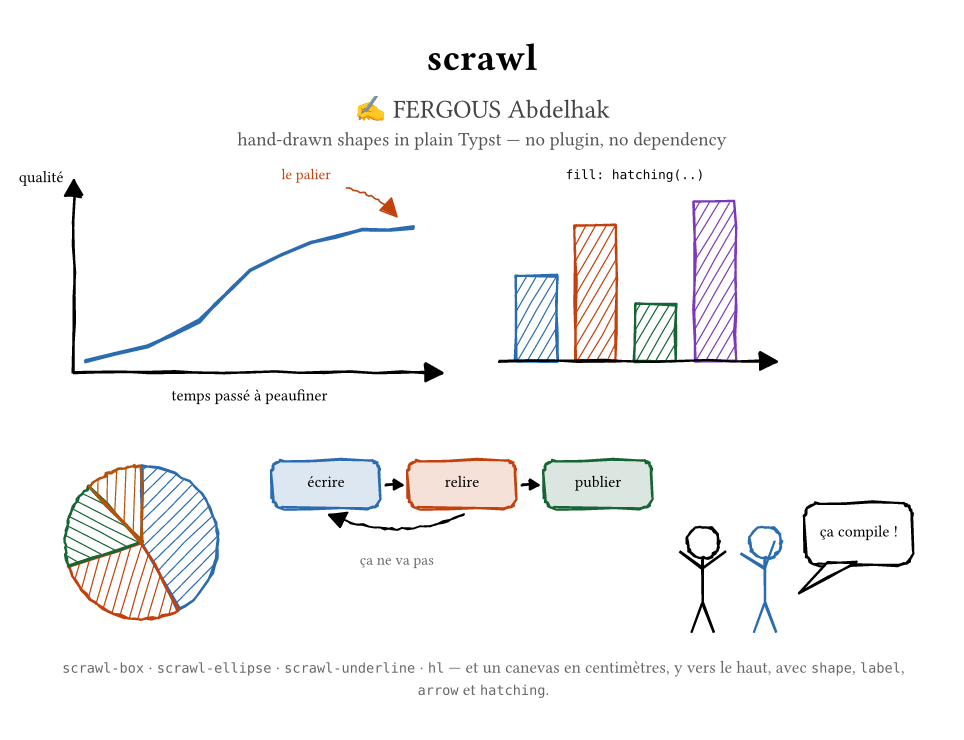

# scrawl

Hand-drawn shapes in **plain Typst**. No plugin, no dependency, nothing
downloaded — just Typst's own `curve`.

```typ
#import "@preview/scrawl:0.1.0": *

#scrawl-box(fill: rgb("#fffbe6"))[a hand-drawn frame]
```



**[The full showcase](examples/showcase.pdf)** — 18 figures: line charts, bar
graphs, pie charts, Venn diagrams, stick figures, linked diagrams, hatching,
roughness levels — each one *beside the code that made it*. The code shown is
the code that ran: the page evaluates the same source it prints, so the two
cannot drift apart. It also refuses to compile if a code line grows past the
column, because a wrapped line loses its indentation and gets copied wrong.

A scrawled shape is an ordinary Typst element: it measures, nests and flows
like any other, so it can sit in a table cell, a grid or a figure. Nothing
here loads a WASM binary — which matters if your document has to build on a
machine with no network, or if you would simply rather not ship a compiled
blob to draw a wobbly rectangle.

## The three shortcuts

```typ
#scrawl-box(fill: rgb("#fffbe6"))[a frame]
#scrawl-ellipse(paint: green)[circled]
Some #scrawl-underline[underlined] text.
```

They measure their content, so the frame fits what is inside instead of a
size guessed in advance.

## The canvas

Coordinates in **centimetres**, y running **up** — the way one thinks about
a drawing. The body receives the drawing helpers, already bound to the
canvas:

```typ
#scrawl(width: 15cm, height: 4.5cm,
        (shape, lines, region, rough, label, arrow) => {
  shape(rounded-rect-pts((0.2, 0.2), (4.6, 4.2), radius: 0.35),
    paint: rgb("#2B6CB0"), fill: rgb("#EAF2FB"))
  shape(circle-pts((7, 2.2), 1.6), paint: rgb("#C2410C"))
  arrow((10, 0.5), (14, 3.5))
  label((12, 4.2), [a label])
})
```

The body receives six helpers, already bound to the canvas:

| | |
|---|---|
| `shape(pts, ..)` | a contour: `fill`, `paint`, `weight`, `closed`, `seed` |
| `lines(paths, ..)` | several polylines in one `curve` |
| `region(contours, ..)` | fill with holes punched through (even-odd) |
| `rough(contour, ..)` | the wobbly stroke on its own |
| `label(pos, body, ..)` | text at a canvas coordinate — `anchor`, `dx`, `dy` |
| `arrow(from, to, ..)` | a line with a solid head — `head`, `weight`, `bend` |

`label` and `arrow` exist so a figure reads like the drawing it is.
Positioning text used to mean writing `place(dx: 5cm, dy: height - 2cm)` by
hand — the very conversion `scrawl` is there to spare you, and getting the
sign wrong sent the label off the canvas silently.

Point lists come from `rect-pts`, `rounded-rect-pts`, `circle-pts` and
`arc-pts`, or you write the tuples yourself — a contour is just an array of
`(x, y)`.

## Hatching

`hatching(..)` goes where a colour would, because the hatching *is* the fill:

```typ
#scrawl(width: 8cm, height: 3cm, (shape, ..) => {
  shape(circle-pts((1.6, 1.5), 1.3), paint: black,
    fill: hatching(rgb("#2B6CB0"), angle: 45deg, gap: 0.2))
  shape(rect-pts((3.6, 0.3), (5.6, 2.7)), paint: black,
    fill: hatching(rgb("#C2410C"), cross: true))
})
```

| | |
|---|---|
| `angle`, `gap` | direction and spacing of the lines |
| `cross: true` | a second pass at right angles |
| `backdrop` | a flat colour under the lines, so text stays readable |
| `weight` | thickness of a hatch line |

It is a scanline sweep obeying the **even-odd** rule, so a concave shape
hatches correctly and a second contour punches a hole — pass a list of
contours and they are treated as one region. The lines wobble by the
amplitude of the *shape*, not their own: otherwise a short segment near a
corner would shake harder than the long one across the middle, and the fill
would look sorted by length.

## Arrows

`arrow(from, to, bend: 0.25)` curves the shaft, and the head follows the
**tangent** rather than the straight line between the ends — a curved arrow
that pointed along its own chord would miss what it points at. `bend` is
relative to the length, so the same value gives the same-looking arc between
two neighbouring boxes or across the page.

The head is capped at 55 % of the arrow's length. Between two boxes 4 mm
apart the fixed 0.32 cm head left nothing but a triangle and two pixels of
shaft — the diagram in the showcase had exactly that defect.

## What you can turn

| | |
|---|---|
| `roughness` | `0` is ruler-clean, `1` the default, `2.5` a loose doodle |
| `hand: false` | no wobble at all, same geometry |
| `seed` | the same seed gives the same wobble, every build |
| `damping: false` | let long edges wobble as much as short ones |
| `weight`, `paint`, `fill` | as you would expect |

## Two details that make it work

**A four-point rectangle cannot look hand-drawn.** A rough stroke only
deviates where there is a vertex, so a long straight edge stays
ruler-straight however high the roughness. Every edge is resampled into
~0.42 cm steps first — that is what makes the effect exist at all.

**A hairline must wobble less than an edge**, or the deviation is several
times the line's own width and a 0.4 pt rule turns into a scribble. Below
0.9 pt only one pass is drawn, because doubling a thin rule merely doubles
the ink and reads as bold rather than as pencil.

By the same reasoning, long edges are damped: a page-tall table rule that
shook like a small box would look wrong on a form. That is the default —
`damping: false` turns it off when you are drawing a loose sketch and want
the wobble proportional.

## Determinism

The same `seed` produces the same wobble on every compile, so a document
builds byte-for-byte identically. A form that reshuffled its own lines
between builds would be unusable for anyone who files them.

## Under the hood

`rough-amp(pts, ..)` gives the wobble amplitude of a contour and
`jitter(paths, ..)` displaces point lists — the two halves of the engine,
exposed because the hatching needs them and so might you.

## Also included

`hl(body)` — a highlighter swipe behind inline text, drawn with the same
pen. Named `hl` and not `highlight` so Typst's own flat-rectangle
`#highlight` stays reachable.

## Licence

MIT.

FERGOUS Abdelhak
