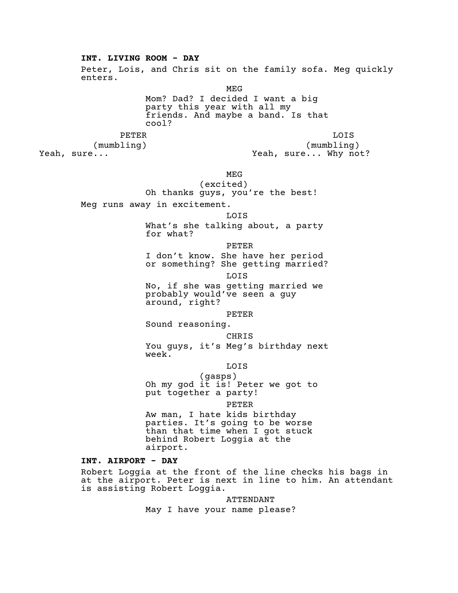

screen-scripted
===============

<!--toc:start-->
- [screen-scripted](#screen-scripted)
  - [Fonts](#fonts)
  - [Functions](#functions)
    - [`scripted`](#scripted)
    - [`slugline`](#slugline)
    - [`minislug`](#minislug)
    - [`dialogue`](#dialogue)
    - [`dual-dialogue`](#dual-dialogue)
    - [`montage`](#montage)
    - [`transition`](#transition)
    - [`character`](#character)
  - [Configuration](#configuration)
    - [`check-strict`](#check-strict)
    - [`bold-slugs`](#bold-slugs)
    - [`dialogue-cont`](#dialogue-cont)
    - [`slug-dashes`](#slug-dashes)
    - [`cont-str`](#cont-str)
  - [Barebones Template](#barebones-template)
<!--toc:end-->

Format TV and film screenplay drafts with helpers for scene headings, dialogue, montages, and transitions. The main feature is automatic dialogue continuation across page breaks: split dialogue receives a `(MORE)` marker before the break and a repeated character cue with `(CONT'D)` on the following page.

The formatting is based primarily on the Academy of Motion Picture Arts and Sciences' [screenplay formatting sample](https://www.oscars.org/sites/oscars/files/scriptsample.pdf) and StudioBinder's [screenplay formatting guide](https://www.studiobinder.com/blog/how-to-write-a-screenplay/).


```typ
#import "@preview/screen-scripted:0.1.0": *

/*
  Season 5, episode 10 of "Family Guy"

  Certain copyrighted materials appear in this work
  without permission from the copyright holder and is
  used under a good-faith claim of fair use
*/
#show: scripted.with(
  title: "Stuck Behind Robert Loggia",
  authors: "Seth Macfarlane",
  date: datetime(month: 8, day: 20, year: 2026),
  version: "0.0.1",
  info: [
    probablysethsemail\@domain.com \
    (555) 555-5555
  ],
  config: (
    /*
      Enable/disable input checking for some package functions
      Example: Sluglines should only expect "INT" or "EXT" 
    */
    check-strict: true,
    /*
      Control the slugline formatting
    */
    bold-slugs: true,
    /*
      Set to "false" for manual dialogue continuation.
    */
    dialogue-cont: true,
    /*
      Some templates use "--" whereas others use "-". Choose
      whichever version you prefer
    */
    slug-dashes: "single",  // "single" | "double"
    /*
      Customize the continued-dialogue marker if needed
    */
    cont-str: "CONT'D",
  )
)

/*
  The "character" function prepares variables ready to be
  reused throughout the document, which is ideal for placeholder
  names, or names that may change later.
*/
#let (char1, char1-fl) = character("Peter", "Griffin")
#let (char2, char2-fl, char2-full) = character("Lois", "Patrice", "Griffin")
#let (char3, char3-fl) = character("Chris", "Griffin")
#let (char4, char4-fl) = character("Robert", "Loggia")
#let (char5) = character("Meg")

#slugline[int][living room][day]

#char1, #char2, and #char3 sit on the family sofa. Meg quickly enters.

#dialogue[#char5][
  Mom? Dad? I decided I want a big party this year with all my friends. And maybe a band. Is that cool?
]

#dual-dialogue(
  dialogue[#char1][
    (mumbling) \
    Yeah, sure\... 
  ],
  dialogue[#char2][
    (mumbling) \
    Yeah, sure\... Why not? 
  ]
)

#dialogue[#char5][
  (excited) \
  Oh thanks guys, you're the best! 
]

Meg runs away in excitement.

// Below is not rendered in the sample image and is used
// to highlight additional features
 
/*
  There's also helpful shorthands that can be optionally used
*/
#d[#char1][  // dialogue
  Ugh\...
]

#sl[e][griffin house][d]  // slugline with EXT and DAY shorthands
#t[cut to]  // transition
#sl[i][kitchen][d]  // slugline with INT and DAY shorthands

Stewie prepares mail to be sent out while Brian reads the newspaper.
```



## Fonts

[Courier Prime](https://quoteunquoteapps.com/courierprime/) is the recommended font for this package. DejaVu Sans Mono is the fallback font if Courier Prime is not detected in the system font library.

If Courier Prime is not installed in your system by default, it is highly recommended to download it from either:

- [The official Courier Prime website](https://quoteunquoteapps.com/courierprime/)
- [Google Fonts](https://fonts.google.com/specimen/Courier+Prime)
- [The Courier Prime source repository](https://github.com/quoteunquoteapps/CourierPrime)

## Functions

### `scripted`

```typ
scripted(
  title: "",
  authors: (),
  date: datetime.today(),
  version: "",
  info: [],
  config: (:),
  body,
)
```

Applies the screenplay layout to `body`, including the title page, US Letter page dimensions, margins, page numbering, and screenplay typography. It is normally used as a show rule with `#show: scripted.with(..)`.

- `title`: The screenplay title shown on the title page.
- `authors`: One author as a string, or multiple authors as an array of strings.
- `date`: A `datetime` displayed on the title page.
- `version`: An optional draft or version label. An empty string hides it.
- `info`: Contact or other identifying content placed at the bottom of the title page.
- `config`: A dictionary containing any of the [configuration options](#configuration). Unspecified options use their defaults.
- `body`: The screenplay content. A show rule supplies this argument automatically.

### `slugline`

```typ
slugline(intext, location, time)
```

- `intext`: The interior or exterior marker, normally `INT` or `EXT`. `I` and `E` are accepted as shorthands.
- `location`: The scene location.
- `time`: The scene time. `D` and `N` are accepted as shorthands for `DAY` and `NIGHT`.

All three arguments are automatically capitalized. Formatting and validation are controlled by [`check-strict`](#check-strict), [`bold-slugs`](#bold-slugs), and [`slug-dashes`](#slug-dashes). The shorthand function is `sl`.

### `minislug`

```typ
minislug(location)
```

- `location`: The short scene heading to display.

The location is automatically capitalized and follows the [`bold-slugs`](#bold-slugs) setting. The shorthand function is `ms`.

### `dialogue`

```typ
dialogue(name, ext: "", cont: false, body)
```

- `name`: The character cue. It is automatically capitalized.
- `ext`: An optional cue extension such as `"V.O."` or `"O.S."`.
- `cont`: Whether the first cue should be marked with the configured continuation text.
- `body`: The dialogue content. This is a required content argument.

When [`dialogue-cont`](#dialogue-cont) is `true`, dialogue that crosses a page boundary is handled automatically: `(MORE)` is placed at the bottom of the earlier page, and the character cue is repeated with the configured continuation text on the next page. Set `dialogue-cont` to `false` to manage page-break continuation manually with `cont: true`.

```typ
#dialogue("Alex", ext: "V.O.")[
  This dialogue body may continue across a page break.
]
```

The shorthand function is `d`.

### `dual-dialogue`

```typ
dual-dialogue(d1, d2)
```

- `d1`: The dialogue content displayed in the left column.
- `d2`: The dialogue content displayed in the right column.

Creates a two-column block for simultaneous dialogue. Pass a [`dialogue`](#dialogue) call for each argument.

### `montage`

```typ
montage(desc, body)
```

- `desc`: A short description used in the montage heading. It is automatically capitalized.
- `body`: The montage content. This is a required content argument.

An `END MONTAGE` marker is added after the body automatically.

### `transition`

```typ
transition(tr)
```

- `tr`: The transition text, such as `CUT TO` or `FADE OUT`.

The transition is automatically capitalized and right-aligned. The shorthand function is `t`.

### `character`

```typ
character(..args)
```

Creates reusable variants of a character name. It accepts one to three name strings:

- One string returns the first name.
- Two strings return `(first, first-last)`.
- Three strings return `(first, first-last, first-middle-last)`.

```typ
// Example usage
#let (alice, alice-fl, alice-full) = character("Alice", "Barney", "Miller")

#alice      // outputs "Alice"
#alice-fl   // outputs "Alice Miller"
#alice-full // outputs "Alice Barney Miller"
```

## Configuration

### `check-strict`

When `true`, functions such as [`slugline`](#slugline) reject unconventional values. The default is `true`.

### `bold-slugs`

Controls whether scene headings are bold. The default is `true`.

### `dialogue-cont`

Controls automatic dialogue continuation across page breaks. When `true`, the package inserts `(MORE)` and repeats the continued character cue automatically. Set it to `false` to manage continuation with the `cont` argument to [`dialogue`](#dialogue). The default is `true`.

### `slug-dashes`

Accepts `"single"` or `"double"` and controls the dash used by [`slugline`](#slugline) and [`montage`](#montage). The default is `"double"`.

### `cont-str`

Sets the text used for continued dialogue cues. The default is `"CONT'D"`.

## Barebones Template

```typ
#import "@preview/screen-scripted:0.1.0": *

#show: scripted.with(
  title: "YOUR TITLE HERE",
  authors: ("NAME 1", "NAME 2"),
  date: datetime.today(),
  version: "0.0.1",
  info: [
    YOUR-EMAIL\@domain.com \
    (555) 555-5555
  ],
  config: (
    check-strict: true,
    bold-slugs: true,
    dialogue-cont: true,
    slug-dashes: "single",
    cont-str: "CONT'D",
  )
)

#slugline[INT][ROOM][DAY]

You sit at your desk, ready to write something for the world to see.
```
