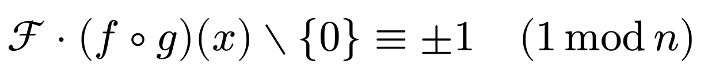

# scribe

**Scribe** exports a set of `show-rules` designed to make Typst’s mathematical markup more readable. The ultimate aim is to produce an `ASCII`-based notation that closely mirrors the familiar style of written mathematics.

```typst
#import "@preview/scribe:0.1.0": *
#show: scribe

With scribe you can write 
$Ff * (f @ g)(x) \\ {0} == +-1 .. (1 % n)$

instead of
$cal(F) dot.op (f compose g)(x) without {0} equiv plus.minus 1 quad (1 mod n)$
```

