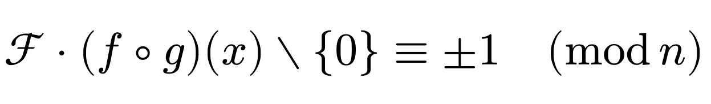
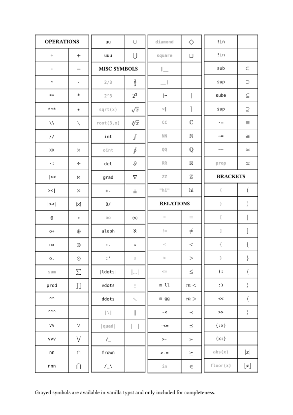
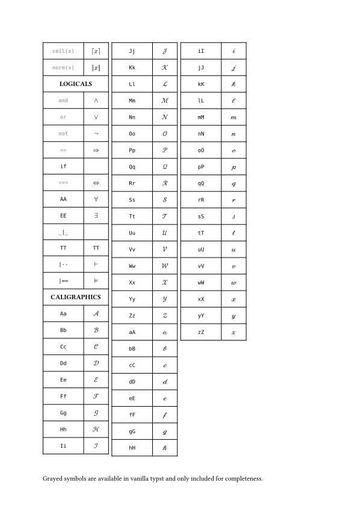

# scribe

**scribe** lets you write more readable math by defining an `ASCII`-based notation.
The notation aims to be intuitive and resemble its rendered form visually. 
Large parts of it are derived from [asciimath](http://asciimath.org). 

All you need to do is to import the following.
```typst
#import "@preview/scribe:0.2.0": *
#show: scribe

With scribe you can write 
$Ff * (f @ g)(x) \\ {0} -= +-1 .. (mod n)$

instead of
$cal(F) dot.op (f compose g)(x) without {0} equiv plus.minus 1 quad (mod n)$
```
<div align="center">
  
</div>

It is possible to only use a subset of the features.
```typst
#import "@preview/scribe:0.2.0": *
#show: scribe.with("operations", "logicals")

$ a * b = 0 vv a +- b = 3 $
```

If you need to keep the namespace clean, you can import only the features you use.
```typst
#import "@preview/scribe:0.2.0": scribe, operations, logicals
#import operations: *
#import logicals: *

#show: scribe.with("operations", "logicals")

$ a * b = 0 vv a +- b = 3 $
```


## Index
Below is a complete list of everything that is supported. Unsupported symbols are marked with an empty cell.
<div align="center">
  
  
</div>

