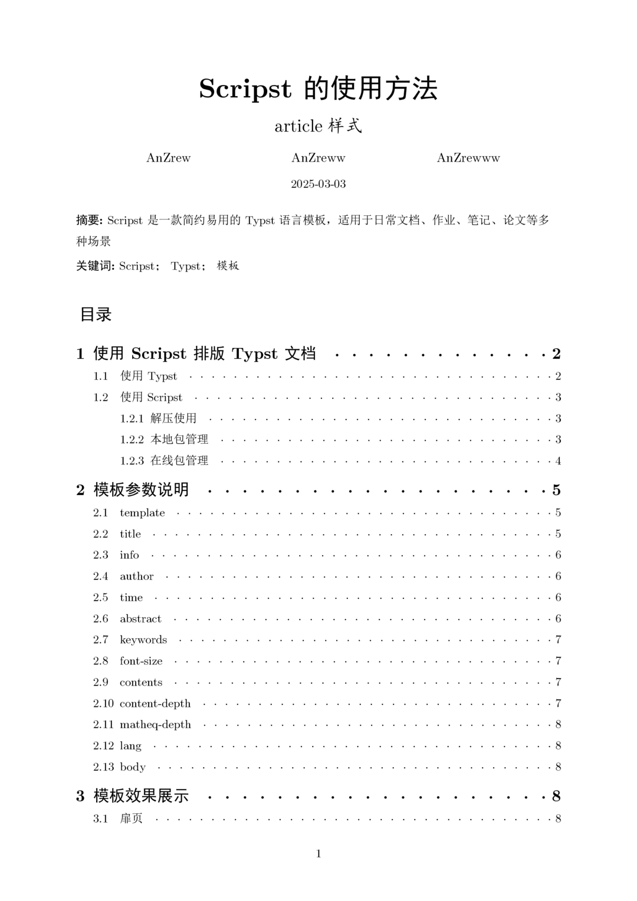
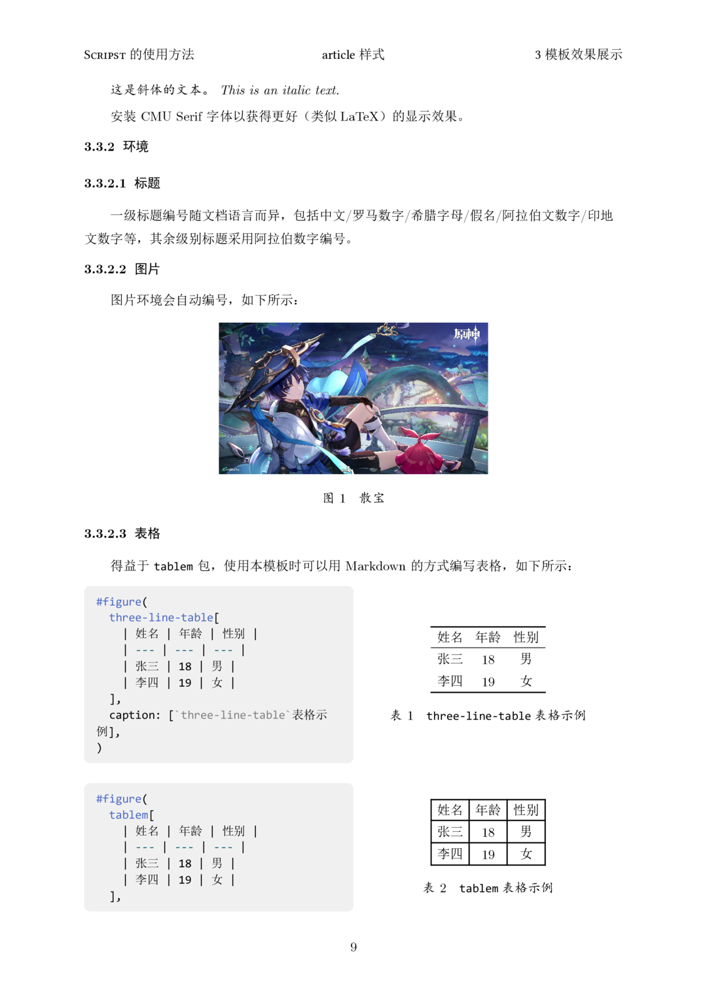
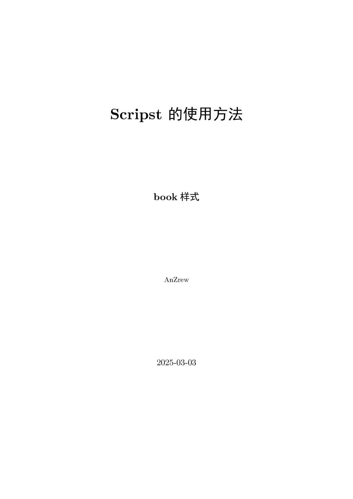
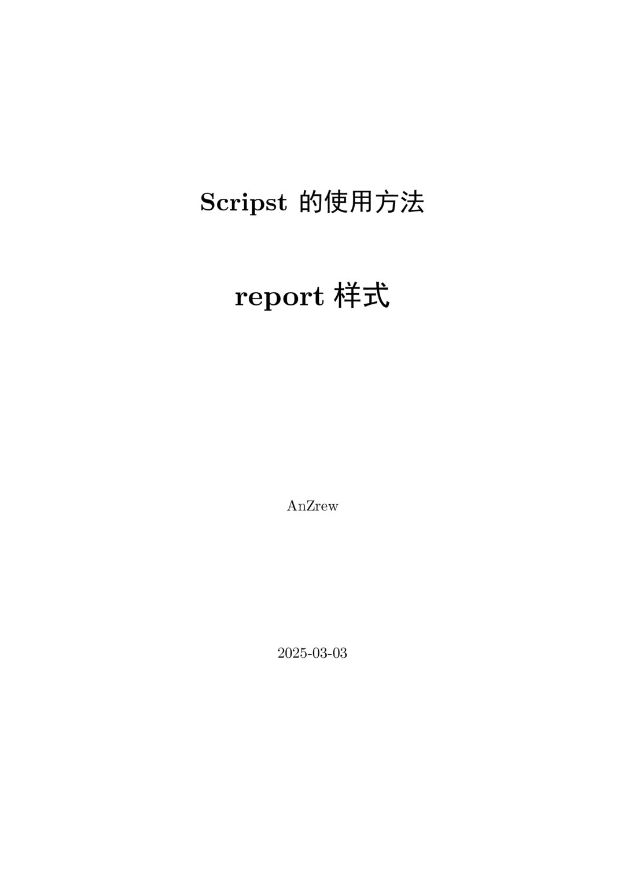

<h1 align="center">
Scripst
</h1>

**Scripst** is a template package based on **Typst**, offering a set of simple and efficient document templates suitable for everyday documents, assignments, notes, papers, and other scenarios.

<div align="center">

[](https://github.com/An-314/scripst/releases/tag/v1.1.0)
[](https://github.com/An-314/scripst/blob/main/LICENSE)
[](https://an-314.github.io/scripst)
[](https://github.com/An-314/scripst/releases/latest)

[简体中文](https://github.com/An-314/scripst/blob/main/README_zh-CN.md) | English

</div>

## 📑 Contents

- [📑 Contents](#-contents)
- [🚀 Features](#-features)
- [📦 Installation](#-installation)
  - [Install Typst](#install-typst)
  - [Download Scripst Template](#download-scripst-template)
    - [Method 1: Download Manually](#method-1-download-manually)
    - [Method 2: Use Typst Local Package Management](#method-2-use-typst-local-package-management)
- [📄 Using Scripst](#-using-scripst)
  - [Import Scripst Template](#import-scripst-template)
  - [Create `article` Document](#create-article-document)
- [🔧 Template Parameters](#-template-parameters)
- [🆕 `countblock` Module](#-countblock-module)
  - [Creating and Registering a `countblock`](#creating-and-registering-a-countblock)
  - [Using `countblock`](#using-countblock)
  - [Encapsulating the `countblock` Module](#encapsulating-the-countblock-module)
- [✨ Template Examples and Explanations](#-template-examples-and-explanations)
  - [Article](#article)
  - [Book](#book)
  - [Report](#report)
- [📜 Contributing](#-contributing)
- [📌 Fonts](#-fonts)
- [🔗 Dependencies](#-dependencies)
- [📝 License](#-license)
- [🎯 TODO](#-todo)
* * *

## 🚀 Features

* High Extensibility: Modular design, easy to extend the templates.
* Multilingual Design: Localization for different languages.
* Supports module `countblock`, which allows custom names and colors, includes a built-in counter, and can be referenced anywhere in the document. It can be used for theorems, problems, notes, etc. For more details, see [🆕 `countblock` Module](#-countblock-module).





## 📦 Installation

### Install Typst

Make sure Typst is installed. You can install it using the following commands:

```bash
sudo apt install typst # Debian/Ubuntu
sudo pacman -S typst # Arch Linux
winget install --id Typst.Typst # Windows
brew install typst # macOS
```

Or refer to the [Typst official documentation](https://github.com/typst/typst) for more information.

### Download Scripst Template

Should you need to use the template locally, or should you need to make adjustments to the template, you can download the Scripst template manually.

#### Method 1: Download Manually

1. Visit the [Scripst GitHub repository](https://github.com/An-314/scripst)
2. Click the `<> Code` button
3. Choose `Download ZIP`
4. After extraction, place the template files into your project directory.

**Suggested directory structure**
```plaintext
project/
├── src/
│   ├── main.typ
│   ├── components.typ
├── pic/
│   ├── image.jpg
├── main.typ
├── chap1.typ
├── chap2.typ
```

If the template is stored in the `src/` directory, import it like this:

```typst
#import "src/main.typ": *
```

#### Method 2: Use Typst Local Package Management

You can manually download Scripst and store it in:

```
~/.local/share/typst/packages/preview/scripst/1.1.0                 # Linux
%APPDATA%\typst\packages\preview\scripst\1.1.0                      # Windows
~/Library/Application Support/typst/packages/preview/scripst/1.1.0  # macOS
```

or using these commands:

```bash
cd {data-dir}/typst/packages/preview/scripst
git clone https://github.com/An-314/scripst.git 1.1.0
```

Where `data-dir` refers to Typst's data directory, such as `~/.local/share/typst` for Linux, `%APPDATA%\typst` for Windows, and `~/Library/Application Support/typst` for macOS.

Then import directly in your Typst file:
```typst
#import "@preview/scripst:1.1.0": *
```
Now you can use the Scripst template.

Use `typst init` to quickly create a project:

```bash
typst init @preview/scripst:1.1.0 project_name
```

* * *

## 📄 Using Scripst

### Import Scripst Template

Import the template at the beginning of your Typst file:
```typst
#import "@preview/scripst:1.1.0": *
```

### Create `article` Document

```typst
#show: scripst.with(
  title: [How to Use Scripst],
  info: [This is an article template],
  author: ("Author1", "Author2", "Author3"),
  time: datetime.today().display(),
  abstract: [Abstract content],
  keywords: ("Keyword1", "Keyword2", "Keyword3"),
  contents: true,
  content-depth: 2,
  matheq-depth: 2,
  lang: "en",
)
```

* * *

## 🔧 Template Parameters

| Parameter | Type | Default Value | Description |
| --- | --- | --- | --- |
| `template` | `str` | `"article"` | Choose template (`"article"`, `"book"`, `"report"`) |
| `title` | `content`, `str`, `none` | `""` | Document title |
| `info` | `content`, `str`, `none` | `""` | Document subtitle or supplementary information |
| `author` | `array` | `()` | List of authors |
| `time` | `content`, `str`, `none` | `""` | Document date |
| `abstract` | `content`, `str`, `none` | `none` | Document abstract |
| `keywords` | `array` | `()` | Keywords |
| `preface` | `content`, `str`, `none` | `none` | Preface |
| `font-size` | `length` | `11pt` | Font size |
| `contents` | `bool` | `false` | Whether to generate a table of contents |
| `content-depth` | `int` | `2` | Table of contents depth |
| `matheq-depth` | `int` | `2` | Math equation numbering depth |
| `lang` | `str` | `"zh"` | Language (`"zh"`, `"en"`, `"fr"`, etc.) |

* * *

## 🆕 `countblock` Module

The `countblock` module is a customizable module where you can set the name and color, and it comes with a built-in counter that can be referenced anywhere in the document. It can be used to create blocks for theorems, definitions, problems, notes, and more.

Below is an example of a `countblock` module:


### Creating and Registering a `countblock`

Scripst provides several default `countblock` modules, which already have preset names, colors, and registered counters:

```typst
#let cb = (
  "thm": ("Theorem", color.blue),
  "def": ("Definition", color.green),
  "prob": ("Problem", color.purple),
  "prop": ("Proposition", color.purple-grey),
  "ex": ("Example", color.green-blue),
  "note": ("Note", color.grey),
  "cau": ("⚠️", color.red),
)
```

You can also define your own `countblock` modules:

```typst
#let cb = add-countblock("test", "This is a test", teal) // Define a "test" countblock
#show: register-countblock.with("test") // Register the countblock
```

This allows you to use the `test` module in your document.

### Using `countblock`

You can use the `countblock` module in the document as follows:

```typst
#countblock(
  name,
  subname,
  count: true,
  cb: cb,
  lab: none,
)[...]
```

Parameter descriptions:

| Parameter | Type | Default Value | Description |
| --- | --- | --- | --- |
| `name` | `str` | `""` | Name of the module |
| `subname` | `str` | `""` | The name of the specific block |
| `count` | `bool` | `true` | Whether to count or not |
| `cb` | `dict` | `cb` | The `countblock` dictionary |
| `lab` | `str`, `none` | `none` | Label |

For example:

```typst
#countblock("thm", subname: [_Fermat's Last Theorem_], lab: "fermat", cb)[

  No three $a, b, c \in \mathbb{N}^+$ can satisfy the equation
  $
    a^n + b^n = c^n
  $
  for any integer value of $n$ greater than 2.
]
#proof[Cuius rei demonstrationem mirabilem sane detexi. Hanc marginis exiguitas non caperet.]
Fermat did not provide a public proof for @fermat.
```

This will create a theorem block and allow it to be referenced in the document.

### Encapsulating the `countblock` Module

You can encapsulate the `countblock` module into a function for repeated use in the document:

```typst
#let test = countblock.with("test", cb)
```

This allows you to use the `test` function in the document:

```typst
#test[...]
```

Additionally, the default `countblock` modules provided by Scripst have already been encapsulated, allowing you to use them directly as `#theorem`, `#definition`, `#problem`, `#proposition`, `#example`, `#note`, and `#caution`.


* * *

## ✨ Template Examples and Explanations

### Article 

   
[Aritcle Demo](./docs/locale/builds/article-en.pdf) 

### Book

   
[Book Demo](./docs/builds/book.pdf) *(Only in Simplified Chinese)*


### Report

   
[Report Demo](./docs/builds/report.pdf) *(Only in Simplified Chinese)*

## 📜 Contributing

Feel free to submit issues or pull requests! If you have any improvement suggestions, join the discussion.

* **GitHub Repository**: [Scripst](https://github.com/An-314/scripst)
* **Issue Feedback**: Submit an issue to discuss

## 📌 Fonts

This project uses the following fonts by default:

* Primary fonts: [CMU Serif](https://en.wikipedia.org/wiki/Computer_Modern), [Consolas](https://en.wikipedia.org/wiki/Consolas)
* Alternative fonts: [Linux Libertine](https://en.wikipedia.org/wiki/Linux_Libertine)
* Chinese fonts such as SimSun, SimHei, KaiTi, etc. 

If using these default fonts, please make sure they are correctly installed. Otherwise, replace them if needed in `./src/configs.typ`.

## 🔗 Dependencies

For certain content, Scripst uses the following Typst packages:

* [tablem](https://typst.app/universe/package/tablem)
* [physica](https://typst.app/universe/package/physica)

## 📝 License

This project is licensed under the MIT License.

## 🎯 TODO

* [ ] Add `beamer` template
* [ ] Add more configuration options