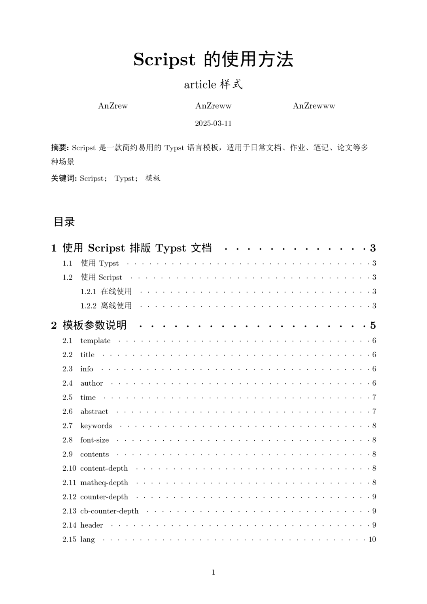
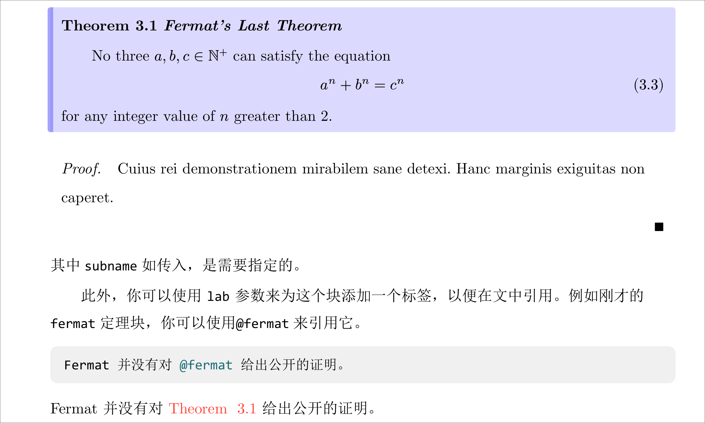
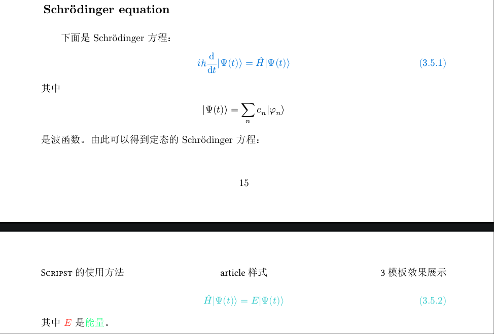
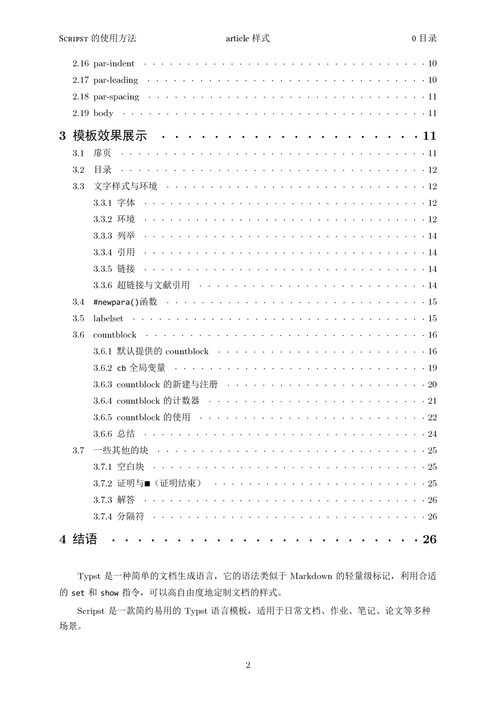
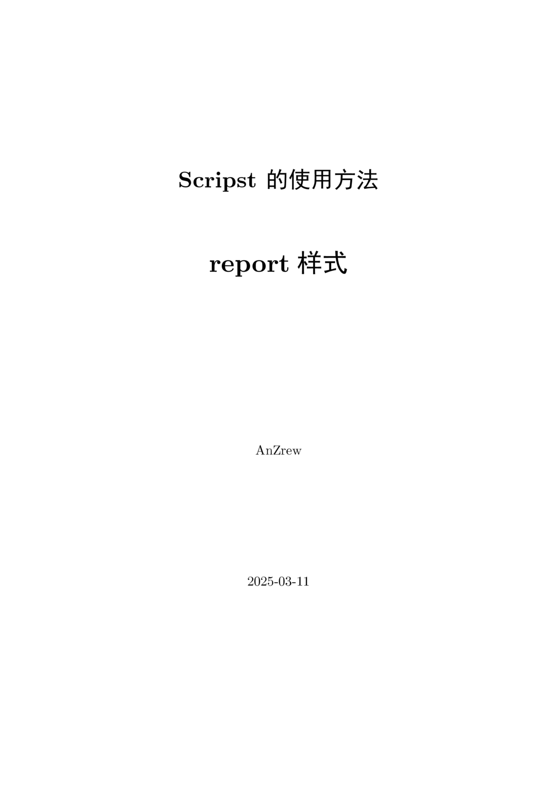

<h1 align="center">
Scripst
</h1>

**Scripst** is a template package based on **Typst**, offering a set of simple and efficient document templates suitable for everyday documents, assignments, notes, papers, and other scenarios.

<div align="center">

[](https://github.com/An-314/scripst/releases/tag/v1.1.1)
[](https://github.com/An-314/scripst/blob/main/LICENSE)
[](https://an-314.github.io/scripst)
[](https://github.com/An-314/scripst/releases/latest)

[简体中文](https://github.com/An-314/scripst/blob/main/README_zh-CN.md) | English

</div>

## 📑 Contents

- [📑 Contents](#-contents)
- [🚀 Features](#-features)
- [📌 Fonts](#-fonts)
- [📦 Installation](#-installation)
  - [Install Typst](#install-typst)
  - [Using Scripst](#using-scripst)
- [📄 Using Scripst](#-using-scripst)
  - [Import Scripst Template](#import-scripst-template)
  - [Create `article` Document](#create-article-document)
- [🔧 Template Parameters](#-template-parameters)
- [🆕 Feature Demonstration](#-feature-demonstration)
  - [`countblock` Module](#countblock-module)
  - [Quick setting by using lable](#quick-setting-by-using-lable)
  - [`newpara` function](#newpara-function)
- [✨ Template Examples and Explanations](#-template-examples-and-explanations)
  - [Article](#article)
  - [Book](#book)
  - [Report](#report)
- [📜 Contributing](#-contributing)
- [🔗 Dependencies](#-dependencies)
- [📝 License](#-license)
- [📥 Offline Usage](#-offline-usage)
  - [Method 1: Manual Download](#method-1-manual-download)
  - [Method 2: Using Typst Local Package Management](#method-2-using-typst-local-package-management)
- [🎯 TODO](#-todo)


* * *

## 🚀 Features

* Added the `countblock` module: A customizable-named and colored block with a built-in counter that can be referenced anywhere in the document. It supports theorem/problem/remark typesetting. For details, see [🆕 `countblock` module](#-countblock-module).  
* Quick settings via labels: Font color customization, disabling math environments, and removing title numbering.  
* Enhanced counter hierarchy: Global counters now support multi-level numbering formats (`1`, `1.1`, `1.1.1`). Equations, figures, and `countblock` can adopt hierarchical numbering as needed.  
* New modules: `blankblock`, `proof`, `solution`, and other environments.  
* Universal function `#newpara()`: Instantly switch to a new paragraph without layout issues.  
* Personalization options: Easily adjust document indentation, line spacing, and paragraph spacing.  
* Multilingual design: Localized default layouts for different languages.  
* Simple and lightweight: Minimalist templates for effortless use and clean aesthetics.  
* High Extensibility: Modular design, easy to extend the templates.

<p align="center">
  
  
  
</p>

## 📌 Fonts

This project uses the following fonts by default:

* Primary fonts: [CMU Serif](https://en.wikipedia.org/wiki/Computer_Modern), [Consolas](https://en.wikipedia.org/wiki/Consolas)
* Alternative fonts: [Linux Libertine](https://en.wikipedia.org/wiki/Linux_Libertine)
* Chinese fonts such as SimSun, SimHei, KaiTi, etc. 

If using these default fonts, please make sure they are correctly installed. Otherwise, replace them according to the instructions in [Offline Usage](#-offline-usage).


## 📦 Installation

### Install Typst

Make sure Typst is installed. You can install it using the following commands:

```bash
sudo apt install typst # Debian/Ubuntu
sudo pacman -S typst # Arch Linux
winget install --id Typst.Typst # Windows
brew install typst # macOS
```

Or refer to the [Typst official documentation](https://github.com/typst/typst) for more information.

### Using Scripst


## 📄 Using Scripst

### Import Scripst Template

Import the template at the beginning of your Typst file:

```typst
#import "@preview/scripst:1.1.1": *
```

Use `typst init` to quickly create a project:

```bash
typst init @preview/scripst:1.1.0 project_name
```


### Create `article` Document

```typst
#show: scripst.with(
  template: "article",
  title: [How to Use Scripst],
  info: [This is an article template],
  author: ("Author1", "Author2", "Author3"),
  time: datetime.today().display(),
  abstract: [Abstract content],
  keywords: ("Keyword1", "Keyword2", "Keyword3"),
  font-size: 11pt,
  contents: true,
  content-depth: 2,
  matheq-depth: 2,
  counter-depth: 2,
  cb-counter-depth: 2,
  header: true,
  lang: "en",
)
```


## 🔧 Template Parameters

| Parameter | Type | Default Value | Description |
| --- | --- | --- | --- |
| `template` | `str` | `"article"` | Choose template (`"article"`, `"book"`, `"report"`) |
| `title` | `content`, `str`, `none` | `""` | Document title |
| `info` | `content`, `str`, `none` | `""` | Document subtitle or supplementary information |
| `author` | `content`, `str`, `array` | `()` | List of authors |
| `time` | `content`, `str`, `none` | `""` | Document date |
| `abstract` | `content`, `str`, `none` | `none` | Document abstract |
| `keywords` | `array` | `()` | Keywords |
| `preface` | `content`, `str`, `none` | `none` | Preface |
| `font-size` | `length` | `11pt` | Font size |
| `contents` | `bool` | `false` | Whether to generate a table of contents |
| `content-depth` | `int` | `2` | Table of contents depth |
| `matheq-depth` | `int` | `2` | Math equation numbering depth |
| `counter-depth` | `int` | `2` | Overall counter numbering depth |
| `cb-counter-depth` | `int` | `2` | `countblock` module counter numbering depth |
| `header` | `bool` | `true` | Enable header |
| `lang` | `str` | `"zh"` | Language (`"zh"`, `"en"`, `"fr"`, etc.) |

* * *

## 🆕 Feature Demonstration

The specific use of this section is described in [Scripst Documentation](. /docs/builds/article.pdf).

### `countblock` Module

The `countblock` module is a customizable module where you can set the name and color, and it comes with a built-in counter that can be referenced anywhere in the document. It can be used to create blocks for theorems, definitions, problems, notes, and more.

Below is an example of a `countblock` module:



```typst
#theorem("thm", subname: [_Fermat's Last Theorem_], lab: "fermat", cb)[

  No three $a, b, c in NN^+$ can satisfy the equation
  $
    a^n + b^n = c^n
  $
  for any integer value of $n$ greater than 2.
]
#proof[Cuius rei demonstrationem mirabilem sane detexi. Hanc marginis exiguitas non caperet.]
Fermat did not provide a public proof for @fermat.
```

This will create a theorem block and allow it to be referenced in the document.

### Quick setting by using lable

```typst
== Schrödinger equation <hd.x>

Below is Schrödinger equation：
$
  i hbar dv(,t) ket(Psi(t)) = hat(H) ket(Psi(t))
$ <text.blue>
where
$
  ket(Psi(t)) = sum_n c_n ket(phi_n)
$ <eq.c>
is the wave function. From this, the time-independent Schrödinger equation can be derived:
$
  hat(H) ket(Psi(t)) = E ket(Psi(t))
$
<text.teal>
where $E$<text.red> is #[energy]<text.lime>。
```



### `newpara` function

```typst
#newpara()
```
Some of the text after the environment will not be automatically line-breaked, such as math equations, code blocks, `countblock`, etc., because some explanation of the above may be needed.

But if you need line breaks, you can use the `#newpara()` function. The newly opened natural paragraph will be indented automatically and the line spacing will be adjusted automatically.

This function allows you to create new natural paragraphs in all scenarios without worrying about layout!

So when you think the layout between paragraphs is not pretty enough, try using the `#newpara()` function.

* * *

## ✨ Template Examples and Explanations

### Article 

<p align="center">
  
  
</p>

[Aritcle Demo](./docs/locale/builds/article-en.pdf) 

### Book

<p align="center">
  
  
</p>

[Book Demo](./docs/builds/book.pdf) *(Only in Simplified Chinese)*


### Report


<p align="center">
  
  
</p>

[Report Demo](./docs/builds/report.pdf) *(Only in Simplified Chinese)*

## 📜 Contributing

Feel free to submit issues or pull requests! If you have any improvement suggestions, join the discussion.

* **GitHub Repository**: [Scripst](https://github.com/An-314/scripst)
* **Issue Feedback**: Submit an issue to discuss

## 🔗 Dependencies

For certain content, Scripst uses the following Typst packages:

* [tablem](https://typst.app/universe/package/tablem)
* [physica](https://typst.app/universe/package/physica)

## 📝 License

This project is licensed under the MIT License.

## 📥 Offline Usage

To use the template locally or make adjustments, you can manually download the Scripst template.  

### Method 1: Manual Download  
1. Visit the [Scripst GitHub repository](https://github.com/An-314/scripst).  
2. Click the `<> Code` button.  
3. Select `Download ZIP`.  
4. After extraction, place the template files in your project directory.  

**Recommended Directory Structure**  
```plaintext  
project/  
├── src/  
│   ├── main.typ  
│   ├── components.typ  
├── pic/  
│   ├── image.jpg  
├── main.typ  
├── chap1.typ  
├── chap2.typ  
```  
If the template is stored in the `src/` directory, import it as:  
```typst  
#import "src/main.typ": *  
```  

### Method 2: Using Typst Local Package Management  
Manually download Scripst and store it in:  
```  
~/.local/share/typst/packages/preview/scripst/1.1.1                 # Linux  
%APPDATA%\typst\packages\preview\scripst\1.1.1                      # Windows  
~/Library/Application Support/typst/packages/preview/scripst/1.1.1  # macOS  
```  

Alternatively, run the following command:  
```bash  
cd {data-dir}/typst/packages/preview/scripst  
git clone https://github.com/An-314/scripst.git 1.1.1  
```  
Here, `data-dir` refers to Typst's data directory (e.g., `~/.local/share/` on Linux, `%APPDATA%\` on Windows, or `~/Library/Application Support/` on macOS).  

Then import the template directly in your Typst file:  
```typst  
#import "@local/scripst:1.1.1": *  
```  

Use `typst init` to create a project quickly:  
```bash  
typst init @local/scripst:1.1.1 project_name  
```  

Scripst offers several adjustable settings, i.e. font, colour palette, default countblock name in `./src/configs.typ`. You can adjust them per your need.

## 🎯 TODO

* [ ] Add `beamer` template
* [ ] Add more configuration options