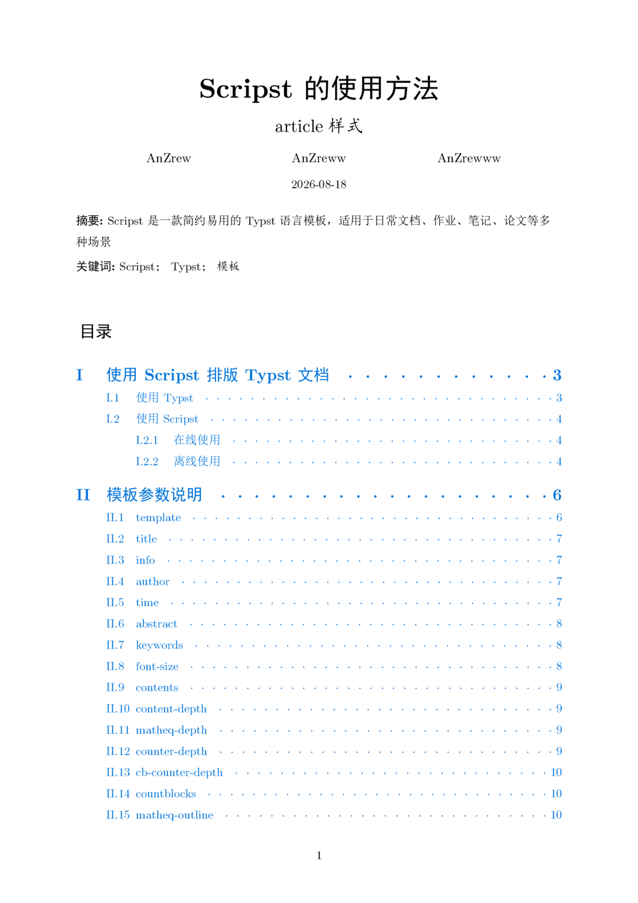
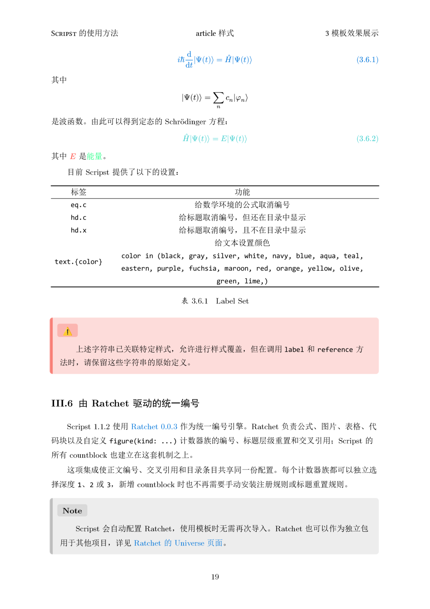
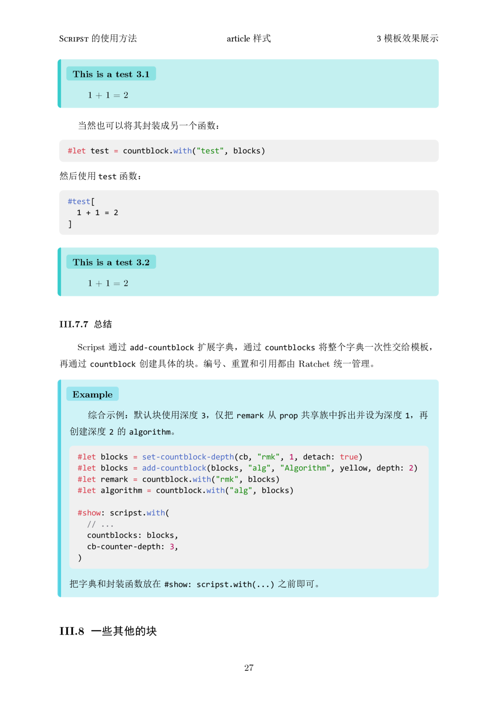
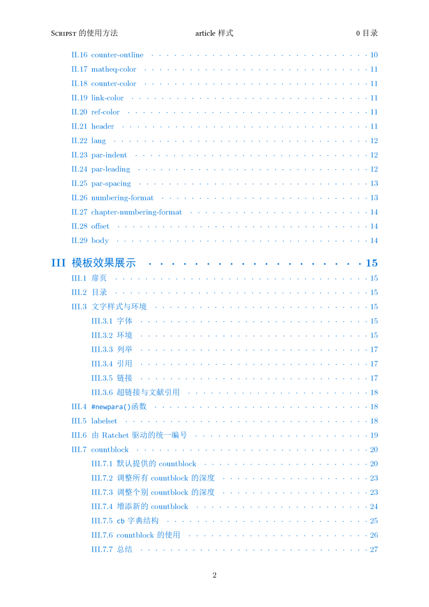

<h1 align="center">
Scripst
</h1>

**Scripst** 是一个基于 **Typst** 的模板包，提供了一套简约高效的文档模板，适用于日常文档、作业、笔记、论文等场景。

<div align="center">

[](https://github.com/An-314/scripst/releases/tag/v1.1.2)
[](./LICENSE)
[](https://an-314.github.io/scripst/zh)
[](https://github.com/An-314/scripst/releases/latest)

简体中文 | [English](./README.md)

</div>

## 📑 目录

- [📑 目录](#-目录)
- [🚀 特性](#-特性)
- [⚙️ Ratchet 驱动的统一编号](#-ratchet-驱动的统一编号)
- [📌 字体](#-字体)
- [📦 安装](#-安装)
  - [安装 Typst](#安装-typst)
  - [使用 Scripst](#使用-scripst)
- [📄 使用 Scripst](#-使用-scripst)
  - [引入 Scripst 模板](#引入-scripst-模板)
  - [创建 `article` 文档](#创建-article-文档)
- [🔧 模板参数](#-模板参数)
- [🆕 特性展示](#-特性展示)
  - [`countblock`模块](#countblock模块)
  - [label 快速设置](#label-快速设置)
  - [`newpara` 函数](#newpara-函数)
- [✨ 模板效果示例与说明](#-模板效果示例与说明)
  - [article 文档](#article-文档)
  - [book 文档](#book-文档)
  - [report 文档](#report-文档)
- [📜 贡献](#-贡献)
- [🔗 依赖](#-依赖)
- [📝 许可证协议](#-许可证协议)
- [📥 离线使用](#-离线使用)
  - [方法 1：手动下载](#方法-1手动下载)
  - [方法 2：使用 Typst 本地包管理](#方法-2使用-typst-本地包管理)
- [🎯 TODO](#-todo)

---

## 🚀 特性

- 由 [Ratchet](https://github.com/An-314/ratchet) 驱动统一编号：公式、图片、表格、代码块与自定义 `countblock` 计数器族使用同一套可靠的编号与引用引擎
- 新增模块`countblock`：这是一个可以自定义名称和颜色的模块，内置一个计数器，并且可以在文中随时引用；可以用来做定理、问题、注记等模块，更详细的内容见[🆕 `countblock`模块](#countblock模块)
- 利用 label 快速设置：字体颜色、取消数学环境和标题的计数编号等
- 更好的计数器支持：支持为全局的计数器选择层数，公式、图片环境、`countblock`等的计数器都可以根据需要选择层数（`1`, `1.1`, `1.1.1`）
- 新增模块：`blankblock`, `proof`, `solution`等环境
- 万能函数`#newpara()`：一键切换到新的自然段，无需担心布局问题
- 个性化调整：轻松调节文档的缩进、行间距、段间距
- 多语言设计：针对不同语言进行本地化设计，对于不同语言提供不同的默认布局
- 简约轻便：提供简约风格的模板，方便使用，简洁美观
- 高扩展性：模块化设计，便于对模板进行扩展

<p align="center">
  
  
  
</p>

## ⚙️ Ratchet 驱动的统一编号

Scripst 1.1.2 使用同一作者开发的 [Ratchet 0.0.3](https://github.com/An-314/ratchet) 作为统一编号引擎。公式、图片、表格、代码块以及自定义 `figure(kind: ...)` 计数器族——包括所有 Scripst `countblock`——都由 Ratchet 统一管理。

Ratchet 为 Scripst 带来了：

- 可为每一个计数器族独立选择深度 `1`、`2` 或 `3`；
- 根据对应的标题层级准确重置计数器；
- 保证正文编号、交叉引用和目录条目始终一致；
- 新增 countblock 时不再需要额外编写注册和重置规则。

Scripst 已经自动完成 Ratchet 配置，使用模板时无需再次导入。Ratchet 也可以脱离 Scripst 单独使用，详见其 [代码仓库](https://github.com/An-314/ratchet) 和 [Universe 页面](https://typst.app/universe/package/ratchet)。

## 📌 字体

本项目默认使用以下字体：

- 主要字体：[CMU Serif](https://en.wikipedia.org/wiki/Computer_Modern), [Consolas](https://en.wikipedia.org/wiki/Consolas)
- 备选字体：[Linux Libertine](https://en.wikipedia.org/wiki/Linux_Libertine)
- 以及SimSun, SimHei, KaiTi等中文字体

使用默认字体前，请确保已安装该字体，或根据[离线使用](#-离线使用)部分的指导进行替换。

## 📦 安装

### 安装 Typst

确保已安装 Typst，可以使用以下命令进行安装：

```bash
sudo apt install typst # Debian/Ubuntu
sudo pacman -S typst # Arch Linux
winget install --id Typst.Typst # Windows
brew install typst # macOS
```

或参考 [Typst 官方文档](https://github.com/typst/typst) 了解更多信息。

### 使用 Scripst

## 📄 使用 Scripst

在 `.typ` 文档开头添加

```typst
#import "@preview/scripst:1.1.2": *
```
即可。

亦可以使用 `typst init` 快速创建项目：
```bash
typst init @preview/scripst:1.1.2 project_name
```


### 引入 Scripst 模板

在 Typst 文件开头引入模板：

```typst
#import "@preview/scripst:1.1.2": *
```

### 创建 `article` 文档

```typst
#show: scripst.with(
  template: "article",
  title: [Scripst 的使用方法],
  info: [这是文章的模板],
  author: ("作者1", "作者2", "作者3"),
  time: datetime.today().display(),
  abstract: [摘要内容],
  keywords: ("关键词1", "关键词2", "关键词3"),
  font-size: 11pt,
  contents: true,
  content-depth: 2,
  matheq-depth: 2,
  counter-depth: 2,
  cb-counter-depth: 2,
  countblocks: cb,
  matheq-outline: "(1.1)",
  link-color: blue,
  ref-color: red,
  header: true,
  lang: "zh",
  par-indent: 2em,
  par-leading: 1em,
  par-spacing: 1em,
)
```

## 🔧 模板参数

| 参数 | 类型 | 默认值 | 说明 |
| --- | --- | --- | --- |
| `template` | `str` | `"article"` | 选择模板 (`"article"`, `"book"`, `"report"`) |
| `title` | `content`, `str`, `none` | `""` | 文档标题 |
| `info` | `content`, `str`, `none` | `""` | 文档副标题或补充信息 |
| `author` | `content`, `str`, `array` | `()` | 作者列表 |
| `time` | `content`, `str`, `none` | `""` | 文档时间 |
| `abstract` | `content`, `str`, `none` | `none` | 文档摘要 |
| `keywords` | `array` | `()` | 关键词 |
| `preface` | `content`, `str`, `none` | `none` | 前言 |
| `font-size` | `length` | `11pt` | 字体大小 |
| `contents` | `bool` | `false` | 是否生成目录 |
| `content-depth` | `int` | `2` | 目录深度 |
| `matheq-depth` | `int` | `2` | 数学公式编号深度 |
| `counter-depth` | `int` | `2` | 全局的计数器编号深度 |
| `cb-counter-depth` | `int` | `2` | `countblock` 模块的计数器编号深度 |
| `countblocks` | `dict` | `cb` | 交由 Ratchet 配置的 countblock 字典 |
| `matheq-outline` | `str`, `function` | `"(1.1)"` | 数学公式编号格式 |
| `link-color` | `color` | `blue` | 超链接文字颜色 |
| `ref-color` | `color` | `red` | 普通 `@label` 引用颜色 |
| `header` | `bool` | `true` | 是否生成页眉 |
| `lang` | `str` | `"zh"` | 语言 (`"zh"`, `"en"`, `"fr"` 等) |
| `par-indent` | `length` | `2em` | 段落首行缩进 |
| `par-leading` | `length` | 跟随语言 | 段落首行缩进 |
| `par-spacing` | `length` | 跟随语言 | 段落间距 |

---

## 🆕 特性展示

该部分的具体使用方法请参见 [Scripst 文档源码](./docs/article.typ)。

### `countblock`模块

`countblock` 是一个可以自定义名称和颜色的模块，内置一个计数器，并且可以在文中随时引用；可以用来做定理、问题、注记等模块。

下图是一个 `countblock` 模块的示例：


```typst
#theorem(subname: [_Fermat's Last Theorem_], lab: "fermat")[

  No three $a, b, c in NN^+$ can satisfy the equation
  $
    a^n + b^n = c^n
  $
  for any integer value of $n$ greater than 2.
]
#proof[Cuius rei demonstrationem mirabilem sane detexi. Hanc marginis exiguitas non caperet.]
Fermat 并没有对 @fermat 给出公开的证明。
```
就可以生成一个定理模块，并且在文中引用该模块。

计数深度既可以统一设置，也可以精确到单个块。共享同一
`counter-name` 的块属于同一个计数器族，因此默认会一起调整；若只想让某个块
独立编号，请使用 `detach: true`。

```typst
#let blocks = set-countblock-depth(cb, "thm", 3)
#let blocks = set-countblock-depth(blocks, "rmk", 1, detach: true)
#let blocks = add-countblock(blocks, "alg", "算法", yellow, depth: 2)

#show: scripst.with(
  countblocks: blocks,
  cb-counter-depth: 2, // 未单独指定深度的块使用此值。
)

#let algorithm = countblock.with("alg", blocks)
#algorithm[一个使用二级编号的算法块。]
```

完整的默认块列表（名称、深度、颜色、调用函数）以及共享计数器示例，请参见文档。

### label 快速设置

```typst
== Schrödinger equation <hd.x>

下面是 Schrödinger 方程：
$
  i hbar dv(,t) ket(Psi(t)) = hat(H) ket(Psi(t))
$ <text.blue>
其中
$
  ket(Psi(t)) = sum_n c_n ket(phi_n)
$ <eq.c>
是波函数。由此可以得到定态的 Schrödinger 方程：
$
  hat(H) ket(Psi(t)) = E ket(Psi(t))
$
<text.teal>
其中 $E$<text.red> 是#[能量]<text.lime>。
```


### `newpara` 函数

```typst
#newpara()
```
一些环境后的文字不会自动换行，例如数学公式、代码块、`countblock` 等，因为此时可能需要对上面做一些解释。

但是如果需要换行，可以使用 `#newpara()` 函数。新开的自然段会自动缩进，行间距也会自动调整。

该函数可以让你在一切场景下创建新的自然段，无需担心布局问题！

所以当你觉得段落间的布局不够美观时，就可以试试使用 `#newpara()` 函数。

## ✨ 模板效果示例与说明

### article 文档

<p align="center">
  
  
</p>

[Article 示例源码](./docs/article.typ)

### book 文档

<p align="center">
  
  
</p>
  
[Book 示例源码](./docs/book.typ)

### report 文档

<p align="center">
  
  
</p>

[Report 示例源码](./docs/report.typ)

## 📜 贡献

欢迎提交 Issue 或 Pull Request！如果有改进建议，欢迎加入讨论。

- **GitHub 仓库**：[Scripst](https://github.com/An-314/scripst)
- **问题反馈**：提交 Issue 进行讨论


## 🔗 依赖

对于部分内容，Scripst 引用了以下 Typst 包：

- [ratchet](https://typst.app/universe/package/ratchet) — 统一管理编号、重置、引用和自定义计数器族
- [tablem](https://typst.app/universe/package/tablem)
- [physica](https://typst.app/universe/package/physica)

## 📝 许可证协议

本项目使用 MIT 许可证协议。

`docs/pic/pic.jpg` 和 `docs/locale/pic/pic.jpg` 中的《原神》图片仅用作文档示例，
并依照授权方的[公开规则](https://www.hoyolab.com/article/143107)限于个人、非商业用途。
在中国大陆地区，授权方为上海米哈游网络科技股份有限公司；在中国大陆以外地区，
授权方为 Cognosphere Pte. Ltd.。`docs/pic/pic.jpg` 的图片版权标识为 © miHoYo，
`docs/locale/pic/pic.jpg` 的图片版权标识为 © COGNOSPHERE。
这两张图片不适用于本项目的 MIT 许可证。

## 📥 离线使用

如果希望在本地使用，或者需要对模板进行调整，可以手动下载 Scripst 模板。

### 方法 1：手动下载

1. 访问 [Scripst GitHub 仓库](https://github.com/An-314/scripst)
2. 点击 `<> Code` 按钮
3. 选择 `Download ZIP`
4. 解压后，将模板文件放入你的项目目录

**目录结构建议**
```plaintext
project/
├── src/
│   ├── main.typ
│   ├── components.typ
├── pic/
│   ├── image.jpg
├── main.typ
├── chap1.typ
├── chap2.typ
```
若模板存放于 `src/` 目录下，引入方式：

```text
#import "src/main.typ": *
```

### 方法 2：使用 Typst 本地包管理

可手动下载 Scripst 并将其存放至：
```text
~/.local/share/typst/packages/preview/scripst/1.1.2                 # Linux
%APPDATA%\typst\packages\preview\scripst\1.1.2                      # Windows
~/Library/Application Support/typst/packages/preview/scripst/1.1.2  # macOS
```

或者运行如下命令：

```bash 
cd {data-dir}/typst/packages/preview/scripst
git clone https://github.com/An-314/scripst.git 1.1.2
```

其中`data-dir`为Typst的数据目录，如上述Linux系统中的`~/.local/share/`，Windows系统中的`%APPDATA%\`，macOS系统中的`~/Library/Application Support/`。

然后在 Typst 文件中直接引入：

```typst
#import "@local/scripst:1.1.2": *
```

即可使用 Scripst 模板。

使用 `typst init` 快速创建项目：

```bash
typst init @local/scripst:1.1.2 project_name
```

Scripst 提供多项可调参数，例如字体、配色方案、默认的 countblock 名称等，均位于 ./src/configs.typ 文件中，可按需修改。

## 🎯 TODO

- 加入 `beamer` 模板
- 加入更多可配置项
