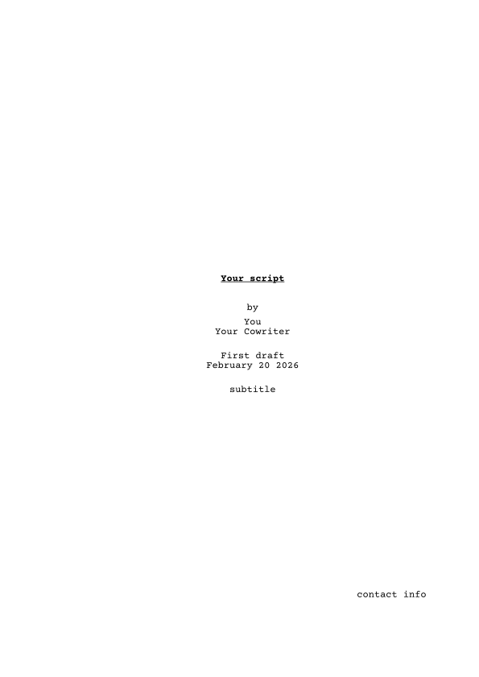
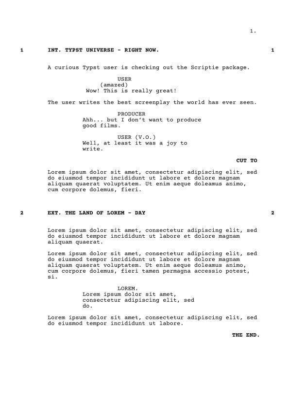

# ***Scriptie***

*Scriptie* formats your movie or tv script to the standard layout.
It has title pages, scene loglines, action, dialogue (with automatic _cont'd_ over page breaks!), parentheticals, transitions and more.

In addition, Scriptie optionally features a hackish abuse of Typst's syntax for a very efficient screenwriting experience.

# Demo
```typst
#import "@preview/scriptie:0.1.0":*
#show: qscript

#titlepage(
  title:[Your script],
  author:("You", "Your Cowriter"),
  version:"First draft",
  contact:"contact info",
  subtitle:"subtitle"
)

== INT. TYPST UNIVERSE - RIGHT NOW.

A curious Typst user is checking out the Scriptie package.

/ USER: (amazed) Wow! This is really great!

The user writes the best screenplay the world has ever seen.

/ PRODUCER: Ahh... but I don't want to produce good films.

/ USER (V.O.): Well, at least it was a joy to write.

- CUT TO

#lorem(30)

== EXT. The land of Lorem - DAY

#lorem(20)#parbreak()#lorem(35) 
/ #lorem(1): #lorem(10)
#lorem(15)
- THE END.
```



There's a demo showcasing all the functionalities [with the quick syntax](https://github.com/KauriP/scriptie/blob/main/demo-quick.typ)
and [without the quick syntax](https://github.com/KauriP/scriptie/blob/main/demo.typ).

# Possible issues

The preferred font to use with this package is [Courier Prime](https://quoteunquoteapps.com/courierprime/) or Courier.
For the web app, you should drop the `.ttf` files (unzipped from the linked download) into `Files`.

# Roadmap
- [x] Refactor all formatting into nice, non-hackish commands
  - [x] Dialogue
  - [x] Bring all configurable formatting into show command
- [x] Stabilise hackish version and use the nice commands
- [ ] Add options for styling
  - [ ] Which elements should be bolded
  - [ ] Which elements should be UPPER CASE
  - [x] Which elements should be numbered
  - [x] Customise margins & other geometry
- [ ] Implement side-by-side dialog
- [x] Implement
  - ```
    TEXT SIGNS
    IN SCRIPT
    ```
- [x] Implement raw pages with just typewriter input
- [x] Add translations
  - places
    - Contd
    - == Part N: XXX ==
    - titlepage by
    - titlepage date?
    - titlepage "Unnamed screenplay"
    - titlepage keywords?
  - [x] English
  - [x] Finnish
- [ ] Write documentation for all functionality
- [x] Write examples you are allowed to share
- [x] Write packaging TOML
- [ ] Maybe distribute Courier Prime with the package
