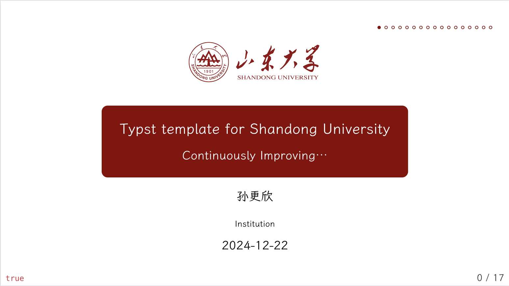

# sdu-typst-touying

目前处于开发阶段，当前模板较多地方未处理好，整体很依托，预计寒假期间修改并发布正式版本。

效果如下：

对于字体，可以到本项目的[Github仓库](https://github.com/Dregen-Yor/sdu-touying)下载

## TODO

- 修改 footer，提供 footer 自定义API
- 加入更多实例代码
- 更多颜色选项，加入更多山大 logo.
- 更多字体支持

## 开源协议

本项目采用 GPL-3.0 许可证。详细信息请参阅 LICENSE 文件。
