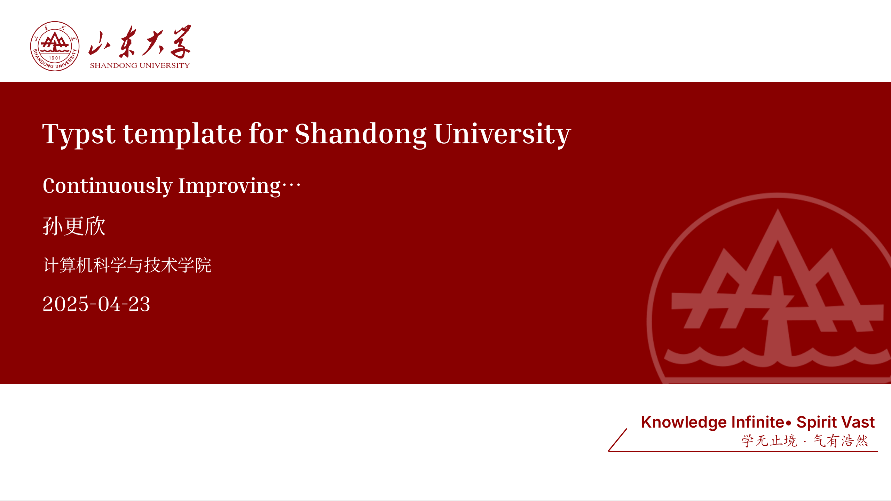

# sdu-typst-touying

一个为山东大学设计的、基于强大的 Touying 库的简化 Typst 演示文稿模板。
效果如下：
## 目录

- [关于](#关于)
- [特性](#特性)
- [使用方法](#使用方法)
- [许可证](#许可证)
- [致谢](#致谢)

## 关于

`sdu-touying-simpl` 是一个专为 [Typst](https://typst.app/) 排版系统设计的演示文稿（幻灯片/Slide）模板库。它构建于强大的 Typst 幻灯片基础库 [`touying`](https://github.com/touying-typst/touying) 之上，旨在提供与 LaTeX 的 Beamer 包类似的功能，但运行在现代化的 Typst 生态系统中。

`sdu-touying-simpl` 特别为**山东大学（SDU）**的学生量身定制，提供了一个可能更为简化的使用接口，并包含了与山大视觉形象一致的元素（如 Logo 和配色方案）。名称后缀 "simpl" 暗示其着重于易用性，让用户能够快速创建外观专业的演示文稿，而无需深入了解 `touying` 或 Typst 主题定制的全部复杂性。

## 特性

* **现代化排版:** 基于 [Typst](https://typst.app/) 构建，编译速度快，语法清晰直观。
* **强大的幻灯片引擎:** 由 [`touying`](https://github.com/touying-typst/touying) 驱动，继承了其核心特性，例如：
    * 逐步显示 (`#pause`, `#uncover`, `#only`, `#alternatives` 等)
    * 灵活的幻灯片布局
    * 演讲者备注
    * 讲义模式
* **类 Beamer 体验:** 为从 LaTeX/Beamer 迁移过来的用户提供了熟悉的结构和工作流程。
* **山大主题（推测）:** 可能预设了山东大学的 Logo、配色方案和字体，以保持品牌一致性。
* **简化使用:** 相较于直接使用 `touying` 或从零开始构建主题，旨在提供更低的使用门槛。

## 使用方法

首先确保电脑中安装了 `typst-cli`，并执行
 
`typst init @preview/sdu-touying-simpl:0.3.0`

或者在 [typst.app](https://typst.app/universe/package/sdu-touying-simpl) 中使用。

### 演示效果

对于字体，可以到本项目的[Github仓库](https://github.com/Dregen-Yor/sdu-touying-simpl/tree/main/fonts)下载

## 许可证

本项目采用 GPL-3.0 许可证。详细信息请参阅 LICENSE 文件。

## 致谢

感谢舍友提供的素材。

感谢 [PolyU Beamer Slides](https://www.overleaf.com/latex/templates/polyu-beamer-slides/pyhhgmgmvzhg) 提供的封面灵感。

