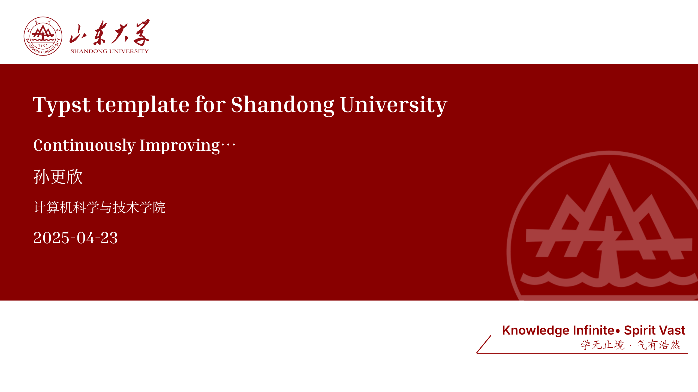

# SDU-Touying-Simpl

一个为山东大学设计的、基于 [Touying](https://github.com/touying-typst/touying) 的 Typst 演示文稿模板。



## 目录

- [简介](#简介)
- [特性](#特性)
- [安装](#安装)
- [快速开始](#快速开始)
- [主题定制](#主题定制)
- [字体支持](#字体支持)
- [许可证](#许可证)
- [致谢](#致谢)

## 简介

`sdu-touying-simpl` 是一个基于 [Typst](https://typst.app/) 和 [Touying](https://github.com/touying-typst/touying) 的演示文稿模板，专为山东大学师生设计。本项目旨在提供一个简单易用、美观大方的学术演示模板，同时保持与山东大学视觉形象的一致性。

## 特性

- **现代化排版系统**：基于 Typst 构建，提供快速的编译速度和清晰的语法
- **完整的幻灯片功能**：
  - 支持渐进式显示（`#pause`、`#uncover`、`#only` 等）
  - 灵活的幻灯片布局系统
  - 演讲者备注支持
  - 讲义模式
- **山大特色设计**：
  - 内置山东大学校徽和视觉元素
  - 采用山大标准红色（`#880000`）作为主题色
  - 优化的中文字体支持
- **丰富的幻灯片类型**：
  - 标题页（`title-slide`）
  - 大纲页（`outline-slide`）
  - 标准内容页
  - 自定义页脚样式
- **主题定制**：
  - 支持多种主题样式（`full` 和 `normal`）
  - 可自定义页眉页脚
  - 灵活的布局配置

## 安装

### 方法一：通过 Typst Universe 安装

```bash
typst init @preview/sdu-touying-simpl:0.3.1
```

### 方法二：通过 [Typst.app](https://typst.app/universe/package/sdu-touying-simpl) 在线使用

## 快速开始

创建一个新的 Typst 文件（例如 `main.typ`），并添加以下内容：

```typst
#import "@preview/sdu-touying-simpl:0.3.1": *

#show: sdu-theme.with(
  title: "演示文稿标题",
  author: "您的姓名",
  subtitle: "副标题",
  institution: "山东大学",
  date: datetime.today(),
)

#title-slide()

#outline-slide("目录")

= 主题一

== 页面一

= 主题二

== 页面二

== 页面三
```


## 字体支持

本项目支持中文字体，您可以从以下位置获取字体文件：

1. 项目 [GitHub 仓库](https://github.com/Dregen-Yor/sdu-touying-simpl/tree/main/fonts) 的 `fonts` 目录
2. 将字体文件放置在您的项目目录中
3. 在文档中通过 `#set text(font: "字体名称")` 设置字体

## 许可证

本项目采用 GPL-3.0 许可证。详见 [LICENSE](LICENSE) 文件。

## 致谢

- 感谢 [Touying](https://github.com/touying-typst/touying) 项目提供的强大基础
- 感谢 [PolyU Beamer Slides](https://www.overleaf.com/latex/templates/polyu-beamer-slides/pyhhgmgmvzhg) 提供的设计灵感
- 感谢所有为本项目提供反馈和建议的用户

