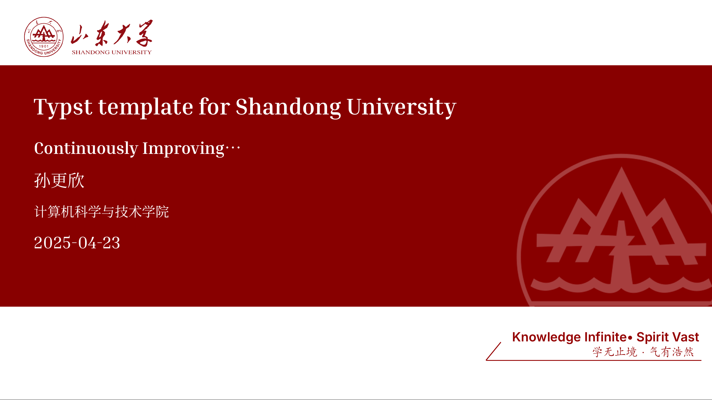

# SDU-Touying-Simpl

基于 [Touying](https://github.com/touying-typst/touying) 的 [Typst](https://typst.app/) 演示文稿模板，面向山东大学师生。

A [Touying](https://github.com/touying-typst/touying)-based [Typst](https://typst.app/) presentation template for Shandong University.



## 特性

- 内置山东大学校徽与标准红 (`#880000`) 主题色，支持亮色/暗色模式
- 支持自定义主色调，自动派生配色方案
- 数学定理环境（定理、定义、引理、推论、证明、示例）
- 代码语法高亮（支持行号、行高亮、语言标签）
- 多栏布局、卡片组件、高亮块
- 渐进式显示 (`#pause`、`#uncover`、`#only`)、演讲者备注、讲义模式
- Typst 编译速度显著优于 LaTeX，语法更简洁

## 安装

```bash
typst init @preview/sdu-touying-simpl:1.1.0
```

也可在 [Typst App](https://typst.app/universe/package/sdu-touying-simpl) 在线使用。

## 快速开始

```typst
#import "@preview/sdu-touying-simpl:1.1.0": *

#show: sdu-theme.with(
  config-info(
    title: [演示文稿标题],
    author: [您的姓名],
    subtitle: [副标题],
    institution: [山东大学],
    date: datetime.today(),
  ),
)

#title-slide()
#outline-slide([目录])

= 主题一
== 页面一

= 主题二
== 页面二
```

完整使用说明参见 [使用文档](docs/usage.md)。

## 依赖

| 包名 | 版本 | 用途 |
|------|------|------|
| [Touying](https://typst.app/universe/package/touying) | 0.7.3 | 演示文稿框架 |
| [Octique](https://typst.app/universe/package/octique) | 0.1.1 | GitHub Octicons 图标 |
| [Codly](https://typst.app/universe/package/codly) | 1.3.0 | 代码语法高亮 |
| [Codly Languages](https://typst.app/universe/package/codly-languages) | 0.1.10 | 语言定义数据 |

## 字体

中文字体需手动配置：

1. 从 [GitHub](https://github.com/Dregen-Yor/sdu-touying-simpl/tree/v1.0.0/fonts) 下载 `fonts` 目录中的字体文件
2. 放入项目目录
3. 在文档中通过 `#set text(font: "字体名称")` 设置

## 许可证

本项目采用 **GPL-3.0-or-later** 许可证，仅覆盖模板代码与原创内容。

> **关于山东大学标识：** 本仓库可能包含山东大学名称、校徽等标识，仅供模板渲染使用。这些标识属于山东大学无形资产，本项目不对其授予任何使用权利。本项目与山东大学无隶属关系，不代表学校官方立场。详见 [LICENSE](LICENSE)。

This project is licensed under **GPL-3.0-or-later**. SDU visual identifiers included for template rendering only — no rights to SDU marks are granted. See [LICENSE](LICENSE) for details.

## 致谢

- [Touying](https://github.com/touying-typst/touying) · [Typst](https://typst.app/) · [Typst 中文教程](https://github.com/typst-doc-cn/tutorial)
- [OrangeX4's typst-talk](https://github.com/OrangeX4/typst-talk) · [touying-pres-ustc](https://github.com/Quaternijkon/touying-pres-ustc) · [touying-brandred-uobristol](https://github.com/HPDell/touying-brandred-uobristol) · [PolyU Beamer Slides](https://www.overleaf.com/latex/templates/polyu-beamer-slides/pyhhgmgmvzhg)
- [sdu-touying-template](https://github.com/xmdjy/sdu-touying-template)
