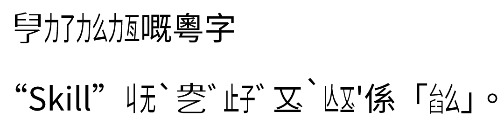

# Se-Jyutcitzi

A Typst package for rendering
[Jyutcitzi (粵切字)](https://jyutcitzi.github.io/table).  "Se-Jyutcitzi" means
"to write Jyutcitzi", and it is pronounced as **[sɛː˧˥ jyːt˨ t͡sʰiːt˧ t͡siː˨]**.

## Features

- Jyutcitzi generation from jyutping (粵拼)
- Compound initial support

## Usage

```typst
#import "@preview/se-jyutcitzi:0.2.3": *
#set page(height: auto, width: auto, margin: 4pt)
// Set to any font that contains the Jyutcitzi alphabets
#set text(font: "Noto Sans CJK TC")

#jyutcitzi("keu leu liu lang")嘅粵字

"Skill"#jyutcitzi("ge3 jyut6 zi6 m3 hm1")係「#combine-parts(
  combine-parts(initials-dict.s.at(0), initials-dict.k.at(0), "-"),
  "么",
  "|"
)」。
```



## License

MIT

## Contributing

Contributions are welcome! Please open an issue or submit a pull request.
