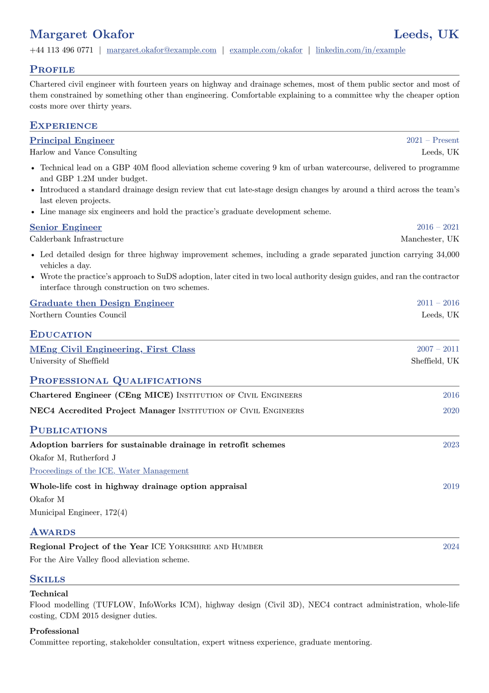

# Sentinel CV

Small-caps section headings, fine rules, justified text, name and location
sharing the top line. Nothing here is trying to be memorable. This is the layout
a hiring panel has read a thousand times, which is what you want when the reader
is a professional body or a public-sector appointments panel and treats novelty
as a risk.

Its real use is the long tail of a conventional career. Alongside ordinary job
entries there are purpose-built rows for publications, professional
qualifications and awards, each shaped for what it is instead of being forced
through one entry macro.

<div align="center">
  
</div>

## Getting started

**In the Typst app**, open
[the package page](https://typst.app/universe/package/sentinel-cv) and choose
*Create project in app*.

**On the command line:**

```sh
typst init @preview/sentinel-cv:0.1.0 my-cv
typst compile my-cv/main.typ
```

Sentinel is set in **New Computer Modern**, which ships with Typst, so it
compiles identically everywhere with nothing to install.

## Using it as a package

The contact details go on the show rule, not in a separate header call:

```typ
#import "@preview/sentinel-cv:0.1.0": *

#let accent = "#26428b"

#show: resume.with(
  author: "Margaret Okafor",
  location: "Leeds, UK",
  phone: "+44 113 496 0771",
  email: "margaret.okafor@example.com",
  social-links: (("example.com/okafor", "example.com/okafor"),),
  accent-color: accent,
)

#cv-section("Experience", accent-color: accent)

#entry-heading(
  main: "Principal Engineer",
  dates: format-dates("2021", "Present"),
  description: "Harlow and Vance Consulting",
  bottom-right: "Leeds, UK",
  accent-color: accent,
)
- Something you did, with the number that makes it land.
```

The package exports `resume`, `cv-section`, `entry-heading`, `cv-publication`,
`cv-certification`, `cv-award` and `format-dates`.

`social-links` is an array of `(url, display text)` pairs, rendered in the order
given. A bare domain is fine; `https://` is added if you leave it off.

`entry-heading` sets `main` and `dates` on the first line, then `description`
and `bottom-right` on the second, so the usual reading is role and dates over
employer and location. Bullets go after the call, as ordinary Typst list items,
rather than being passed in as a body.

`format-dates` joins a start and an end with an en dash and drops either side if
it is empty, so `format-dates("2021", "")` gives just the start year.

## The specialist rows

| Function | Fields |
|---|---|
| `cv-publication` | `title`, `authors`, `url`, `url_name`, `date` |
| `cv-certification` | `title`, `organization`, `url`, `date`, `description` |
| `cv-award` | `title`, `organization`, `url`, `date`, `description` |

All three put the date in the accent colour at the right margin and leave out
any field you do not set. In `cv-publication`, `url_name` is the visible text,
so it can carry the journal and volume while `url` points at the paper.

## Customising

| Parameter | Default | Notes |
|---|---|---|
| `accent-color` | `"#26428b"` | Headings, links and the dates on the right. Pass it to each section and row, as the sample does. |
| `font` | `"New Computer Modern"` | Any installed family. |
| `font-size` | `10pt` | Heading sizes are derived from this. |
| `paper` | `"a4"` | `"us-letter"` also works. |
| `margin` | `0.5in` | Tighter than most, which suits a dense two-page CV. |
| `justify` | `true` | Set `false` for a ragged right edge. |
| `leading` | `0.65em` | Line spacing within a paragraph. |

## License

The package source is MIT. Everything under `template/`, which is the part you
edit and publish as your own CV, is MIT-0, so nothing has to travel with it.

Maintained by [JobSprout](https://jobsprout.ai), where this design is also
available as a [hosted CV builder](https://jobsprout.ai/resume-templates/classic).
