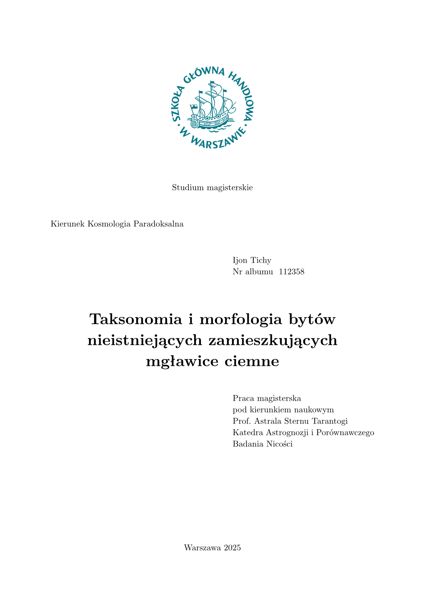

# sgh-thesis

A diploma thesis template (bachelor's and master's) compliant with the editorial
requirements of the SGH Warsaw School of Economics (Szkoła Główna Handlowa
w Warszawie). The template is bilingual — it supports Polish and English.

The default font used for typesetting theses is New Computer Modern, which ships
with every Typst installation, so no additional configuration is required to use
the template.

The full manual, a complete example thesis, and the matching SGH presentation
template are available in the project repository:
<https://github.com/piotr-m-kuszewski/Szablony_Typst_SGH>.



## Usage

```typst
#import "@preview/sgh-thesis:0.1.0": *

#show: sgh.with(
  author: "Ijon Tichy",
  student_id: "112358",
  title: "Taksonomia i morfologia bytów nieistniejących zamieszkujących mgławice ciemne",
  advisor: "prof. Astrala Sternu Tarantogi", // inflected for the phrase "pod kierunkiem naukowym..."
  advisor_department: "Katedra Astrognozji i Porównawczego Badania Nicości",
  year: "2025",
  studies: "mgr",       // "mgr" (master's) or "lic" (bachelor's)
  program: "Kosmologia Paradoksalna",
  language: "pl",       // "pl" or "en"
)

#sgh-summary[
  Abstract text.
]

#table-of-contents()

= Introduction

Body of the thesis...

#list-of-sources("sources.bib")
#list-of-figures()
#list-of-tables()
```

## Available procedures

- `sgh(...)` — the main template procedure; generates the title page and configures
  document formatting (used with `#show: sgh.with(...)`).
- `sgh-summary[...]` — the thesis abstract.
- `table-of-contents()` — table of contents.
- `list-of-figures()` — list of figures.
- `list-of-tables()` — list of tables.
- `list-of-sources(plik, styl: "harvard-cite-them-right")` — bibliography.
- `sgh-figure(caption:, source:, placement:, body)` — a figure with a caption and
  source; included in the list of figures.
- `sgh-table(caption:, source:, placement:, body)` — a table with a caption and
  source; included in the list of tables.
- `sgh-stripped-tables` — formats tables with alternating shaded rows
  (used with `#show: sgh-stripped-tables`).

## License

MIT — see the [LICENSE](LICENSE) file.
