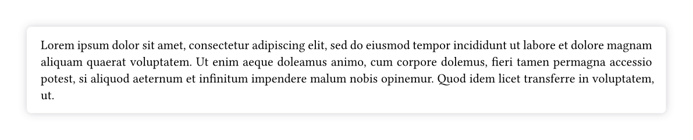

# shadowed

Box shadows for [Typst](https://typst.app/).

## Usage

```typ
#import "@preview/shadowed:0.2.0": shadowed

#set par(justify: true)

#shadowed(radius: 4pt, inset: 12pt)[
    #lorem(50)
]
```



## Reference

### `shadowed`

```typst
#let shadowed(
  fill: white,
  radius: 0pt,
  inset: 0pt,
  clip: false,
  shadow: 8pt,
  color: rgb(89, 85, 101, 30%),
  body,
) = { ... }
```

- **Input Arguments**
    - `fill` : [`color`] The block's background color.
    - `radius` : [`length`] How much to round the block's corners.
    - `inset` : [`length] How much to pad the block's content.
    - `clip` : [`bool`] Whether to clip the content inside the block.
    - `shadow` : [`length`] Blur radius of the shadow. Also adds a padding of the same size.
    - `color` : [`color`] Color of the shadow.
    - `dx` : [`relative`] The horizontal displacement of the shadow. Does not alter the block's padding.
    - `dy` : [`relative`] The vertical displacement of the shadow. Does not alter the block's padding.
    - `body` : [`content`] The contents of the block.

- **Output**
    - [`content`]

## Credits

This project was inspired by [Harbinger](https://github.com/typst-community/harbinger).
