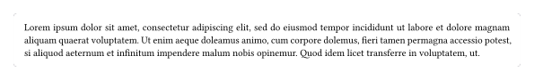
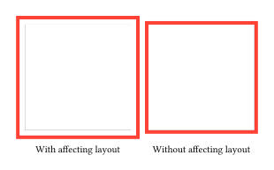
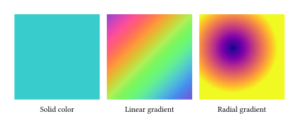
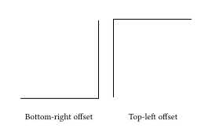
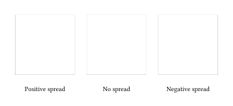
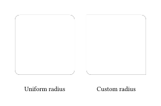

# shadowed

Box shadows for [Typst](https://typst.app/).

## Installation

Add the package to your Typst document:

```typ
#import "@preview/shadowed:0.3.0": shadow
```

## Quick Start

```typ
#import "@preview/shadowed:0.3.0": shadow

#set par(justify: true)

#shadow(blur: 8pt, fill: rgb(89, 85, 101, 25%), radius: 4pt)[
  #block(fill: white, radius: 4pt, inset: 12pt)[
    #lorem(50)
  ]
]
```



## Parameters

```typ
/// A box shadow.
/// -> content
#let shadow(
  /// The horizontal offset.
  /// -> length
  dx: 0pt,
  /// The vertical offset.
  /// -> length
  dy: 0pt,
  /// How strong to blur the shadow.
  /// 
  /// Must be equal to or greater than 0pt.
  /// 
  /// -> length
  blur: 0pt,
  /// How far to spread the length of the shadow.
  /// -> length
  spread: 0pt,
  /// How to fill the shadow.
  /// 
  /// Currently only supports linear or radial gradients.
  /// 
  /// -> color | gradient | none
  fill: black,
  /// How much to round the shadow's corners.
  /// 
  /// Can be either:
  /// - A relative length for a uniform corner radius.
  /// 
  /// - A dictionary: With a dictionary, the stroke for each side can be set individually.
  ///   The dictionary can contain the following keys in order of precedence:
  ///   - top-left: The top-left corner radius.
  ///   - top-right: The top-right corner radius.
  ///   - bottom-right: The bottom-right corner radius.
  ///   - bottom-left: The bottom-left corner radius.
  ///   - left: The top-left and bottom-left corner radii.
  ///   - top: The top-left and top-right corner radii.
  ///   - right: The top-right and bottom-right corner radii.
  ///   - bottom: The bottom-left and bottom-right corner radii.
  ///   - rest: The radii for all corners except those for which the dictionary explicitly sets a size.
  /// 
  /// -> length | dictionary
  radius: 0pt,
  /// The content to place in front of the shadow.
  /// -> content
  body,
) = { ... }
```

## Examples

### Layout

By default `shadow` does not affect the layout and just draws the shadow behind its content. This can lead to overlapping elements. To prevent this a `pad` of `blur + spread` can be applied.

```typ
#let blur = 4pt
#let spread = 2pt

// Padding has to consist of the blur + the spread.
#pad(blur + spread)[
  #shadow(blur: blur, spread: spread)[
    #block(height: 120pt, width: 120pt, fill: white)
  ]
]
```

For comparison, here are two shadows where one affects the layout while the other does not:



### Fill

The fill of a shadow can consist of nothing, a solid color or a gradient. Currently only linear and radial gradients are supported.

```typ
// Solid color
#shadow(blur: 3pt, fill: color.teal)[
  #block(width: 120pt, height: 120pt)
]

// Linear gradient
#shadow(blur: 3pt, fill: gradient.linear(..color.map.rainbow, angle: 45deg))[
  #block(width: 120pt, height: 120pt)
]

// Radial gradient
#shadow(blur: 3pt, fill: gradient.radial(..color.map.plasma, center: (40%, 40%)))[
  #block(width: 120pt, height: 120pt)
]
```



### Offset

Control the shadow position with `dx` and `dy` parameters:

```typ
// Shadow offset to the bottom-right
#shadow(dx: 3pt, dy: 3pt, blur: 4pt)[
  #block(width: 100pt, height: 100pt, fill: white)
]

// Shadow offset to the top-left
#shadow(dx: -3pt, dy: -3pt, blur: 4pt)[
  #block(width: 100pt, height: 100pt, fill: white)
]
```



### Spread

The `spread` parameter controls how much the shadow expands or contracts:

```typ
// Positive spread makes the shadow larger
#shadow(blur: 4pt, spread: 4pt)[
  #block(width: 100pt, height: 100pt, fill: white)
]

// Negative spread makes the shadow smaller
#shadow(blur: 4pt, spread: -2pt)[
  #block(width: 100pt, height: 100pt, fill: white)
]
```



### Custom Radius

You can set individual corner radii using a dictionary:

```typ
#shadow(
  blur: 4pt,
  radius: (
    top-left: 0pt,
    top-right: 8pt,
    bottom-right: 0pt,
    bottom-left: 8pt,
  )
)[
  #block(width: 100pt, height: 100pt, fill: white)
]
```



## License

MIT License - see [LICENSE](LICENSE) for details.

## Credits

This project was inspired by [Harbinger](https://github.com/typst-community/harbinger).
