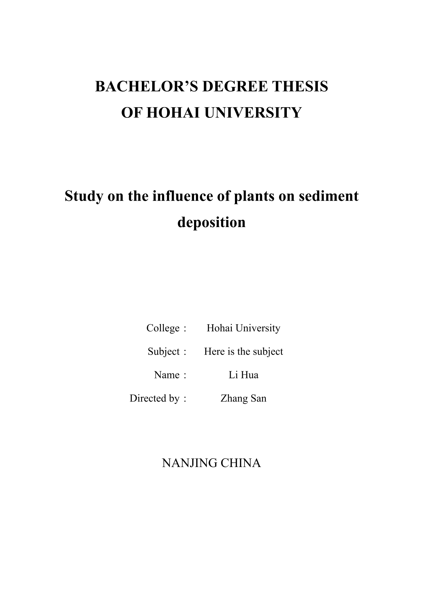
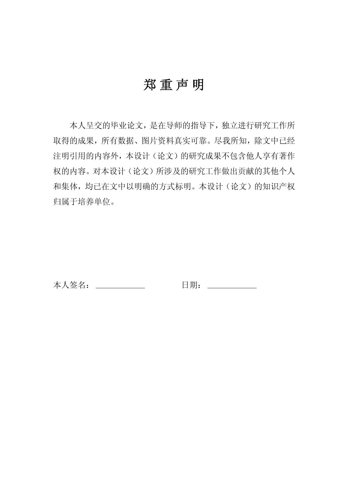
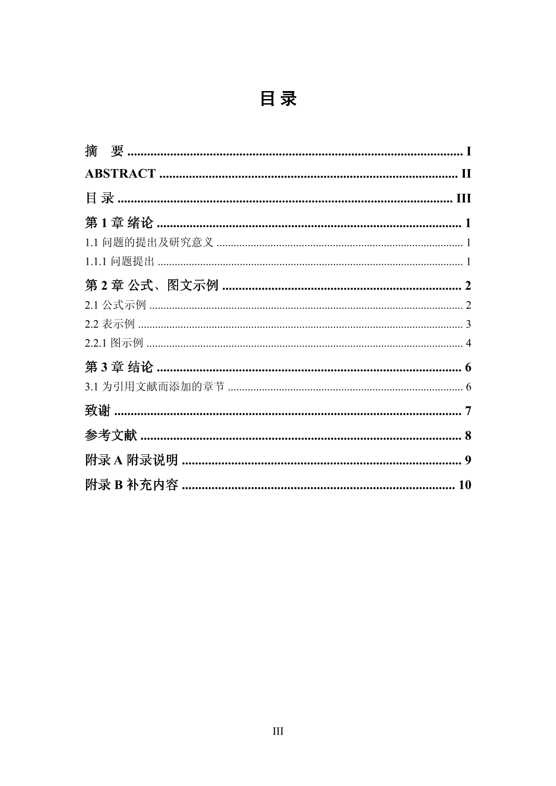

# 河海大学本科毕业论文（设计）模板（工科）

使用 Typst 制作的河海大学「本科毕业设计（论文）报告」模板（工科）。官方模板参考[河海大学本科毕业设计（论文）规范格式参考](https://bylw.hhu.edu.cn/UpLoadFile/83cd5f1169974a0db06d865c7ee11af4.pdf)

> [!IMPORTANT]
>
> 此模板非官方模板，可能仍存在一些问题，后续会不断更新完善。
>
> 此模板仅适用于工科专业本科毕业论文（设计），后续可能会更新文科模板。
>
> 本模板使用 Typst 0.12.x 编译，Typst 更新频率较高，可能出现版本更新后无法编译成功的情况。

  

    
    
  

  

    
    
  

## 使用方法

模板正在上传 Typst Universe ，收录成功后可以使用 `typst init` 功能初始化，也可以使用 Web App 编辑。Typst Universe 上的模板可能不是最新版本。如果需要使用最新版本的模板，从本 repo 中获取。

#### 本地使用（推荐）

使用前，请先安装 `fonts` 目录内的全部字体。

- 克隆或下载本 repo 的全部文件，编辑 `init-files` 目录内的示例文件。

- 使用 `typst init` 本地初始化模板：**TODO**

#### Web App 内使用

由于字体原因，不建议使用此方法。

**TODO**

## 模板内容

此 Typst 模板按照[《河海大学本科毕业设计（论文）基本规范(修订)》](https://bylw.hhu.edu.cn/UpLoadFile/83cd5f1169974a0db06d865c7ee11af4.pdf)制作，制作时参考了[东南大学制作的 Typst 模板](https://github.com/csimide/SEU-Typst-Template)。

目前包含以下页面：

- [x] 中英文封面
- [x] 中英文摘要
- [x] 目录
- [x] 正文
- [x] 致谢
- [x] 参考文献
- [x] 附录

模板目前仍然存在一些细节问题，后续会陆续更新解决。

- [ ] 图标后的段落需要使用 `#h(2em)` 手动缩进两个字符。
- [ ] 参考文献格式不完全符合学校要求的国家标准（GB7714-2005）要求。
- [ ] 行距、边距等有待继续调整，尤其是图标的上下行距。
- [ ] 存在多个重复的下划线显示方式，需要合并。
- [ ] 表头单独加粗英文字体。
- [ ] 调整下划线和下划线之前的文字底部对齐。
- [ ] 调整有序列表序号的位置，使其与文字对齐。
- [ ] 其他代码精简与优化。

## 致谢

- 东南大学论文模板：[csimide/SEU-Typst-Template](https://github.com/csimide/SEU-Typst-Template)

- 北京大学本科生毕业论文模板：[sigongzi/pkuthss-typst-undergraduate](https://github.com/sigongzi/pkuthss-typst-undergraduate)
