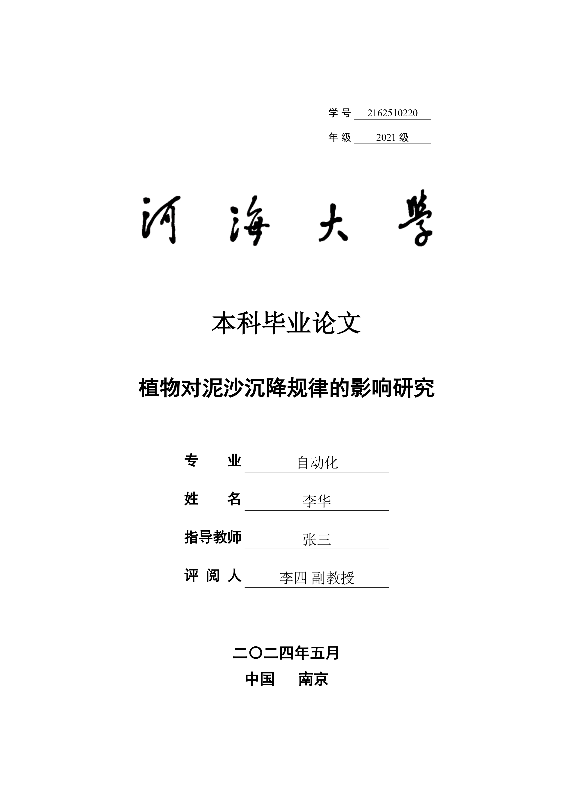

# 河海大学本科毕业论文（设计）模板（工科）

使用 Typst 制作的河海大学「本科毕业设计（论文）报告」模板（工科）。参考[河海大学本科毕业设计（论文）规范格式参考](https://bylw.hhu.edu.cn/UpLoadFile/83cd5f1169974a0db06d865c7ee11af4.pdf) 制作，但并非官方模板，可能存在细节问题。



## 使用方法

模板已上传 Typst Universe ，可以使用 `typst init` 功能初始化，也可以使用 Web APP 编辑。**Typst Universe 上的模板可能不是最新版本。如果需要使用最新版本的模板，从本 repo 中获取。**

#### 本地使用（推荐）

1. 使用前，请先安装 [fonts](https://github.com/shaneworld/Dots/tree/master/fonts) 中的全部字体。

2. 安装 Typst

    **Arch Linux**

    ```shell
    sudo pacman -S typst
    ```

    **Windows**

    前往 [Release](https://github.com/typst/typst/releases/) 下载最新版并添加到环境变量。

3. 终端执行 `typst init @preview/shane-hhu-thesis:LATEST_VERSION` 本地初始化模板，其中 LATEST_VERSION 为 [Typst Universe](https://typst.app/universe/package/shane-hhu-thesis) 中已发布的最新版本，如 0.4.0。

#### Web APP 内使用

由于 Typst Web APP 在每次打开页面的时候都会从服务器中下载字体，速度较慢，体验较差，因此不建议使用此方法。

在 [Typst Universe](https://typst.app/universe/package/shane-hhu-thesis) 中点击 `Create project in app` 按钮进入 Web APP 内。

然后，请将 [fonts](https://github.com/shaneworld/Dots/tree/master/fonts) 内的所有字体上传到 Web APP 内该项目的根目录任意位置后按照提示使用。

## 模板内容

此 Typst 模板按照[《河海大学本科毕业设计（论文）基本规范(修订)》](https://bylw.hhu.edu.cn/UpLoadFile/83cd5f1169974a0db06d865c7ee11af4.pdf)制作，制作时参考了[东南大学制作的 Typst 模板](https://github.com/csimide/SEU-Typst-Template)。

此论文模板不仅适用于本科生毕业论文/设计，同样适用于平时的课程报告等规范内容。可以通过自定义 `form` 字段更改论文种类，有以下3种格式可供选择：

- `thesis`：毕业论文
- `design`：毕业设计
- `report`：课程报告

可以通过修改 `heading` 字段修改页眉内容，修改 `thesis-name` 下的 `CN` 字段修改封面页面展示的标题。

### 参考文献格式

本模板按照学校要求采用 GB7714-2005 格式对参考文献进行排版，并针对测试中遇到的格式问题进行适当的修改加工。

由于项目使用 BibTex 方式自动导入参考文献，因此需要确保 BibTex 信息准确全面，可能需要手动检查并完善。导入的 BibTex 参考文献必须包含以下信息（示例）：


渲染后的结果如下：


具体设置参见 [hhu-bibliography](https://github.com/shaneworld/HHU-Thesis-Template/blob/master/hhu-thesis/parts/hhu-bibliography.typ) 文件。

如果发现模板的问题，欢迎提交 issue。

## 致谢

- 东南大学论文模板：[csimide/SEU-Typst-Template](https://github.com/csimide/SEU-Typst-Template)

- 北京大学本科生毕业论文模板：[sigongzi/pkuthss-typst-undergraduate](https://github.com/sigongzi/pkuthss-typst-undergraduate)

- 南京大学学位论文 Typst 模板：[nju-lug/modern-nju-thesis](https://github.com/nju-lug/modern-nju-thesis)
