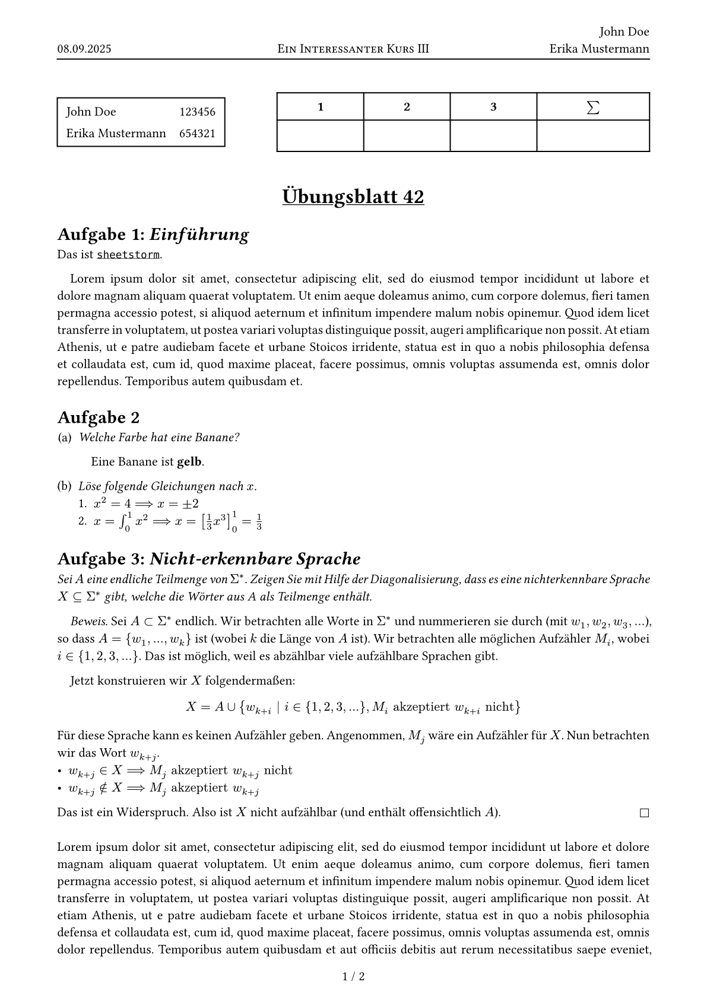

# sheetstorm
A Typst template for university exercise sheets.

## Quick Start

### Template CLI
```sh
typst init @preview/sheetstorm
```

### Manual
```typst
#import "@preview/sheetstorm:0.1.0"

#show: sheetstorm.setup.with(
  course: smallcaps[A very interesting course 101],
  title: "Assignment 42",
  authors: (
    (name: "John Doe", id: 123456),
    (name: "Erika Mustermann", id: 654321),
  ),

  info-box-enabled: true,
)
```

## Preview


## Development
For local development, install the package to the `@local` namespace.

This is very easy with a tool like [typship](https://github.com/sjfhsjfh/typship):
```sh
typship install local
```

Then, you can use it in a Typst file:
```typst
#import "@local/sheetstorm:0.1.0"
```

## TODOs / Ideas
- [ ] Points for tasks
