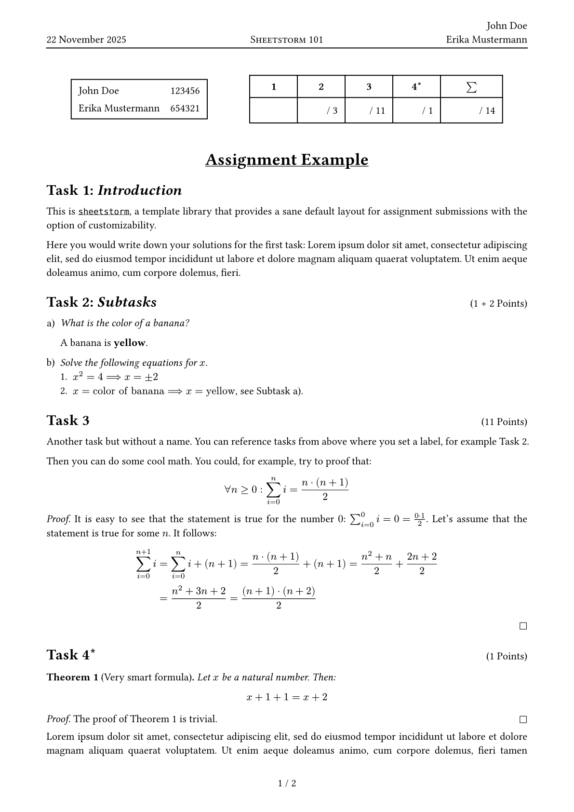

# sheetstorm
A Typst template for assignment sheets.

*Disclaimer:*
Although we find this library to be perfectly usable, it is still rather new and under active development.
Breaking changes in new versions are to be expected.

## Quick Start
```typst
#import "@preview/sheetstorm:0.4.0": *

#show: assignment.with(
  title: "My title",
  // ...
)

#task[
  // Write down your solutions for task 1 here.
]
```

Or using the template CLI:
```sh
typst init @preview/sheetstorm
```

## Preview


See [here](./examples/assignment.typ) for the source code.

## Documentation
We have a [user manual](./docs/manual.pdf) that documents the entire public API with all customization options.

There are also a few [examples](./examples) that illustrate how to use the template.

## Feature Highlights
- Sane minimal default layout with "vanilla" look
- Very customizable with lots of configuration options
- Multi-language capability (see [internationalization](./src/i18n.typ) module)
- Built-in theorem/proof environments
- "TODO" warning system
- Useful widgets: info box and score box
