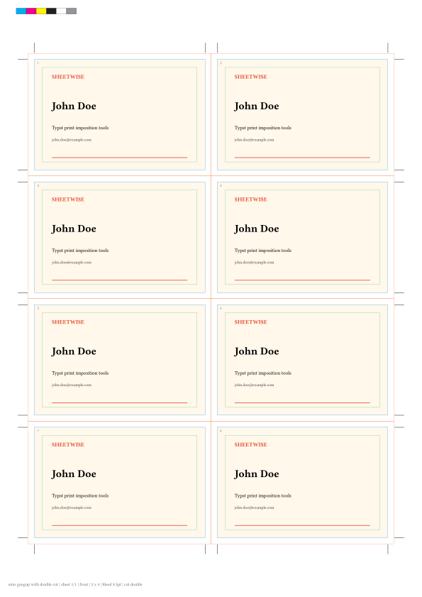
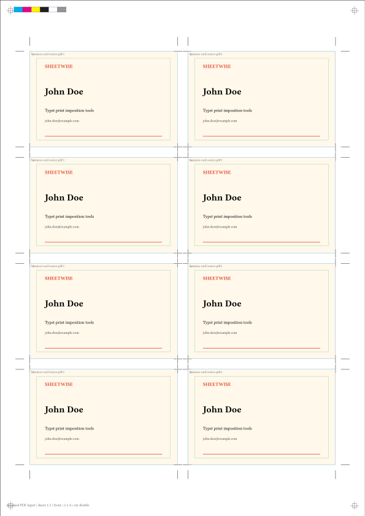
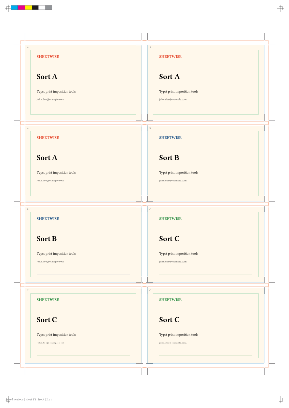
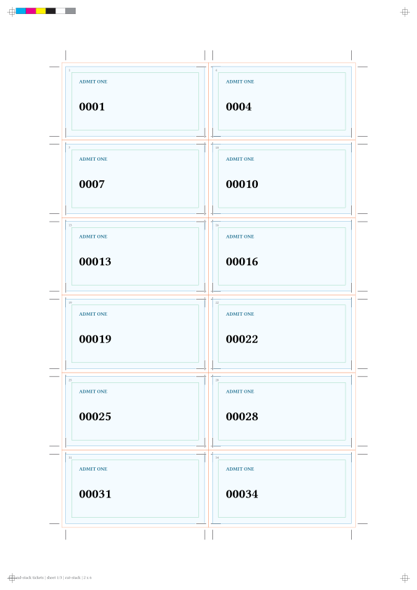
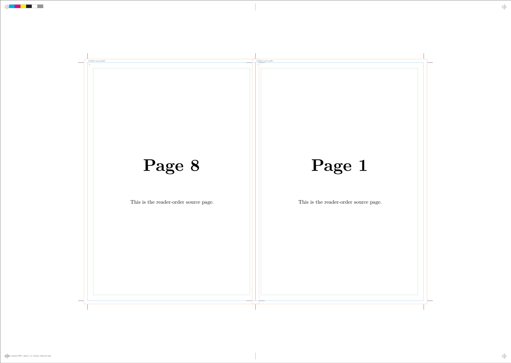
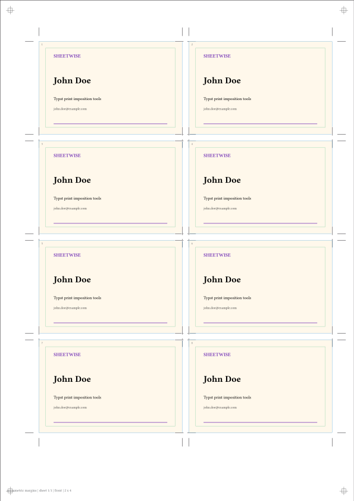

# Sheetwise

Arrange print items on press sheets in Typst.

Sheetwise is a Typst-native imposition helper for business cards, labels,
stickers, coupons, tickets, flyer grids, mixed versions, duplex sheets,
cut-and-stack jobs, independent cut-mark regions, and saddle-stitch booklet
proofs.

## Two Input Workflows

Sheetwise supports two ways to work:

| Workflow | Use it when | Job constructors |
| --- | --- | --- |
| Typst content | The design is authored in Typst and should be repeated or arranged on press sheets. | `repeat`, `variants`, `sequence` |
| Finished PDF input | The design is already compiled and should be imposed without re-authoring it. | `pdf`, `booklet` |

Use `marks-only` when you only need crop/registration marks around explicit
regions. Use `calibration` to print a front/back duplex alignment sheet.

## Features

- One canonical renderer: `impose(job, ...)`.
- Job constructors for repeated content, mixed variants, numbered sequences,
  finished PDF input, saddle-stitch booklets, mark-only sheets, and duplex
  calibration.
- Automatic or manual rows/columns for press-sheet grids.
- Side-specific margins with `(left:, right:, top:, bottom:)`.
- Single-cut and double-cut spacing with bleed validation.
- Per-item crop marks, shared grid marks, and arbitrary explicit mark regions.
- Registration marks default to 4C process black
  `cmyk(100%, 100%, 100%, 100%)`; crop marks use K-only black by default.
- Duplex front/back alignment with long-edge and short-edge flipping.
- Saddle-stitch PDF imposition with blank-page padding, binding direction, fold
  marks, and creep compensation.

## Preview

Automatic gang-up with print guides:



Finished PDF input imposed on a sheet:



Multiple versions and cut-and-stack output:





Saddle-stitch printer spreads:



Independent mark regions and asymmetric margins:




## Installation

After publishing to Typst Universe:

```typst
#import "@preview/sheetwise:0.1.0": impose, repeat
```

For local development from this repository, compile with a local package path
and use the same import shape:

```typst
#import "@preview/sheetwise:0.1.0": impose, repeat
```

If you cloned the source repository, compile all local examples and tests with:

```sh
sh tests/run.sh
```

## Quick Start: Typst Content

Use this mode when your design is Typst content.

```typst
#import "@preview/sheetwise:0.1.0": impose, repeat

#let card = rect(width: 100%, height: 100%, fill: rgb("#fff8eb"))[
  #pad(6mm)[
    #text(size: 15pt, weight: "bold")[John Doe]
    #v(2mm)
    Typst print imposition tools
  ]
]

#impose(
  repeat()[#card],
  paper: "a4",
  trim-size: (85mm, 55mm),
  margin: 12mm,
  gap: 6mm,
  cut-mode: "double",
  bleed: 3mm,
  safe: 4mm,
  marks: (crop: true, bleed: true, safe: true, color-bar: true),
  slug: (job: "business cards", sheet: true, grid: true),
)
```

## Quick Start: Finished PDF

Use this mode when the design is already compiled. Prefer passing PDF bytes with
`read(..., encoding: none)` so the source path is resolved by your document.

```typst
#import "@preview/sheetwise:0.1.0": impose, pdf

#impose(
  pdf(read("card.pdf", encoding: none), source-name: "card.pdf"),
  paper: "a4",
  trim-size: (85mm, 55mm),
  cut-mode: "double",
  gap: 6mm,
  bleed: 3mm,
  marks: (crop: true, registration: true, file-header: true),
)
```

## Core Concepts

| Term | What it means | How to set it |
| --- | --- | --- |
| Paper | The full press sheet or printer sheet. | `paper: "a4"` or `paper: (320mm, 450mm)` |
| Trim size | The final cut size of one item. | `trim-size: (85mm, 55mm)` |
| Margin | Empty space around the grid. | `margin: 12mm` or side margins |
| Gap | Space between items. | `gap: 4mm` or `(width: 6mm, height: 3mm)` |
| Bleed | Artwork allowance outside the trim. | `bleed: 3mm` |
| Safe area | Inset guide for text/logos away from trim. | `safe: 4mm` |
| Cut mode | Whether neighboring items share one cut or use a removable gutter. | `cut-mode: "single"` or `"double"` |
| Marks | Crop, bleed, safe, registration, color, and fold guides. | `marks: true` or a dictionary |
| Proof | Adds visible proof outlines and labels. | `proof: true` |
| Slug | Small metadata text on the sheet edge. | `slug: "Job 42"` or a dictionary |

## The `impose` Renderer

Every output goes through `impose(job, ...)`. The job defines what content is
placed. Renderer options define the sheet, grid, marks, and proof overlays.

```typst
#impose(
  repeat()[#card],
  paper: "a4",
  orientation: "portrait",
  trim-size: (85mm, 55mm),
  margin: 10mm,
  gap: 3mm,
  rows: auto,
  columns: auto,
  cut-mode: "single",
  bleed: 0pt,
  safe: 0pt,
  marks: true,
)
```

### Sheet And Grid Options

| Option | Default | Meaning |
| --- | --- | --- |
| `paper` | `"a4"` | Named paper size or custom `(width, height)` / `(width:, height:)`. Built-ins: `a6`, `a5`, `a4`, `a3`, `sra3`, `letter`, `legal`, `tabloid`. |
| `orientation` | `"portrait"` | `"portrait"` keeps the paper size as defined; `"landscape"` swaps width and height. |
| `trim-size` | `auto` | Required finished item size unless `item-size` is supplied. |
| `item-size` | `auto` | Alias for `trim-size`; if both are set, they must match. |
| `item-orientation` | `"original"` | `"original"`, `"portrait"`, `"landscape"`, or `"auto"`. `"auto"` chooses the orientation that fits the most slots. |
| `margin` | `10mm` | Length, `(x, y)`, `(width:, height:)`, or `(left:, right:, top:, bottom:)`. |
| `gap` | `3mm` | Length or pair. Controls horizontal and vertical space between trim boxes. |
| `rows` | `auto` | Manual row count. Must be at least `1` when set. |
| `columns` | `auto` | Manual column count. Must be at least `1` when set. |

Side-specific margins solve asymmetric printer or finishing needs:

```typst
margin: (left: 18mm, right: 8mm, top: 12mm, bottom: 28mm)
```

### Cut, Bleed, And Safe Options

| Option | Default | Meaning |
| --- | --- | --- |
| `cut-mode` | `"single"` | `"single"` means adjacent items can share cut lines. `"double"` means a removable strip separates items. |
| `bleed` | `0pt` | Must not be negative. For double-cut jobs, each gap must be at least `2 * bleed`. |
| `safe` | `0pt` | Must be smaller than half of the item width and height. |

Use `"single"` for zero-gap shared cutting. Use `"double"` when each item has
its own bleed and the gutter will be removed.

### Marks And Proof Options

`marks` can be `true`, `false`, `none`, or a dictionary.

```typst
marks: (
  crop: true,
  crop-mode: "auto",
  bleed: true,
  safe: true,
  registration: true,
  color-bar: true,
  fold: false,
  file-header: false,
  page-border: false,
)
```

| Mark option | Default with `marks: true` | Meaning |
| --- | --- | --- |
| `crop` | `true` | Draw crop marks around trim regions. |
| `crop-mode` | `"auto"` | `"per-item"` draws each item separately. `"grid"` draws shared grid cut lines. `"auto"` picks grid marks for tight shared cuts and per-item marks otherwise. |
| `bleed` | `false` | Draw bleed outlines when `bleed > 0pt`. |
| `safe` | `false` | Draw safe-area outlines when `safe > 0pt`. |
| `registration` | `false` | Draw four registration marks on the sheet. |
| `color-bar` | `false` | Draw CMYK and gray color patches. |
| `fold` | `false` | Draw fold marks, mainly useful for booklets. |
| `file-header` | `false` | Draw per-PDF source labels such as `flyer.pdf:2` when PDF jobs provide `source-name`. |
| `page-border` | `false` | Draw a thin border around the full output sheet. Works for Typst-content and finished-PDF jobs. |

`proof: true` adds colored trim/bleed/safe outlines and labels for checking
placement. It is useful for development proofs, not final print output.

### Mark Style

Use `mark-style` to tune crop and registration mark appearance.

```typst
mark-style: (
  color: cmyk(0%, 0%, 0%, 100%),
  registration-color: cmyk(100%, 100%, 100%, 100%),
  length: 5mm,
  offset: 3.1751mm,
  bleed-offset: 0pt,
  no-bleed-offset: 2mm,
  thickness: 0.1764mm,
  knockout: true,
  knockout-color: cmyk(0%, 0%, 0%, 0%),
  knockout-padding: 0.7pt,
  file-header-size: 5pt,
  file-header-color: cmyk(0%, 0%, 0%, 70%),
  file-header-inset: 1mm,
  page-border-color: cmyk(0%, 0%, 0%, 100%),
  page-border-thickness: 0.1764mm,
)
```

Registration and fold marks use `registration-color`, which defaults to 4C
process black. Crop marks use `color`, which defaults to K-only black. The
default crop mark offset and width follow common InDesign-style values:
`offset: 3.1751mm` and `thickness: 0.1764mm`.

`file-header` needs explicit PDF metadata because `read(..., encoding: none)`
passes bytes, not the original path. Set `source-name` so the imposed sheet can
show `filename:page` in the bleed area of each placed PDF page.

### Slug Metadata

`slug` prints small metadata near the sheet edge.

```typst
slug: (job: "cards", sheet: true, grid: true, bleed: true, cut-mode: true)
```

Set `slug: none` or `slug: false` to disable it. Use a string for fixed text or
a dictionary with `job`, `date`, `sheet`, `grid`, `bleed`, `cut-mode`, or
`text`.

## Job Constructors

### `repeat(...)[body]`

Repeat one Typst design across the grid.

```typst
#impose(
  repeat(copies: auto)[#card],
  paper: "a4",
  trim-size: (85mm, 55mm),
)
```

Options:

| Option | Default | Meaning |
| --- | --- | --- |
| `copies` | `auto` | Number of occupied slots. `auto` fills the grid. |
| `duplex` | `false` | Emit a back side after the front. |
| `back` | `none` | Back-side Typst content. Required when `duplex: true`. |
| `back-rotation` | `180deg` | Rotates back content before placement. |
| `flip` | `"long-edge"` | Back-side slot mapping: `"long-edge"`, `"short-edge"`, or `"none"`. |

### `variants(items: ...)`

Arrange several Typst designs with per-variant copy counts.

```typst
#impose(
  variants(
    items: (
      (label: "A", copies: 3, body: card-a),
      (label: "B", copies: 2, body: card-b),
      (label: "C", copies: 3, body: card-c),
    ),
  ),
  paper: "a4",
  trim-size: (85mm, 55mm),
)
```

Each item needs `body`. It may also include `label`, `copies`, and `back` for
duplex variant jobs. `order: "reverse"` fills records in reverse order.

### `sequence(count:, item:, ...)`

Generate numbered or variable items. This is useful for tickets, coupons, and
cut-and-stack work.

```typst
#let ticket(n) = align(center + horizon)[Ticket #n]

#impose(
  sequence(
    count: 36,
    stack-flow: ("deep", "right", "down"),
    item: n => ticket(n),
  ),
  paper: "a4",
  trim-size: (70mm, 35mm),
  rows: 6,
  columns: 2,
)
```

Options:

| Option | Default | Meaning |
| --- | --- | --- |
| `count` | required | Total generated records. |
| `item` | required | Function called as `item(n)` for 1-based record numbers. |
| `flow` | `"cut-stack"` | Preset ordering. Supported: `"cut-stack"`, `"n-up"`, `"down-right-deep"`, `"deep-down-right"`, plus the explicit names `"deep-right-down"` and `"right-down-deep"`. |
| `stack-flow` | `auto` | Custom ordering tuple containing `deep`, `right`, and `down` exactly once. |
| `stack-size` | `auto` | Force the number of sheets in the stack. Must fit `count`. |
| `order` | `"forward"` | `"forward"` or `"reverse"`. |

### `pdf(source:, ...)`

Impose one page from a finished PDF. Use this when artwork already exists as a
PDF.

```typst
#impose(
  pdf(
    read("front.pdf", encoding: none),
    source-name: "front.pdf",
    page: 1,
    copies: auto,
  ),
  paper: "a4",
  trim-size: (85mm, 55mm),
)
```

Options:

| Option | Default | Meaning |
| --- | --- | --- |
| `source` | required | PDF bytes or a source accepted by Typst `image`. |
| `source-name` | `none` | Optional filename printed by `marks.file-header`, for example `front.pdf`. |
| `page` | `1` | Source PDF page to place. |
| `fit` | `"stretch"` | Passed to Typst `image`. |
| `alt` | `none` | Alternative text for the placed image. |
| `copies` | `auto` | Number of occupied slots. |
| `duplex` | `false` | Emit a back side. |
| `back-source` | `none` | Back-side PDF source. Required when `duplex: true`. |
| `back-source-name` | `auto` | Filename for the back side. `auto` reuses `source-name`; set it when the back comes from a different PDF. |
| `back-page` | `1` | Back-side page number. |
| `back-fit` | `auto` | Uses `fit` when left as `auto`. |
| `back-alt` | `none` | Alternative text for the back-side image. |
| `back-rotation` | `180deg` | Rotates back PDF content before placement. |
| `flip` | `"long-edge"` | Back-side slot mapping. |

### `booklet(source:, page-count:, ...)`

Create saddle-stitch printer spreads from a finished PDF. Sheetwise outputs
front and back sides for each booklet sheet.

```typst
#impose(
  booklet(
    read("booklet-source.pdf", encoding: none),
    source-name: "booklet-source.pdf",
    page-count: 8,
    creep: (paper-thickness: 0.12mm),
  ),
  paper: "sra3",
  orientation: "landscape",
  trim-size: (148mm, 210mm),
  marks: (crop: true, registration: true, color-bar: true, fold: true),
)
```

Options:

| Option | Default | Meaning |
| --- | --- | --- |
| `source` | required | Finished source PDF bytes. |
| `source-name` | `none` | Optional filename printed by `marks.file-header` for each placed booklet page. |
| `page-count` | required | Number of source pages before optional blank padding. |
| `fit` | `"stretch"` | Passed to Typst `image`. |
| `alt` | `none` | Alternative text for placed pages. |
| `creep` | `0pt` | Saddle-stitch creep compensation. Use a direct amount or `(paper-thickness: 0.12mm)`. |
| `blank-policy` | `"error"` | `"error"` rejects page counts not divisible by 4. `"end"` pads blanks at the end. |
| `binding` | `"left"` | `"left"` or `"right"`. |
| `reading-direction` | `"ltr"` | `"ltr"` or `"rtl"`. RTL mirrors page pairs. |
| `order` | `"forward"` | `"forward"` or `"reverse"` output sheet order. |

Creep is the English term for German `Bundverdrangung`: inner sheets shift when
nested and folded for saddle stitching. `creep: (paper-thickness: 0.12mm)`
computes the maximum shift from paper thickness and sheet count, then applies a
progressive horizontal correction across sheets.

Use the helpers below to inspect spread order:

```typst
#booklet-plan(8)
#booklet-report(12, blank-policy: "end")
```

### `marks-only(regions:)`

Draw marks around explicit regions without placing content. This covers
multi-region cut-mark workflows.

```typst
#impose(
  marks-only(
    regions: (
      (x: 18mm, y: 20mm, width: 50mm, height: 30mm, label: "A"),
      (x: 82mm, y: 20mm, width: 50mm, height: 30mm, label: "B"),
    ),
  ),
  paper: "a4",
  bleed: 2mm,
  marks: (crop: true, registration: true),
  proof: true,
)
```

Regions can be dictionaries `(x:, y:, width:, height:)` or arrays
`(x, y, width, height)`. Coordinates start at the top-left sheet corner.

### `calibration(...)`

Print a two-page duplex calibration sheet to verify flip direction and back-side
rotation before running real jobs.

```typst
#impose(
  calibration(flip: "long-edge", back-rotation: 180deg),
  paper: "a4",
  marks: (registration: true),
)
```

## Planning Helpers

Sheetwise exports small helpers for checking imposition math:

| Helper | Use |
| --- | --- |
| `paper-size("a4", orientation: "landscape")` | Resolve paper dimensions. |
| `grid-plan(...)` | Inspect rows, columns, slot count, margins, and grid origin before rendering. |
| `booklet-plan(page-count, ...)` | Return saddle-stitch page pairs. |
| `booklet-report(page-count, ...)` | Typeset a human-readable booklet spread report. |
| `registration-color` | Exported 4C registration mark color. |

## Current Limits

Sheetwise is a Typst package, not a PDF preflight engine. It can arrange pages
and draw print guides, but it cannot guarantee PDF/X conformance, convert color
profiles, inspect image resolution, or rewrite PDF page boxes. Use dedicated
prepress tooling when those constraints matter.
