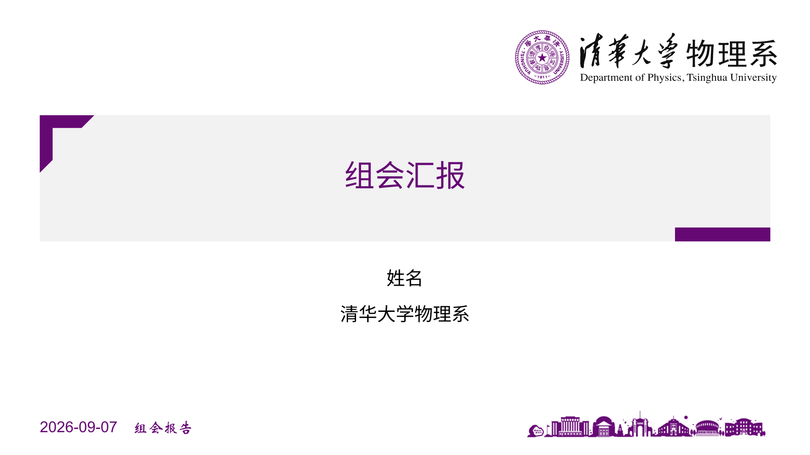
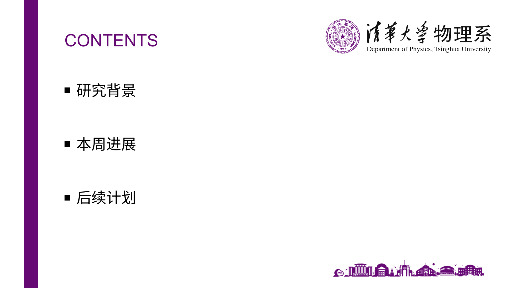
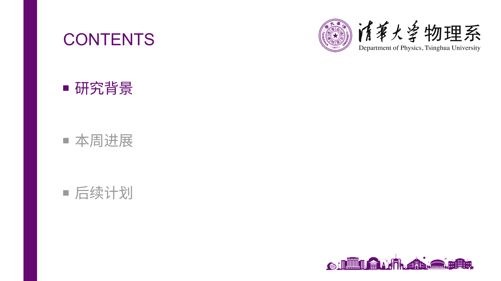
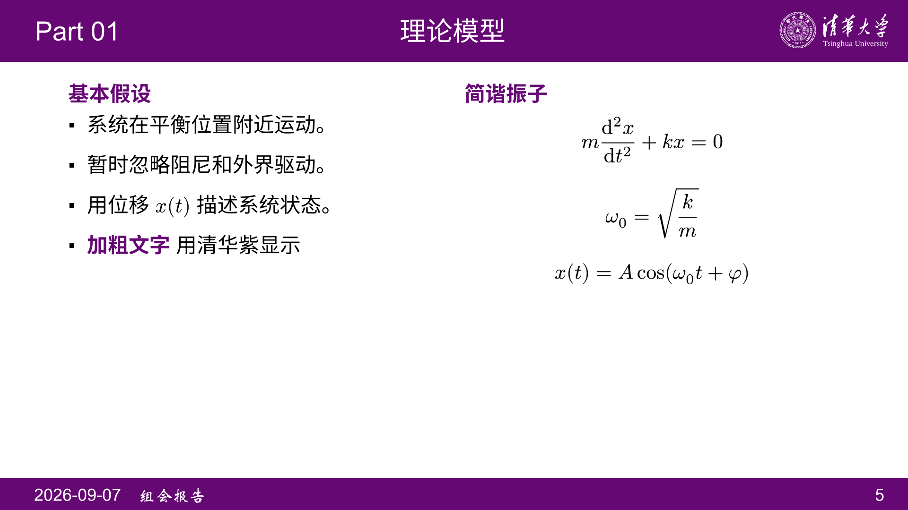
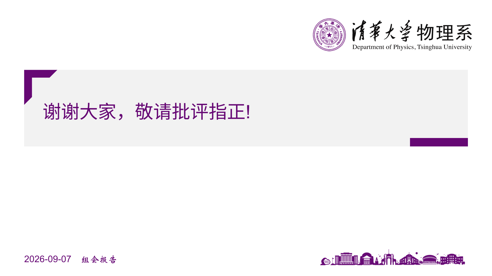

# Shuimu-touying-zen: 清华简约主题 Touying 模板

[English](README.md) | 简体中文

根据 [THU-PPT-Theme](https://github.com/atomiechen/THU-PPT-Theme) 简约主题 PPT 重建。原稿为 16:9、960 × 540 pt，采用清华紫 `#660874` (见[色彩规范](https://vi.tsinghua.edu.cn/gk/xxbz/scgf.htm))、灰色封面标题框、目录竖线及正文页上下横条。

## 文件

- `theme.typ`：可复用的主题和页面函数。
- `assets/`：各院系标识、校园剪影。
- `tools/binarize.py`：可选的二值化脚本，用于把位图转成纯黑白素材。
- `gallery/`：示例页面和生成 SVG 的 inkscape 源图。

## 开始使用

直接编辑 `main.typ`。VS Code 中可用现有的 Tinymist 预览和导出 PDF；也可在本目录运行：

```powershell
typst compile main.typ main.pdf
typst watch main.typ main.pdf
```

本次使用本机 Tinymist 0.15.6 编译验证，依赖固定为 `@preview/touying:0.7.4`。第一次在新设备编译需要下载 Touying 及其依赖。主题默认的中文字体为黑体（`SimHei`），英文为 Arial，公式独立使用 `New Computer Modern Math`；页脚副标题的中文使用华文新魏（`STXinwei`），英文仍使用 Arial。随包的 `main.typ` 把 `font` 覆盖为 `("Arial", "Noto Sans SC")`，未覆盖 `subtitle-font`。换设备时请确保这些字体可用，或通过对应参数指定替代字体。

最小示例：

```typst
#import "@preview/touying:0.7.4": *
#import "@preview/shuimu-touying-zen:0.1.0": *

#show: group-meeting-theme.with(
  config-info(
    title: [报告标题],
    subtitle: [博士生论坛],
    author: [姓名],
    institution: [清华大学物理系],
    date: datetime.today(),
  ),
)

#title-slide()
#outline-slide()

= 研究背景
== 研究问题

- 第一个问题
- 第二个问题

= 本周进展
== 主要结果

这里填写正文。

#closing-slide()
```

`= 一级标题`定义章节，`== 二级标题`开始新的一页。左上角的 `Part 01`、`Part 02` 自动随章节更新。每个章节开始前自动显示一次目录，当前章节行（含方块）为清华紫，其余行为灰色。封面、目录参与逻辑页码计数，但不显示页码。动画的多个步骤显示同一页码。

## 主题设置

下面这些参数都写在 `group-meeting-theme.with(...)` 中：

| 参数 | 默认值 | 用途 |
| --- | --- | --- |
| `primary` | `tsinghua-purple` | 横条、竖线、标题与强调文字的颜色，同时决定预设 SVG 标识的重着色 |
| `font` | `("Arial", "SimHei")` | 英文与中文字体 |
| `math-font` | `"New Computer Modern Math"` | 公式字体，独立于全局字体 |
| `subtitle-font` | `("Arial", "STXinwei")` | 页脚副标题的英文与中文字体 |
| `body-size` | `22pt` | 正文字号 |
| `title-size` | `28pt` | 正文页顶部标题字号，长标题会适当缩小 |
| `section-slides` | `true` | 自动插入当前章节的高亮目录，`false` 可关闭 |
| `outline-v-spacing` | `auto` | 所有目录的条目间距，默认均匀分布，可设为 `32pt` 等长度 |
| `show-contents` | `true` | 是否显示目录，`false` 可隐藏 |
| `part-prefix` | `"Part"` | 左上角章节编号的前缀 |
| `footer` | `auto` | 默认显示日期和副标题；自定义内容可覆盖，`none` 可隐藏 |
| `show-page-number` | `true` | 是否显示正文页页码 |
| `cover-logo-name` | `"university-logo.svg"` | 封面/目录标识使用的 `assets/` 预设文件名 |
| `header-logo-name` | `"university-logo.svg"` | 正文页右上角标识使用的 `assets/` 预设文件名 |
| `cover-logo` | `none` | 直接指定封面/目录标识，优先于 `cover-logo-name` |
| `header-logo` | `none` | 直接指定正文页右上角标识，优先于 `header-logo-name` |
| `campus` | `none` | 直接指定封面/目录右下角剪影；未指定（`none`）时自动读取预设 `campus.svg` |

例如，更改横条背景色并更换封面标识：

```typst
#show: group-meeting-theme.with(
  primary: rgb("194f6b"),
  cover-logo-name: "phys-logo.svg",
  config-info(title: [报告标题]),
)
```

### 标识与剪影

标识有**两套来源**，`-name` 参数决定预设，`cover-logo` / `header-logo` / `campus` 决定自定义内容：

1. **仓库预设**：`cover-logo-name`、`header-logo-name` 接受 `assets/` 下的文件名，默认都是 `"university-logo.svg"`；`campus` 未指定时使用 `assets/campus.svg`。
2. **自定义内容**：`cover-logo`、`header-logo`、`campus` 接受 `image(...)`、路径字符串，或任意 Typst 内容；只要不是 `none`，就**覆盖**对应的预设。

主题读取预设 SVG 时会把其中的清华紫 `#660874` 替换为主色：

| 位置 | 替换规则 |
| --- | --- |
| `cover-logo-name` | 仅替换 `#660874` → `primary`，标识随主色变色 |
| `header-logo-name` | 替换**所有**填充色 → 白色（正文页顶部是彩色横条，需反白） |
| `campus`（预设） | 仅替换 `#660874` → `primary` |

实测 `primary: blue` 时封面标识输出 `#005795`，`primary: red` 时输出 `#D62728`。

**直接传入的图片不做任何重着色**，保持原文件颜色。因此：

- 想让标识跟随主色 → 用 `-name` 预设（或传一个本身就是主色的 SVG）。
- 想让标识保持原始配色 → 用 `cover-logo: image("assets/university-logo.svg")` 直接传入。

可用预设：

| 预设 | 说明 |
| --- | --- |
| `university-logo.svg` | 清华大学标识（默认） |
| `phys-logo.svg` | 物理系标识 |
| `EE-logo.svg` | 电子工程系标识 |
| `energy-power-logo.svg` | 能源与动力工程系标识 |
| `arts-logo.svg` | 美术学院标识 |
| `journalism-logo.svg` | 新闻与传播学院标识 |
| `campus.svg` | 校园剪影（默认剪影） |

字符串路径会被自动当作图片打开：`cover-logo: "assets/my-logo.png"` 等价于 `cover-logo: image("assets/my-logo.png")`。

**关于隐藏**：这三个参数传 `none` 表示"沿用预设/默认"，**不是**隐藏。要真正隐藏，请传入一张全透明图片（如 1×1 透明 PNG）；注意不要传空内容 `[]`，`scale-to-fit` 会因除零报错。

除主色 `tsinghua-purple`（清华紫 `#660874`，即 `primary` 默认值）外，主题另导出以下颜色变量，可直接用于 `text`、线条或图表：

```typst
#text(tsinghua-magenta)[品红]  // #D93379，可作替代主色
#text(red)[红色]              // #D62728
#text(blue)[蓝色]             // #005795
#text(green)[绿色]            // #1A5F1A
#text(orange)[橙色]           // #C45C00
```

## 页面与内容

### 封面

```typst
// 标题、作者、单位居中，日期和副标题放在左下角。
#title-slide()

// 或单独指定这一页的标题、标识和补充内容。
// logo 直接传入图片，不做重着色（区别于 group-meeting-theme 的 cover-logo-name）。
#title-slide(title: [标题], subtitle: [博士生论坛报告],
  logo: image("assets/phys-logo.svg"), extra: [课题组名称])
```

封面标题建议控制在两行内；标题框尺寸固定，长标题需要主动换行或精简。

`config-info.subtitle` 默认仅出现在页脚日期后面，例如 `2026-09-07    博士生论坛报告`。日期和副标题（包括中英文）均为 18pt，中间间隔 18pt。封面页脚使用清华紫，左端与标题框左端（47.18pt）对齐，文字下缘与右下角校园图下缘（515.25pt）对齐；结束页沿用这一位置。正文页脚使用白色，并在底部横条内与页码共用基线、垂直居中。总目录和章节高亮目录均不显示页脚。若需要保留原稿的并排标题形式，仍可显式使用 `#title-slide(inline-subtitle: true)`。

### 目录

`#outline-slide()` 自动收集一级标题并生成可点击的目录。目录文本框以整张 slide 的垂直中线（270pt）为中心，上下留白相等，避开顶部标题、标识和底部校园剪影。未指定间距时，多行条目均匀铺满整个可用文本区（120–420pt）；只有一个章节时，该行居于 slide 正中。也可手动指定条目和垂直间距：

```typst
#outline-slide(title: [目录], v-spacing: 32pt, items: (
  [研究背景],
  [本周进展],
  [后续计划],
))
```

默认目录适合约 3–5 个章节；条目过长或过多时，应拆成多页并分别传入 `items`。

单页的 `v-spacing` 覆盖全局 `outline-v-spacing`；两者均为 `auto` 时自动分配空白。手动间距表示相邻条目之间的净空白，此时将所有条目组成的整个文本组垂直居中，而非从顶部开始排列。`active: 2` 可手动高亮第 2 行，`active: auto` 高亮当前章节，`active: none` 为不高亮的总目录。自动章节目录无需手动调用。

### 普通页和双栏

```typst
// 二级标题方式，自动读取章节编号。
== 实验结果

这里填写正文。

// 显式创建页面并指定顶部文字。
#slide(title: [实验结果], part: [Part 02])[
  这里填写正文。
]

// 双栏比例可修改。
#slide(title: [理论模型], composer: (1fr, 1fr))[
  左栏内容。
][
  $ E = m c^2 $
]
```

正文可直接使用 Typst 的列表、数学公式、`image`、`table`、`figure` 等。为了保留一页对应一张幻灯片的关系，主题关闭自动溢出分页，并启用 Touying 的正文溢出警告。出现警告时请减少内容或手动拆页。

### 动画与讲义

```typst
== 逐步显示

第一步。

#pause

第二步。
```

导出讲义时，在主题参数中加入 `config-common(handout: true)`，每张幻灯片只保留最终步骤。`#meanwhile`、演讲者备注等继续使用 Touying 提供的接口。

### 结束页

```typst
#closing-slide(body: [谢谢！], subtitle: [欢迎讨论])
```

## 素材说明

`assets/` 中的标识以清华紫 `#660874` 作为占位色，主题据此重着色（见上文"标识与剪影"）。封面框、目录竖线和正文横条均由 Typst 原生图形构成，文字、表格和公式可直接编辑。

各标识取自[清华大学形象识别规范](https://vi.tsinghua.edu.cn/gk/xxbz/xh.htm)及各院系公开资料；`campus` 剪影来自原稿渲染结果。为兼容 Typst，部分 SVG 移除了背景矩形、将裁剪组的变换移到路径上并收紧了画布留白。标识与图片的权利归原权利人，不因模板转换而改变。

字体渲染、段落间距和 SVG 标识与 PPT 原稿存在细微差异，本模板保留原稿的主要几何尺寸和设计。

Touying 的接口可参考 [官方文档](https://touying-typ.github.io/zh/docs/intro) 和 [0.7.4 包页面](https://typst.app/universe/package/touying/)。

## 预览





