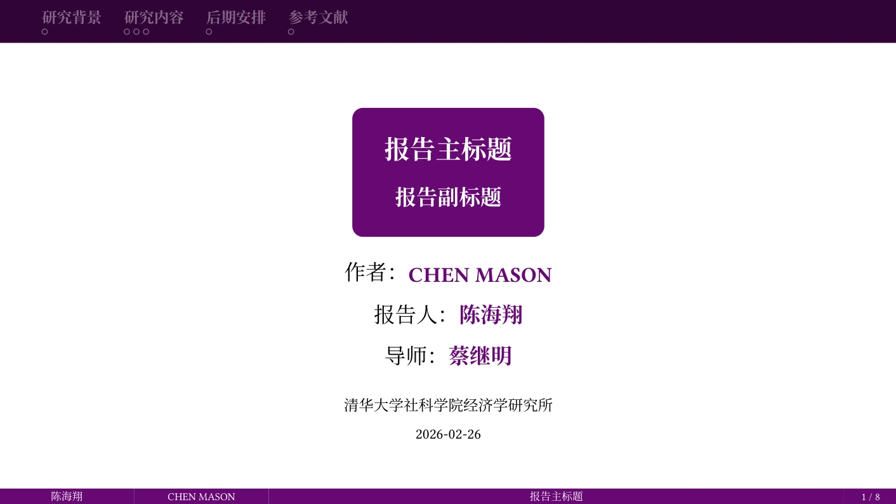
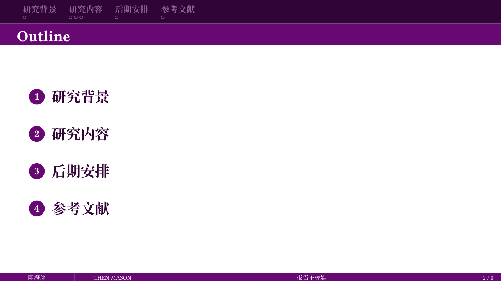
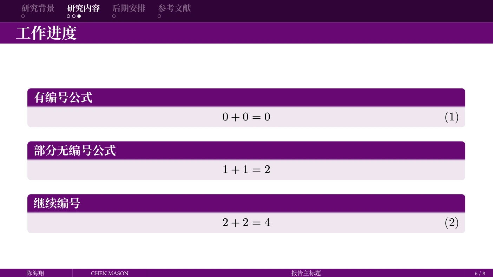
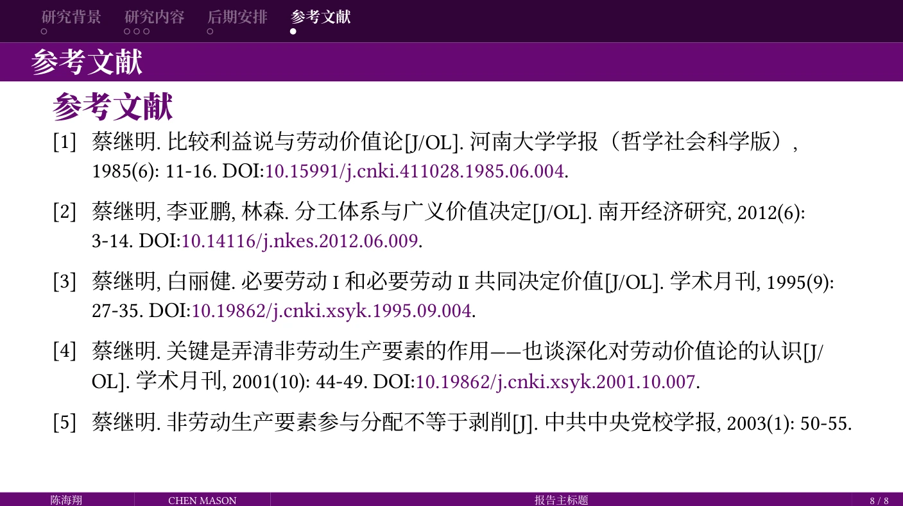

# Shuimu-Touying

## 基本介绍

这是一个基于Stargazer Theme(https://touying-typ.github.io/zh/docs/themes/stargazer)二次开发的，参考了thubeamer(https://github.com/YangLaTeX/thubeamer)样式的touying模板。

## 效果预览




## 使用方法

### 安装字体
为了显示效果，本模板的英文使用了Linux Libertine字体，中文使用了Noto Serif CJK SC字体。如果在本地端进行编译，请先安装这两个字体。

### 方式一：使用 Typst Universe (推荐)

```typst
#import "@preview/shuimu-touying:0.3.0": *
```

### 方式二：typst init命令

在工作目录下新建终端，并运行以下命令：

```typst
typst init @preview/shuimu-touying:0.3.0 my-slide
```

