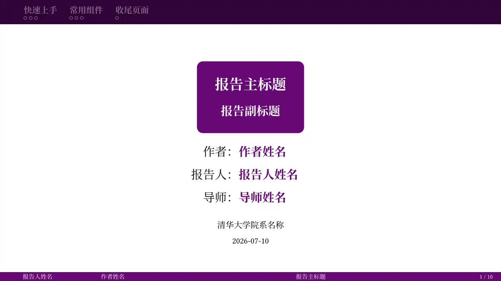
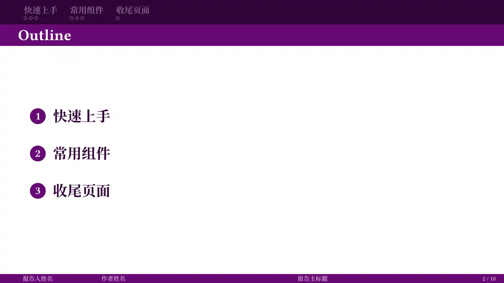
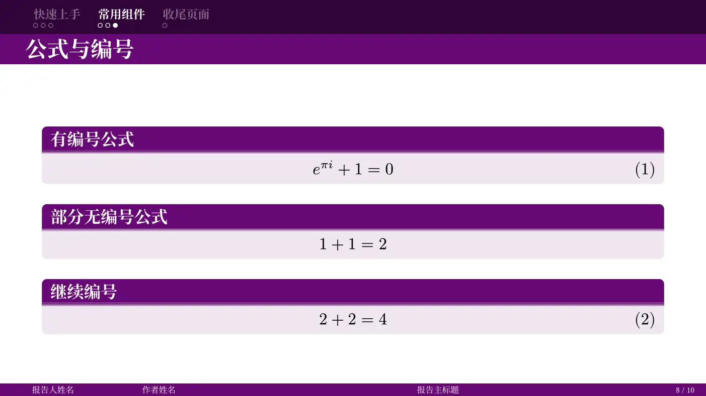
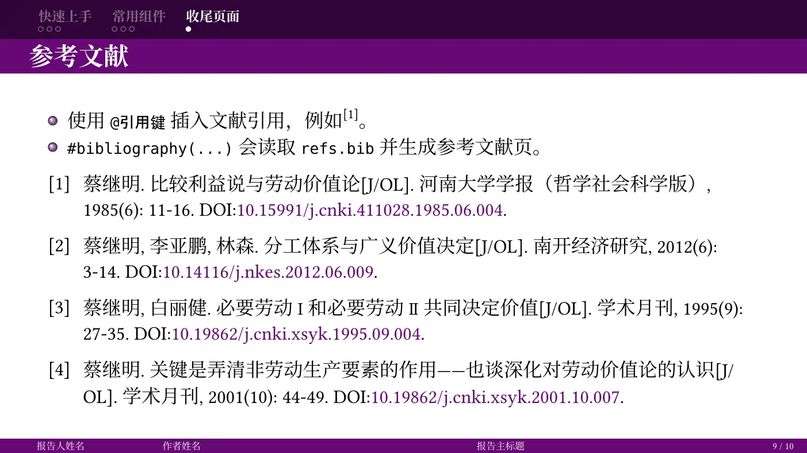

# Shuimu-Touying

## 基本介绍

这是一个基于Stargazer Theme(https://touying-typ.github.io/zh/docs/themes/stargazer)二次开发的，参考了thubeamer(https://github.com/YangLaTeX/thubeamer)样式的touying模板。

## 效果预览




## 使用方法

### 安装字体
为了显示效果，本模板的英文使用了Linux Libertine字体，中文使用了Noto Serif CJK SC字体。如果在本地端进行编译，请先安装这两个字体。

### 方式一：使用 Typst Universe (推荐)

```typst
#import "@preview/shuimu-touying:0.4.1": *
```

### 方式二：typst init命令

在工作目录下新建终端，并运行以下命令：

```sh
typst init @preview/shuimu-touying:0.4.1 my-slide
```

## 基本示例

```typst
#import "@preview/shuimu-touying:0.4.1": *

#show: shuimu-touying-theme.with(
  config-info(
    title: [报告主标题],
    subtitle: [报告副标题],
    reporter: [报告人],
    author: [作者],
    supervisor: [导师],
    date: datetime.today(),
    institution: [清华大学],
  ),
)

#title-slide()
#outline-slide()

= 研究背景

- #lorem(50)

#titled-block(
  title: [公式],
  [$ e^(pi i) + 1 = 0 $],
)

#focus-slide([Q&A])
```

## 公共接口

下面列出本模板定义的所有公共接口。

### `shuimu-colors`

颜色配置接口。不传参数时使用当前默认配色。

```text
#show: shuimu-touying-theme.with(
  theme-colors: shuimu-colors(
    primary: rgb("#660874"),
    primary-dark: rgb("#320439"),
    neutral-lightest: rgb("#ffffff"),
    neutral-darkest: rgb("#000000"),
  ),
  config-info(...),
)
```

常用参数：

- `primary`: 主色，用于标题栏、页脚、重点元素。
- `primary-dark`: 深主色，用于 mini-frame 导航栏背景。
- `neutral-lightest`: 最浅中性色，默认用于深色背景上的文字。
- `neutral-darkest`: 最深中性色，默认用于封面人员信息等正文文字。

### `shuimu-fonts`

字体和字号配置接口。不传参数时使用当前默认字体和字号。

```text
#show: shuimu-touying-theme.with(
  theme-fonts: shuimu-fonts(
    main: ("Linux Libertine", "Palatino", "Noto Serif CJK SC", "Songti SC"),
    body-size: 20pt,
    navigation-size: 0.7em,
    title-slide-title-size: 1.2em,
    title-slide-subtitle-size: 1.0em,
    title-slide-info-size: 0.7em,
    outline-size: 1.2em,
    outline-number-size: 0.75em,
    section-title-size: 2.5em,
    section-body-size: 0.8em,
    focus-size: 1.5em,
    footer-size: 0.5em,
    caption-size: 0.6em,
    footnote-size: 0.6em,
    header-title-size: 1.3em,
  ),
  config-info(...),
)
```

常用参数：

- `main`: 正文字体族。
- `body-size`: 正文基础字号。
- `navigation-size`: mini-frame 导航字号。
- `title-slide-title-size`: 封面主标题字号。
- `title-slide-subtitle-size`: 封面副标题字号。
- `title-slide-info-size`: 封面机构与日期字号。
- `outline-size`: 目录页字号。
- `outline-number-size`: 目录页编号圆点字号。
- `section-title-size`: 章节页标题字号。
- `section-body-size`: 章节页补充内容字号。
- `focus-size`: 焦点页字号。
- `footer-size`: 页脚字号。
- `caption-size`: 图表标题字号。
- `footnote-size`: 脚注字号。
- `header-title-size`: 页眉标题字号。

### `shuimu-touying-theme`

主题入口，通常配合 `#show` 使用。

```text
#show: shuimu-touying-theme.with(
  aspect-ratio: "16-9",
  align: horizon,
  theme-colors: shuimu-colors(),
  theme-fonts: shuimu-fonts(),
  display-section-slides: false,
  header-title: self => utils.display-current-heading(depth: self.slide-level),
  footer-reporter: self => self.info.reporter,
  footer-author: self => self.info.author,
  footer-deck-title: self => self.info.title,
  footer-slide-counter: context utils.slide-counter.display() + " / " + utils.last-slide-number,
  config-info(...),
)
```

常用参数：

- `aspect-ratio`: 幻灯片比例，默认 `"16-9"`。
- `align`: 正文默认对齐方式，默认 `horizon`。
- `theme-colors`: 颜色配置，默认 `shuimu-colors()`。
- `theme-fonts`: 字体和字号配置，默认 `shuimu-fonts()`。
- `display-section-slides`: 是否自动显示章节页，默认 `false`。
- `header-title`: 普通页页眉标题，默认显示当前标题。
- `footer-reporter`: 页脚报告人区域。
- `footer-author`: 页脚作者区域。
- `footer-deck-title`: 页脚报告标题区域。
- `footer-slide-counter`: 页脚页码区域。

### `title-slide`

生成封面页。可以用命名参数临时覆盖 `config-info` 中的同名字段。

```typst
#title-slide()

#title-slide(title: [临时封面标题], reporter: [临时报告人])
```

### `outline-slide`

生成目录页，目录项来自一级标题。

```typst
#outline-slide()

#outline-slide(title: [目录])
```

### `slide`

生成普通正文页。通过一级/二级标题写作时，Touying 通常会自动调用它；手动创建页面时也可以直接使用。

```typst
#slide[
  - 正文内容
]

#slide(title: [手动页标题], align: top)[
  - 自定义页眉标题和正文对齐方式
]
```

常用参数：

- `title`: 临时覆盖页眉标题。
- `header`: 临时覆盖整块页眉。
- `footer`: 临时覆盖整块页脚。
- `align`: 临时覆盖正文对齐方式。
- `config`: 传入 Touying 页面配置。
- `repeat`: 设置重复子页数量。
- `setting`: 添加页面级 show/set 规则。
- `composer`: 设置多栏/组合布局。

### `new-section-slide`

生成章节页。通常设置 `display-section-slides: true` 后由主题自动调用，也可以手动调用。

```typst
#new-section-slide()

#new-section-slide(title: [章节标题])[
  章节说明
]
```

### `focus-slide`

生成强调页或 Q&A 页，不计入幻灯片页码。

```typst
#focus-slide([Q&A])

#focus-slide([谢谢大家], align: center + horizon)
```

### `titled-block`

带标题栏的内容块，用于在正文页中强调公式、定理、定义或阶段性结论。

```typst
#titled-block(title: [重要公式], [$ e^(pi i) + 1 = 0 $])

#titled-block(
  title: [结论],
  [这里放需要强调的内容。],
)
```
