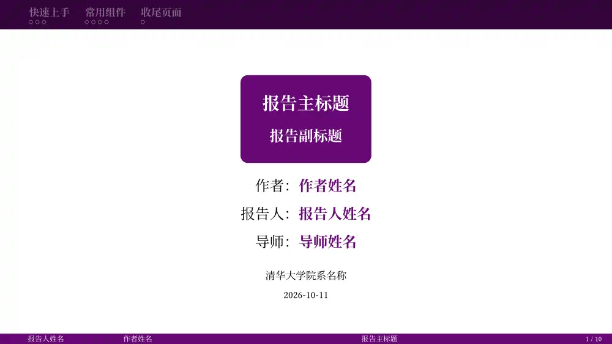
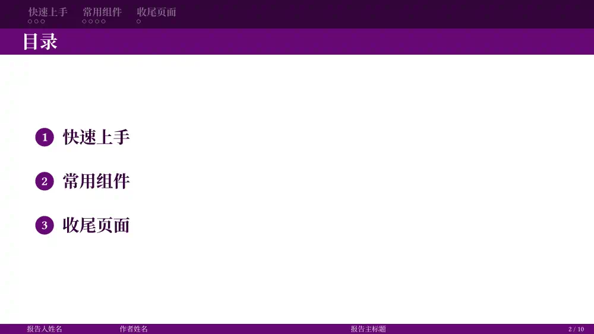
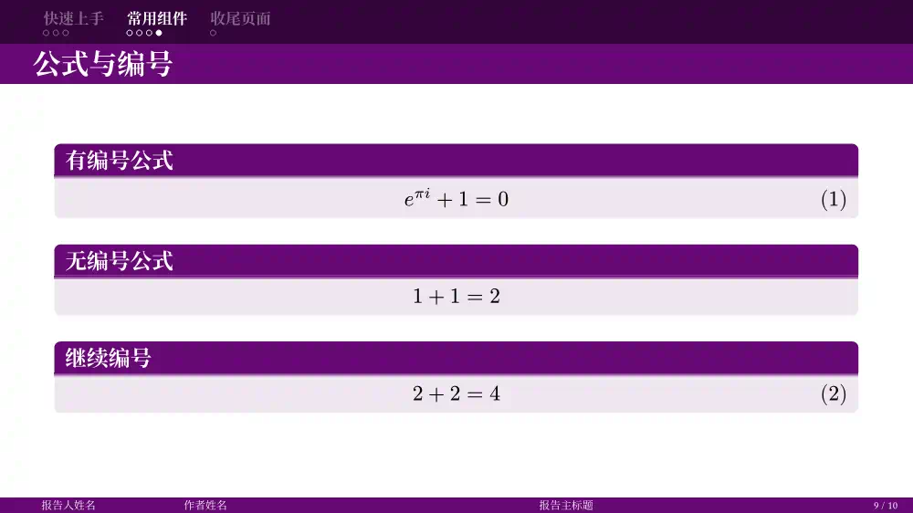
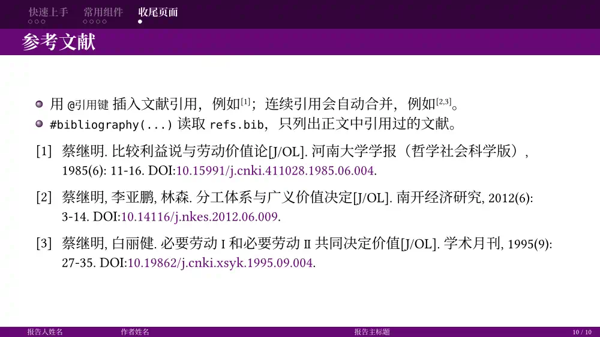

# Shuimu-Touying

A Tsinghua-purple, Beamer-style slide theme for [Typst](https://typst.app), built on [Touying](https://touying-typ.github.io/).

基于 [Touying Stargazer 主题](https://touying-typ.github.io/zh/docs/themes/stargazer) 二次开发、参考 [thubeamer](https://github.com/YangLaTeX/thubeamer) 样式的幻灯片模板，默认使用清华紫配色。






## 快速开始

需要 Typst 0.15.1 或更高版本。英文默认使用 Typst 内置的 Libertinus Serif；中文默认使用 Noto Serif CJK SC（思源宋体），本地编译前请先[下载安装](https://github.com/notofonts/noto-cjk/releases)，或用 `--font-path` 指定字体目录。

从模板新建项目（在 typst.app 网页版中也可以通过 “Start from template” 选择本模板）：

```sh
typst init @preview/shuimu-touying:0.5.0 my-slide
```

或者在已有文档中导入：

```typst
#import "@preview/shuimu-touying:0.5.0": *

#show: shuimu-touying-theme.with(
  config-info(
    title: [报告主标题],
    reporter: [报告人],
    date: datetime.today(),
    institution: [清华大学],
  ),
)

#title-slide()
#outline-slide()

= 研究背景

== 研究现状

- 一级标题创建章节，二级标题创建正文页。

#titled-block(title: [公式])[
  $ e^(pi i) + 1 = 0 $
]

#focus-slide[Q&A]
```

模板 [`template/main.typ`](template/main.typ) 列出了下文的全部接口。本包还重新导出了 touying 0.8.0 的全部接口（`#pause`、`config-common`、`utils` 等），用法见 [Touying 文档](https://touying-typ.github.io/zh/)。

## 主题参数

`#show: shuimu-touying-theme.with(...)` 的参数：

| 参数 | 默认值 | 说明 |
| --- | --- | --- |
| `aspect-ratio` | `"16-9"` | 幻灯片比例，如 `"4-3"`。 |
| `lang` | `"zh"` | 文档语言，决定目录标题、图表标题前缀、封面角色标签等；英文报告用 `"en"`。 |
| `align` | `horizon` | 正文页的默认对齐方式。 |
| `theme-colors` | `shuimu-colors()` | 颜色，见下文。 |
| `theme-fonts` | `shuimu-fonts()` | 字体与字号，见下文。 |
| `display-section-slides` | `false` | 是否在每个一级标题处自动插入章节页。 |
| `header-title` | `auto` | 标题栏文字，可以是内容或 `self => ...` 函数。`auto` 为当前标题，还没有标题的页面不显示标题栏；`none` 为不显示。 |
| `footer-reporter` | `self => self.info.at("reporter", default: none)` | 页脚第一栏。 |
| `footer-author` | `self => self.info.author` | 页脚第二栏。 |
| `footer-deck-title` | 短标题，未设置时为标题 | 页脚第三栏。 |
| `footer-slide-counter` | 当前页码 / 总页数 | 页脚第四栏。 |

页脚各栏可以是内容或 `self => ...` 函数，值为 `none` 时该栏收起，值为数组时连成一段文字。其余位置参数直接传给 Touying，如 `config-info(...)`、`config-common(...)`；`config-store(navigation: none)` 可以去掉顶部导航栏。

### 报告信息 `config-info`

| 字段 | 说明 |
| --- | --- |
| `title`、`subtitle` | 标题、副标题，显示在封面；`title` 也显示在页脚。 |
| `short-title` | 页脚显示的短标题。 |
| `author` | 作者，显示在封面和页脚，并写入 PDF 元数据。多人时用字符串数组，如 `("张三", "李四")`。 |
| `reporter` | 报告人（本主题新增），显示在封面和页脚。 |
| `supervisor` | 导师（本主题新增），只显示在封面。 |
| `institution` | 机构，显示在封面。 |
| `date` | 日期，显示在封面；格式可用 `config-common(datetime-format: ...)` 设置。 |

### 颜色 `shuimu-colors`

| 参数 | 默认值 | 说明 |
| --- | --- | --- |
| `primary` | `rgb("#660874")` | 主色，用于标题栏、页脚、内容块和焦点页。 |
| `primary-dark` | `auto` | 导航栏背景和目录文字的颜色，默认由 `primary` 加深得到。 |
| `neutral-lightest` | `rgb("#ffffff")` | 主色背景上的文字颜色。 |
| `neutral-darkest` | `rgb("#000000")` | 正文文字颜色。 |

### 字体与字号 `shuimu-fonts`

除 `body-size` 外，字号都是相对正文字号的 em 值（`outline-number-size` 相对目录文字）。

| 参数 | 默认值 | 说明 |
| --- | --- | --- |
| `main` | `("Libertinus Serif", "Noto Serif CJK SC")` | 正文字体，西文在前、中文在后。 |
| `mono` | `"DejaVu Sans Mono"` | 等宽字体，中文回退到 `main`。 |
| `math` | `"New Computer Modern Math"` | 数学字体，中文回退到 `main`。 |
| `body-size` | `20pt` | 正文字号。 |
| `navigation-size` | `0.7em` | 导航栏。 |
| `header-title-size` | `1.3em` | 标题栏。上边距随导航栏和标题栏的字号自动调整。 |
| `title-slide-title-size` | `1.2em` | 封面标题。 |
| `title-slide-subtitle-size` | `1.0em` | 封面副标题。 |
| `title-slide-info-size` | `0.7em` | 封面机构与日期。 |
| `outline-size` | `1.2em` | 目录文字。 |
| `outline-number-size` | `0.75em` | 目录编号。 |
| `section-title-size` | `2.5em` | 章节页标题。 |
| `section-body-size` | `0.8em` | 章节页说明。 |
| `focus-size` | `1.5em` | 焦点页。 |
| `footer-size` | `0.5em` | 页脚。 |
| `caption-size` | `0.6em` | 图表标题。 |
| `footnote-size` | `0.6em` | 脚注。 |

## 页面与组件

所有页面函数都有 `config` 参数，用于传入本页的 Touying 配置（如 `config-page(...)`）。

| 函数 | 参数 | 说明 |
| --- | --- | --- |
| `title-slide` | `role-labels`、`..info` | 封面。`role-labels` 修改角色标签，如 `(reporter: [汇报人：])`；命名参数临时覆盖 `config-info` 的字段。 |
| `outline-slide` | `title` | 目录页，章节多时自动分栏并保持一页。`title` 默认随 `lang` 显示“目录”。 |
| `slide` | `title`、`header`、`footer`、`align`、`repeat`、`setting`、`composer` | 正文页，参数只影响本页。`header` 替换标题栏（导航栏保留），`composer: (1fr, 1fr)` 分栏。 |
| `new-section-slide` | `title`、说明文字 | 章节页。手动调用时放在 `= 章节名` 之后。 |
| `focus-slide` | `align` | 焦点页，主色背景，不计入页码。 |
| `titled-block` | `title`、内容 | 带标题栏的内容块，内容中可以使用 `#pause`、`#alert`，标题中不能。 |

## 使用提示

- 全局 `#set`、`#show` 规则写在 `#show: shuimu-touying-theme.with(...)` 之后、第一张幻灯片之前；字体、字号、颜色和语言请用主题参数修改。不要把 set 规则单独写在一级标题和它的第一个二级标题之间，否则会多出一张空白页。
- 顶部导航栏列出进入目录的一级标题，每张正文页对应一个圆点，动画子页和自动续页共用一个圆点。`= 附录 <touying:unoutlined>` 可以让章节不进入导航和目录。
- 参考文献建议用 `== 参考文献` 单独成页，主题默认不生成参考文献自带的标题。

## 许可

[MIT](LICENSE)。部分代码派生自 [Touying](https://github.com/touying-typ/touying) 的 Stargazer 主题，版权声明见 [NOTICE](NOTICE)。
