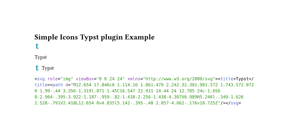

<picture>
  <source media="(prefers-color-scheme: dark)" srcset="https://github.com/cscnk52/typst-sicons/raw/refs/heads/main/assets/img/typst-dark.png" />
  <source media="(prefers-color-scheme: light)" srcset="https://github.com/cscnk52/typst-sicons/raw/refs/heads/main/assets/img/typst-light.png" />
  
</picture>

<div align="center">

# sicons

Access High quality Simple Icons SVGs from Typst.

</div>

## Usage

Function:

- sIcon: return icon in SVG format
- sTitle: return icon name
- sIconLabel: return icon and name
- sIconRaw: return Icon SVG code

Parameters:

- slug: icon slug, can be found at <https://simpleicon.org>
- size: the icon size
- iconColor: icons hex color, default is "default", representation Simple Icons Color
- textColor: text color, default to `#000000`

# Example

```typst
#import "@preview/sicons": *

= typst sicons package Example

#sicon(slug: "typst", size: 1em, iconColor: "default")

#stitle(slug: "typst", size: 1em, textColor: "#000000")

#sicon-label(slug: "typst", size: 1em, textColor: "#000000")

#sicon-raw(slug: "typst")
```



# License

MIT
