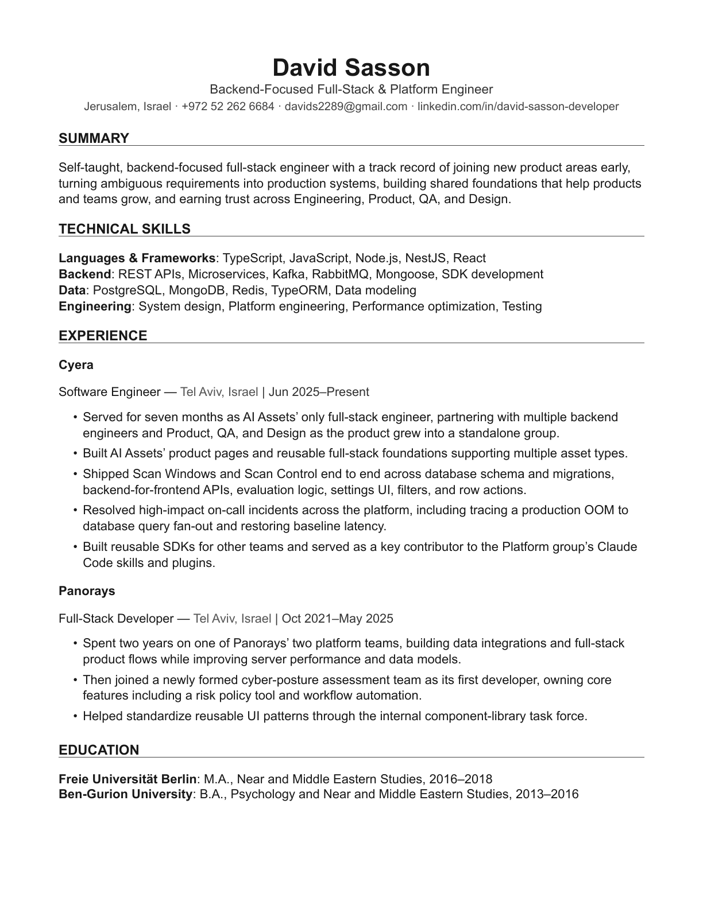

# Signal Resume

An open-source, evidence-informed, ATS-first Typst resume framework for experienced professionals.

It prioritizes reliable parsing, rapid human scanning, evidence-dense accomplishments, and maintainability. It deliberately avoids sidebars, icons, skill bars, profile photos, charts, and decorative graphics.

## What makes it different

This repository documents not only how to build a resume, but why the framework uses its structure. Recommendations are separated into robust constraints, context-dependent practices, and aesthetic preferences.

## Design principles

- Single-column, reverse-chronological structure
- US Letter by default; A4 supported
- 11 pt body text and restrained hierarchy
- 18 mm margins (approximately 0.7 inches)
- Standard, explicit section names
- Contact information in the document body
- Selectable-text PDF output
- Flexible optional sections
- No keyword stuffing or hidden text

## Quick start

After the initial Typst Universe release, install [Typst](https://typst.app/docs/) and create a new resume project:

```bash
typst init @preview/signal-resume:0.1.0 my-resume
cd my-resume
typst compile main.typ resume.pdf
```

Edit `main.typ` with your own experience and evidence.

You can also import the framework into an existing Typst project:

```typst
#import "@preview/signal-resume:0.1.0": resume
```

The public `resume` function is exported from `lib.typ`; its implementation lives in `template/resume.typ`.

The package defaults to New Computer Modern because it is bundled with Typst and renders consistently across platforms. Pass `body-font: "Your Font"` to use another installed or project-provided family.

## Develop from source

Clone the repository and run the package checks:

```bash
git clone https://github.com/DavidSasson22/david-resume-template.git
cd david-resume-template
TYPST_BIN=typst ./scripts/check-package.sh
```

To work directly from the feature-rich fictional example:

```bash
typst compile --root . examples/generic/resume.typ examples/generic/resume.pdf
```

> **Typst compatibility note:** `context` is a reserved Typst keyword and cannot be used as a dictionary field name. This framework uses `description` for optional role or entry context.

## Canonical example

The repository includes a real-world, one-page backend-focused full-stack resume at [`examples/david`](examples/david). It demonstrates concise positioning, categorized technical skills, reverse-chronological experience, reusable infrastructure work, production ownership, cross-functional collaboration, and compact education.

The fictional, feature-rich example at [`examples/generic`](examples/generic) remains available for exploring optional sections such as engineering highlights, certifications, languages, and community work. In either example, replace personal details and claims with your own truthful evidence.

## Preview

[Download David Sasson's generated resume PDF](examples/david/resume.pdf).



## Optional sections

The `sections` parameter supports:

- `kind: "bullets"` for Projects, Awards, Publications, Speaking, or similar lists
- `kind: "labeled"` for Certifications, Languages, Tools, or compact metadata
- `kind: "entries"` for dated roles such as Volunteering or Military Service
- custom Typst content for other needs

Include only sections that improve fit for the target role.

Use `featured-sections` for strong Projects, Open Source, Publications, or Architecture Highlights that should appear before Education. Use `sections` for Education-following material such as Certifications, Languages, or additional details.

## Use A4

Pass `page-size: "a4"` to `resume.with(...)`.

## Documentation

- [`Design principles`](docs/design-principles.md)
- [`ATS guidance`](docs/ats-research.md)
- [`Typography`](docs/typography.md)
- [`Section order`](docs/section-order.md)
- [`Impact bullets`](docs/quantified-bullets.md)
- [`Detailed rationale`](docs/design-rationale.md)

## ATS validation checklist

After generating the PDF:

1. Select all text and paste it into a plain-text editor.
2. Verify that reading order is correct.
3. Confirm that contact details and dates are extractable.
4. Check for clipped text and unexpected page breaks.
5. Keep a DOCX fallback when an employer specifically requests it.

## License

MIT. See [`LICENSE`](LICENSE).
