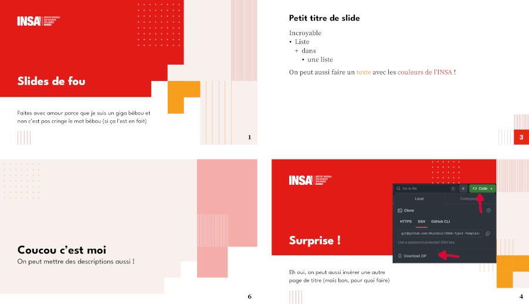

# INSA - Slides Typst Template
<p align="center">
    
</p>

Typst Template for presentation for the french engineering school INSA.

## Table of contents
1. [Example](#examples)
1. [Usage](#usage)
1. [Fonts information](#fonts)
1. [Notes](#notes)
1. [License](#license)
1. [Changelog](#changelog)

## Example
```typst
#import "@preview/silky-slides-insa:0.1.1": *
#show: insa-slides.with(
  title: "Titre du diaporama",
  title-visual: none,
  subtitle: "Sous-titre (noms et prénoms ?)",
  insa: "rennes"
)

= Titre de section

== Titre d'une slide

- Liste
  - dans
    - une liste

On peut aussi faire un #text(fill: insa-colors.secondary)[texte] avec les #text(fill: insa-colors.primary)[couleurs de l'INSA] !

== Une autre slide

Du texte

#pause

Et un autre texte qui apparaît plus tard !

#section-slide[Une autre section][Avec une petite description]

Coucou
```

## Usage
### Slide show rule
You call it with `#show: insa-slides.with(..parameters)`.

| Parameter | Description                   	| Type         	| Example |
|-----------	|-------------------------------	|--------------	|--------------------------------	|
| **title** | Title of the presentation              | content 	| `[Titre de la prez]` |
| **title-visual** | Content shown at the right of the title slide	| content | none | `image("img.png")` |
| **subtitle** | Subtitle of the presentation 	| content      	| `[Sous-titre]` |
| **insa** | INSA name (`rennes`, `hdf`...)        	| str      	| `"rennes"` |

If you assign a content to `title-visual`, the title slide will automatically switch layout to the "visual" one from the graphic charter. If you do not assign a visual content, the title slide will only contain the title and subtitle and will choose the simple layout.

### Section slide
A section slide is automatically created when you put a level-1 header in your markup. For example:
```typst
= Slide section
Blablabla
```
Will create a section slide with the title "Slide section" and will be followed by a content slide containing "Blablabla".

If you want to put a subtitle in your section slide, you must explicitely use the `section-slide` function like so:
```typst
#section-slide[Titre de section][Description de section]
```

## Fonts
The graphic charter recommends the fonts **League Spartan** for headings and **Source Serif** for regular text. To have the best look, you should install those fonts.

> You can download the fonts from [here](https://github.com/SkytAsul/INSA-Typst-Template/tree/main/fonts).

To behave correctly on computers lacking those specific fonts, this template will automatically fallback to similar ones:
- **League Spartan** -> **Arial** (approved by INSA's graphic charter, by default in Windows) -> **Liberation Sans** (by default in most Linux)
- **Source Serif** -> **Source Serif 4** (downloadable for free) -> **Georgia** (approved by the graphic charter) -> **Linux Libertine** (default Typst font)

### Note on variable fonts
If you want to install those fonts on your computer, Typst might not recognize them if you install their _Variable_ versions. You should install the static versions (**League Spartan Bold** and most versions of **Source Serif**).

Keep an eye on [the issue in Typst bug tracker](https://github.com/typst/typst/issues/185) to see when variable fonts will be used!

## Notes
This template is being developed by Youenn LE JEUNE from the INSA de Rennes in [this repository](https://github.com/SkytAsul/INSA-Typst-Template).

For now it includes assets from the graphic charters of those INSAs:
- Rennes (`rennes`)
- Hauts de France (`hdf`)
- Centre Val de Loire (`cvl`)
Users from other INSAs can open a pull request on the repository with the assets for their INSA.

If you have any other feature request, open an issue on the repository.

## License
The typst template is licensed under the [MIT license](https://github.com/SkytAsul/INSA-Typst-Template/blob/main/LICENSE). This does *not* apply to the image assets. Those image files are property of Groupe INSA.

## Changelog
### 0.1.1
- Added INSA CVL assets

### 0.1.0
- Created the template