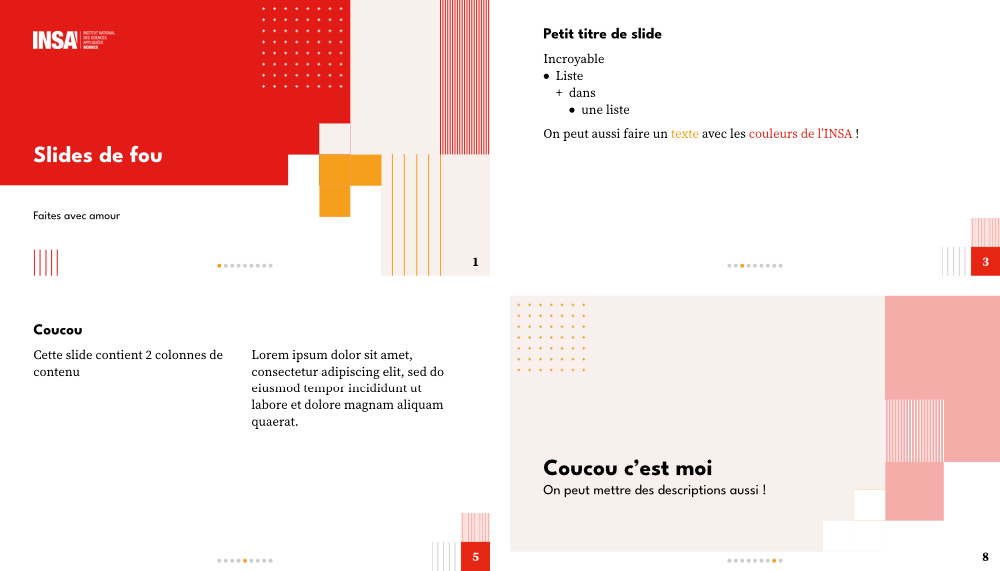

# INSA - Slides Typst Template
<p align="center">
    
</p>

Typst Template for presentation for the french engineering school INSA.

## Table of contents
1. [Example](#examples)
1. [Usage](#usage)
1. [Fonts information](#fonts)
1. [Notes](#notes)
1. [License](#license)
1. [Changelog](#changelog)

## Example
```typst
#import "@preview/silky-slides-insa:0.2.0": *
#show: insa-slides.with(
  title: "Titre du diaporama",
  title-visual: none,
  subtitle: "Sous-titre (noms et prénoms ?)",
  insa: "rennes"
)

= Titre de section

== Titre d'une slide

- Liste
  - dans
    - une liste

On peut aussi faire un #text(fill: insa-colors.secondary)[texte] avec les #text(fill: insa-colors.primary)[couleurs de l'INSA] !

== Une autre slide

Du texte

#pause

Et un autre texte qui apparaît plus tard !

#section-slide[Une autre section][Avec une petite description]

Coucou
```

## Usage
### Slide show rule
You call it with `#show: insa-slides.with(..parameters)`.

| Parameter | Description                   	| Type         	| Example |
|-----------	|-------------------------------	|--------------	|--------------------------------	|
| **title** | Title of the presentation              | content 	| `[Titre de la prez]` |
| **title-visual** | Content shown at the right of the title slide	| content | none | `image("img.png")` |
| **subtitle** | Subtitle of the presentation 	| content      	| `[Sous-titre]` |
| **insa** | INSA name (`rennes`, `hdf`...)        	| str      	| `"rennes"` |
| **breadcrumbs** | Whether or not to show the breadcrumbs (fil d'Ariane) | bool | `false` |
| **total-numbering** | Whether or not to show the total amount of slides in the bottom right counter | bool | `false` |
| **text-size** | Size of the text in the slides bodies | length | `22pt` |

If you assign a content to `title-visual`, the title slide will automatically switch layout to the "visual" one from the graphic charter. If you do not assign a visual content, the title slide will only contain the title and subtitle and will choose the simple layout.

### Section slide
A section slide is automatically created when you put a level-1 header in your markup. For example:
```typst
= Slide section
Blablabla
```
Will create a section slide with the title "Slide section" and will be followed by a content slide containing "Blablabla".

If you want to put a subtitle in your section slide, you must explicitely use the `section-slide` function like so:
```typst
#section-slide([Titre de section], description: [Description de section])
```

### Speaker notes (advanced)
Touying provides a way to attach speaker notes to your slides. This is a powerful feature, compatible with this template. In practice, the slides on the exported PDF will be twice as large since the right half will contain the actual speaker notes. You'll need a dedicated PDF viewer for presentations (e.g. pympress) that will show the left half to the audience and the right half to you.

Follow the instructions [here](https://touying-typ.github.io/docs/external/pympress#speaker-notes) to enable this feature and use it properly with pympress.

## Fonts
The graphic charter recommends the fonts **League Spartan** for headings and **Source Serif** for regular text. To have the best look, you should install those fonts.

To behave correctly on computers lacking those specific fonts, this template will automatically fallback to similar ones:
- Headings: [**League Spartan**](https://fonts.google.com/specimen/League+Spartan) -> **Arial** (approved by INSA's graphic charter, by default in Windows) -> **Liberation Sans** (by default in most Linux)
- Body: **Source Serif** -> [**Source Serif 4**](https://fonts.google.com/specimen/Source+Serif+4) -> **Georgia** (approved by the graphic charter) -> _default Typst font_

> You can download the fonts from [here](https://github.com/SkytAsul/INSA-Typst-Template/tree/slides-0.2.0/fonts).

## Notes
This template is being developed by Youenn LE JEUNE from the INSA de Rennes in [this repository](https://github.com/SkytAsul/INSA-Typst-Template) with contributions by other people.

For now it includes assets from the graphic charters of those INSAs:
- Rennes (`rennes`)
- Hauts de France (`hdf`)
- Centre Val de Loire (`cvl`)
Users from other INSAs can open a pull request on the repository with the assets for their INSA.

If you have any other feature request, open an issue on the repository.

## License
The typst template is licensed under the MIT license. This does *not* apply to the image assets. Those image files are property of Groupe INSA.

## Changelog
### 0.2.0
- Added the `breadcrumbs` option that shows a breadcrumb (fil d'Ariane) at the bottom of the page
- Added the `total-numbering` option to show the total amount of pages at the bottom right
- Added the `add-heading` option to the `section-slide` function in order to display a section slide without adding a heading to the outline
- Added the `text-size` option to change the default size of the text in slide bodies
- Tweaked the height of the title slide visuals
- Updated Touying version
- Made Touying speaker notes work with the template

### 0.1.1
- Added INSA CVL assets

### 0.1.0
- Created the template
