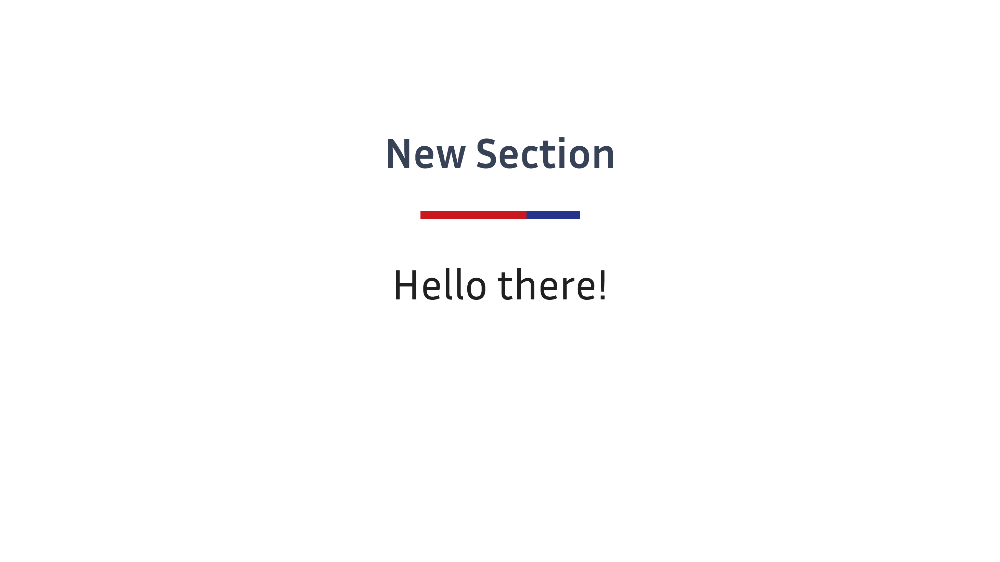

# Inria Theme

| Title Slide | Sample Slide | Section Slide |
|:-----------:|:------------:|:-------------:|
| |  |  |

This theme draws inspiration from the default Metropolis theme for the [touying](https://touying-typ.github.io/) presentation framework for [typst](https://typst.app/home/).
It and has been adapted to comply roughly with Inria's graphic charter while remaining simple and elegant.
Note that this is however an unofficial theme.

[](https://typst.app/universe/package/simple-inria-touying-theme)
[](https://gitlab.inria.fr/soliman/inria-touying-theme/-/raw/main/LICENSE)

It is recommended to have the [Inria Sans](https://font.download/font/inria-sans) font installed (the theme will fallback to Fira Sans or Noto Sans otherwise, since they are reasonably close).
The logo itself is property of Inria (see https://www.inria.fr/fr/charte-dutilisation-de-lidentite-visuelle-dinria)

## Initialization

You can initialize it using the following code:

```typst
#import "@preview/touying:0.6.1": *
#import "@preview/simple-inria-touying-theme:0.1.1": *

#show: inria-theme.with(
  aspect-ratio: "16-9",
  config-info(
    title: [Title],
    subtitle: [Subtitle],
    author: [Authors],
    date: datetime.today(),
  ),
  footer-progress: true,
  section-slides: true,
  black-title: true,
)

#title-slide()

= First Slide

Content

= New Section <touying:hidden>

#new-section-slide([Hello there!])

= Another Slide

More Content
```

The `inria-theme` in the theme accepts the following parameters:

- `aspect-ratio`: The aspect ratio of the slides, which can be "16-9" or "4-3", with a default of "16-9".
- `align`: The alignment of the content within the slides, with a default of `horizon` (horizontal alignment).
- `header`: The content displayed in the header of the slides, with a default that displays the current heading adjusted to fit the width (`utils.display-current-heading(setting: utils.fit-to-width.with(grow: false, 100%))`). Alternatively, you can provide a function like `self => self.info.title` to customize the header content.
- `header-right`: The content displayed on the right side of the header, with a default that shows the logo specified in `self.info.logo`.
- `logo`: A logo image, for the title slide, with a default to the red Inria logo.
- `footer`: The content displayed in the footer of the slides, with a default of the logo. You can customize it with a function, for example, to display the author's information: `self => self.info.author`.
- `footer-right`: The content displayed on the right side of the footer, with a default that shows the slide number (`context utils.slide-counter.display()`).
- `footer-progress`: A boolean value indicating whether to display a progress bar at the bottom of the slides, with a default of `true`.
- `section-slides`: A boolean value indicating whether sections (first level headers) should be considered as defining slides directly, with a default of `true`. Setting it to `false` will use subsections and will display specific slides for each new section.
- `black-title`: A boolean value indicating whether to use the normal text color for titles instead of the accent color, with a default of `true`.

## Color Theme

Inria uses the following default color theme (precise RGB values are given below):

```typst
config-colors(
  primary: inria-rouge,               // accent
  primary-light: inria-bleu-nuit,     // progress
  secondary: inria-framboise,
  neutral-lightest: white,            // bg
  neutral-darkest: inria-gris-bleu,   // fg
),
```

You can modify this color theme using `config-colors()`.
The official Inria graphic charter would use `black` as neutral-darkest.

## Slide Function Family

The Inria theme provides a variety of custom slide functions:

```typst
#title-slide(extra: none, ..args)
```

`title-slide` reads information from `self.info` for display, and you can also pass in an `extra` parameter to display additional information.

## Other Customizations

Consider using:

```typst
#set text(lang: "en")
#show math.equation: set text(font: "Fira Math")
#set strong(delta: 100)
#set par(justify: true)
```

## Convenience Variables and Functions

The theme defines variables corresponding to the official Inria colors.

``` typst
#let inria-rouge = rgb("#c9191e")
#let inria-framboise = rgb("#a60f79")
#let inria-violet = rgb("#5d4b9a")
#let inria-bleu-nuit = rgb("#27348b")
#let inria-bleu-canard = rgb("#1067a3")
#let inria-bleu-azur = rgb("#00a5cc")
#let inria-bleu-vert = rgb("#88ccca")
#let inria-gris-bleu = rgb("#384257")
#let inria-cactus = rgb("#608b37")
#let inria-vert-tendre = rgb("#95c11f")
#let inria-jaune = rgb("#ffcd1c")
#let inria-orange = rgb("#ff8300")
#let inria-sable = rgb("#d6bc86")
```

and a few other utility functions

``` typst
// Utility function when you want bold but not alert
#let bold(body) = {
  text(weight: "bold", body)
}

#let fullcite(label) = {
  set text(size: .5em)
  cite(label, form: "full")
}
```

---

```typst
#slide(
  config: (:),
  repeat: auto,
  setting: body => body,
  composer: components.side-by-side,
  // inria theme
  title: auto,
  footer: auto,
  align: horizon,
)[
  ...
]
```

A default slide with headers and footers, where the title defaults to the current section title, and the footer is what you set.

---

```typst
#focus-slide[
  ...
]
```

Used to draw attention, with the background color set to `self.colors.primary-dark`.

---

```typst
#new-section-slide(short-title: auto, title)
```

Creates a new section with the given title.

## Example

```typst
#import "@preview/touying:0.6.1": *
#import "@preview/simple-inria-touying-theme:0.1.1": *

#import "@preview/numbly:0.1.0": numbly

#show: inria-theme.with(
  aspect-ratio: "16-9",
  footer: self => self.info.institution,
  config-info(
    title: [Title],
    subtitle: [Subtitle],
    author: [Authors],
    date: datetime.today(),
    institution: [Institution],
    logo: emoji.city,
  ),
)

#set heading(numbering: numbly("{1}.", default: "1.1"))

#title-slide()

= Outline <touying:hidden>

#outline(title: none, indent: 1em, depth: 1)

= First Section

---

A slide without a title but with some *important* information.

== A long long long long long long long long long long long long long long long long long long long long long long long long Title

=== sdfsdf

A slide with equation:

$ x_(n+1) = (x_n + a/x_n) / 2 $

#lorem(200)

= Second Section

#focus-slide[
  Wake up!
]

== Simple Animation

We can use `#pause` to #pause display something later.

#meanwhile

Meanwhile, #pause we can also use `#meanwhile` to display other content synchronously.

#speaker-note[
  + This is a speaker note.
  + You won't see it unless you use `config-common(show-notes-on-second-screen: right)`
]

#show: appendix

= Appendix

---

Please pay attention to the current slide number.
```

