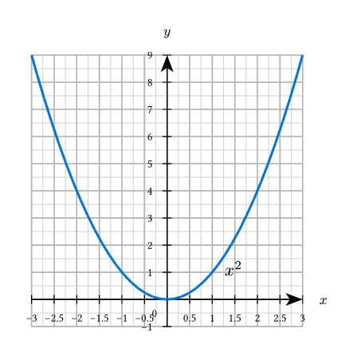
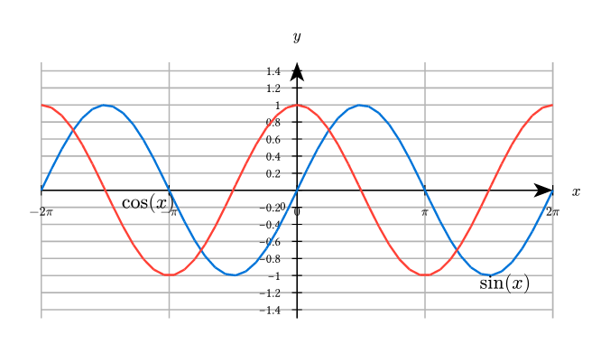
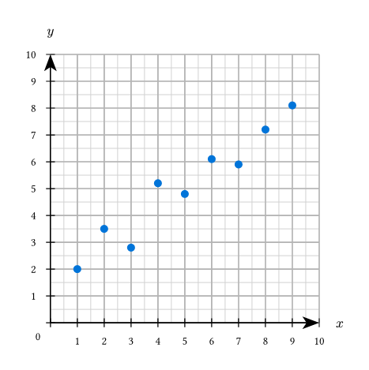
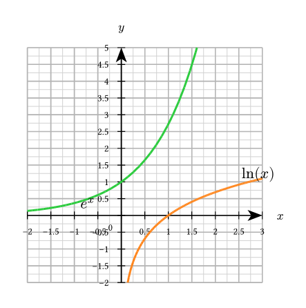
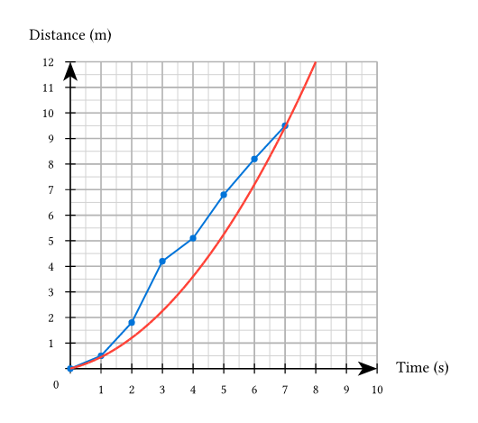
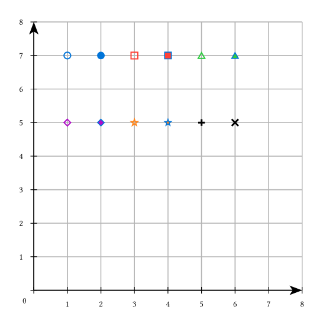
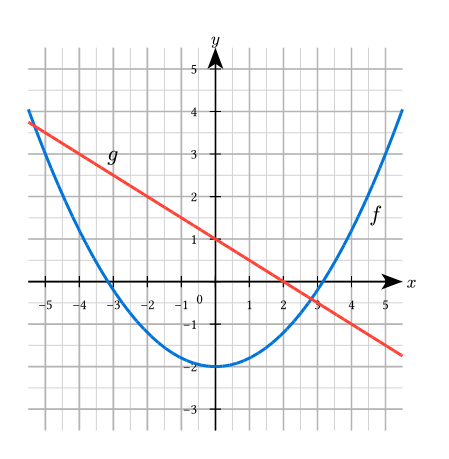

# simple-plot

A simple, pgfplots-like function plotting library for Typst. Create beautiful mathematical plots with minimal code.

> **Note:** This package is built on top of [CeTZ](https://github.com/cetz-package/cetz) v0.4.2.

## Gallery

Click on an image to see the source code.

| | | |
|:---:|:---:|:---:|
| [](gallery/parabola.typ) | [](gallery/trig-functions.typ) | [](gallery/scatter.typ) |
| Parabola | Trigonometric Functions | Scatter Plot |
| [](gallery/exponential.typ) | [](gallery/data-fit.typ) | [](gallery/markers.typ) |
| Exponential & Logarithmic | Data with Model Fit | Marker Types |
| [](gallery/extended-axes.typ) | | |
| Extended Axes | | |

## Features

- **Simple API** - Plot functions with just a few lines of code
- **Multiple plot types** - Functions, scatter plots, line plots with markers
- **Customizable axes** - Position, labels, ticks, and tick labels
- **Axis extension** - Extend axes beyond plot area for cleaner appearance
- **Grid support** - Major and minor grids with custom styling
- **14 marker types** - Circles, squares, triangles, diamonds, stars, and more
- **Origin label control** - Toggle origin '0' label display
- **Global defaults** - Set defaults for all plots in your document
- **Full styling** - Customize colors, strokes, backgrounds, and more

## Quick Start

```typst
#import "@preview/simple-plot:0.2.0": plot

#plot(
  xmin: -3, xmax: 3,
  ymin: -1, ymax: 9,
  xlabel: $x$,
  ylabel: $y$,
  show-grid: true,
  (fn: x => calc.pow(x, 2), stroke: blue + 1.5pt),
)
```

## Basic Usage

### Plotting Functions

```typst
#import "@preview/simple-plot:0.2.0": plot

// Single function
#plot(
  xmin: -5, xmax: 5,
  ymin: -5, ymax: 5,
  xlabel: $x$, ylabel: $y$,
  show-grid: "major",
  (fn: x => calc.sin(x), stroke: blue + 1.5pt),
)

// Multiple functions
#plot(
  xmin: -2 * calc.pi, xmax: 2 * calc.pi,
  ymin: -1.5, ymax: 1.5,
  (fn: x => calc.sin(x), stroke: blue + 1.2pt, label: $sin(x)$),
  (fn: x => calc.cos(x), stroke: red + 1.2pt, label: $cos(x)$),
)
```

### Scatter Plots

```typst
#import "@preview/simple-plot:0.2.0": plot, scatter

#plot(
  xmin: 0, xmax: 10,
  ymin: 0, ymax: 10,
  show-grid: true,
  scatter(
    ((1, 2), (2, 3.5), (3, 2.8), (4, 5.2), (5, 4.8)),
    mark: "*",
    mark-fill: blue,
  ),
)
```

### Line Plots with Markers

```typst
#import "@preview/simple-plot:0.2.0": plot, line-plot

#plot(
  xmin: 0, xmax: 10,
  ymin: 0, ymax: 12,
  axis-x-pos: "bottom",
  axis-y-pos: "left",
  line-plot(
    ((0, 0), (1, 0.5), (2, 1.8), (3, 4.2), (4, 5.1)),
    stroke: blue + 1.2pt,
    mark: "*",
    mark-fill: blue,
  ),
)
```

### Function Labels with Positioning

Control the placement of function labels to avoid overlapping with your graphs using `label-pos` and `label-side`:

```typst
#import "@preview/simple-plot:0.2.0": plot

#plot(
  xmin: -5, xmax: 5,
  ymin: -3, ymax: 5,
  show-grid: true,
  // Label positioned at 90% along the curve, to the right
  (fn: x => 0.2 * calc.pow(x, 2) - 2,
   stroke: blue + 1.5pt,
   label: $f(x)$,
   label-pos: 0.9,           // Position along curve (0-1)
   label-side: "below-right" // Placement relative to point
  ),
  // Label positioned at 20% along the curve, above and to the right
  (fn: x => -0.5 * x + 1,
   stroke: red + 1.5pt,
   label: $g(x)$,
   label-pos: 0.2,
   label-side: "above-right"
  ),
)
```

**Available label-side options:**
- `"above"`, `"below"`, `"left"`, `"right"` - Basic 4 directions
- `"above-left"`, `"above-right"`, `"below-left"`, `"below-right"` - Diagonal positions

The `label-pos` parameter (0-1) determines where along the function curve the label appears, while `label-side` controls the anchor point to prevent overlapping with the graph line.

## Parameters Reference

### Plot Parameters

| Parameter | Type | Default | Description |
|-----------|------|---------|-------------|
| `xmin`, `xmax` | float | -5, 5 | X-axis range |
| `ymin`, `ymax` | float | -5, 5 | Y-axis range |
| `width`, `height` | float | 6, 6 | Plot size in cm |
| `scale` | float | 1 | Scale factor for the entire plot |
| `xlabel`, `ylabel` | content | none | Axis labels |
| `show-grid` | bool/str | false | Grid display: `true`, `false`, `"major"`, `"minor"`, `"both"` |
| `minor-grid-step` | int | 2 | Minor grid subdivisions per major tick |
| `axis-x-pos` | float/str | 0 | X-axis position: value, `"bottom"`, `"center"` |
| `axis-y-pos` | float/str | 0 | Y-axis position: value, `"left"`, `"center"` |
| `axis-x-extend` | float/array | 0 | Extend X-axis beyond plot: value or `(left, right)` |
| `axis-y-extend` | float/array | 0 | Extend Y-axis beyond plot: value or `(bottom, top)` |
| `show-origin` | bool | true | Show "0" label at origin |
| `tick-label-size` | length | 0.65em | Font size for tick labels |
| `axis-label-size` | length | 0.8em | Font size for axis labels (x, y) |

### Axis Label Placement

| Parameter | Type | Default | Description |
|-----------|------|---------|-------------|
| `xlabel-pos` | str/array | "end" | Position: `"end"`, `"center"`, or `(x, y)` |
| `ylabel-pos` | str/array | "end" | Position: `"end"`, `"center"`, or `(x, y)` |
| `xlabel-anchor` | str | "west" | Text anchor point |
| `ylabel-anchor` | str | "south" | Text anchor point |
| `xlabel-offset` | array | (0.3, 0) | Offset `(x, y)` in cm |
| `ylabel-offset` | array | (0, 0.3) | Offset `(x, y)` in cm |

### Tick Configuration

| Parameter | Type | Default | Description |
|-----------|------|---------|-------------|
| `xtick`, `ytick` | auto/none/array | auto | Tick positions |
| `xtick-step`, `ytick-step` | auto/float | auto | Step between ticks |
| `xtick-labels`, `ytick-labels` | auto/array | auto | Custom tick labels |

### Function Specification

Each function is a dictionary with:

```typst
(
  fn: x => ...,           // Required: the function
  stroke: blue + 1.2pt,   // Line style
  domain: (min, max),     // Optional: restrict domain
  samples: 100,           // Number of sample points
  label: $f(x)$,          // Optional label
  label-pos: 0.8,         // Label position (0-1)
  label-side: "above",    // Label placement: "above", "below", "left", "right",
                          // "above-left", "above-right", "below-left", "below-right"
  mark: "o",              // Marker type
  mark-size: 0.1,         // Marker size
  mark-fill: white,       // Marker fill color
  mark-stroke: blue,      // Marker stroke
  mark-interval: 10,      // Show marker every N points
)
```

## Marker Types

| Type | Description | Type | Description |
|------|-------------|------|-------------|
| `"o"` | Hollow circle | `"*"` | Filled circle |
| `"square"` | Hollow square | `"square*"` | Filled square |
| `"triangle"` | Hollow triangle | `"triangle*"` | Filled triangle |
| `"diamond"` | Hollow diamond | `"diamond*"` | Filled diamond |
| `"star"` | Hollow star | `"star*"` | Filled star |
| `"+"` | Plus sign | `"x"` | Cross |
| `"|"` | Vertical bar | `"-"` | Horizontal bar |
| `"none"` | No marker | | |

## Custom Styling

```typst
#plot(
  // ...
  style: (
    background: (
      fill: white,
      stroke: black + 0.5pt,
    ),
    axis: (
      stroke: black + 1pt,
      arrow: "stealth",
    ),
    grid: (
      major: (stroke: gray + 0.6pt),
      minor: (stroke: gray.lighten(50%) + 0.3pt),
    ),
    ticks: (
      length: 0.1,
      stroke: black + 0.6pt,
      label-offset: 0.15,
      label-size: 0.8em,
    ),
    plot: (
      stroke: blue + 1.2pt,
      samples: 100,
    ),
    marker: (
      size: 0.12,
      stroke: black + 0.8pt,
      fill: black,
    ),
  ),
)
```

## Setting Global Defaults

Set defaults that apply to all subsequent plots:

```typst
#import "@preview/simple-plot:0.2.0": plot, set-plot-defaults, reset-plot-defaults

// Set defaults
#set-plot-defaults(
  width: 6,
  height: 4,
  show-grid: "major",
  xlabel: $x$,
  ylabel: $y$,
)

// All plots now use these defaults
#plot(xmin: -2, xmax: 2, ymin: 0, ymax: 4,
  (fn: x => calc.pow(x, 2)))

#plot(xmin: -3, xmax: 3, ymin: -1, ymax: 1,
  (fn: x => calc.sin(x)))

// Override specific values
#plot(width: 10, xlabel: $t$,
  xmin: 0, xmax: 5,
  (fn: x => 2*x))

// Reset all defaults
#reset-plot-defaults()
```

## Examples

### Trigonometric Functions

```typst
#plot(
  xmin: -2 * calc.pi, xmax: 2 * calc.pi,
  ymin: -2, ymax: 2,
  width: 10, height: 5,
  show-grid: "major",
  xtick: (-2*calc.pi, -calc.pi, 0, calc.pi, 2*calc.pi),
  xtick-labels: ($-2pi$, $-pi$, $0$, $pi$, $2pi$),
  (fn: x => calc.sin(x), stroke: blue + 1.2pt),
  (fn: x => calc.cos(x), stroke: red + 1.2pt),
)
```

### Exponential and Logarithmic

```typst
#plot(
  xmin: -2, xmax: 3,
  ymin: -2, ymax: 5,
  show-grid: true,
  (fn: x => calc.exp(x), stroke: green + 1.5pt, label: $e^x$),
  (fn: x => if x > 0 { calc.ln(x) } else { float.nan },
   domain: (0.01, 3), stroke: orange + 1.5pt, label: $ln(x)$),
)
```

### Piecewise Functions

```typst
#plot(
  xmin: -3, xmax: 4,
  ymin: -1, ymax: 5,
  show-grid: true,
  (fn: x => if x < 0 { calc.pow(x, 2) } else { calc.sqrt(x) },
   stroke: blue + 1.5pt),
)
```

### Experimental Data with Fit

```typst
#import "@preview/simple-plot:0.2.0": plot, line-plot

#plot(
  xmin: 0, xmax: 10,
  ymin: 0, ymax: 12,
  xlabel: [Time (s)],
  ylabel: [Distance (m)],
  show-grid: true,
  axis-x-pos: "bottom",
  axis-y-pos: "left",
  // Experimental data
  line-plot(
    ((0, 0), (1, 0.5), (2, 1.8), (3, 4.2), (4, 5.1), (5, 6.8)),
    mark: "*",
    mark-fill: blue,
    label: [Data],
  ),
  // Theoretical fit
  (fn: x => 0.15 * calc.pow(x, 2) + 0.3 * x,
   stroke: red + 1pt, label: [Model]),
)
```

### Extended Axes

Make axes extend beyond the plot area for a cleaner look:

```typst
#plot(
  xmin: -5, xmax: 5,
  ymin: -5, ymax: 5,
  show-grid: true,
  // Extend axes by 0.5 units in each direction
  axis-x-extend: 0.5,
  axis-y-extend: 0.5,
  (fn: x => calc.pow(x, 2) / 5, stroke: blue + 1.5pt),
)

// Asymmetric extension: (left/bottom, right/top)
#plot(
  xmin: 0, xmax: 10,
  ymin: 0, ymax: 8,
  axis-x-pos: "bottom",
  axis-y-pos: "left",
  axis-x-extend: (0, 1),  // Only extend right
  axis-y-extend: (0, 1),  // Only extend top
  (fn: x => calc.sqrt(x) * 2, stroke: green + 1.5pt),
)
```

## Comparison with Other Plotting Libraries

### When to use simple-plot

**simple-plot** is designed for mathematical function plotting with a focus on simplicity and ease of use. Choose simple-plot when you need to:

- **Plot mathematical functions** quickly with minimal boilerplate code
- **Create publication-quality plots** for math, physics, or engineering documents
- **Use a familiar API** similar to pgfplots/matplotlib for straightforward plotting tasks
- **Get started fast** with sensible defaults and intuitive parameter names

### Alternatives

- **[cetz-plot](https://typst.app/universe/package/cetz-plot/)**: A comprehensive charting library for data visualization including pie charts, bar charts, pyramid charts, and process diagrams. Better suited for business charts and general data visualization than mathematical function plotting.

- **[lilaq](https://typst.app/universe/package/lilaq/)**: A powerful, feature-rich plotting library with advanced capabilities like colormesh, contour plots, multi-axis support, and quiver plots. Ideal for complex scientific visualizations, but has a steeper learning curve and requires more setup code.

**In summary**: Use simple-plot for straightforward mathematical function plotting, cetz-plot for business charts and data visualization, and lilaq for advanced scientific plotting with complex multi-axis layouts.

## Dependencies

- [CeTZ](https://github.com/cetz-package/cetz) (v0.4.2+)

## License

MIT License - see LICENSE file for details.

## Changelog

All notable changes to simple-plot are documented here.

### [0.2.0] - 2026-01-15

#### Added
- `axis-x-extend` parameter to extend X-axis beyond plot area (symmetric or asymmetric)
- `axis-y-extend` parameter to extend Y-axis beyond plot area (symmetric or asymmetric)
- `show-origin` parameter to control display of "0" label at origin
- `label-side` parameter for function labels with 8 positioning options: "above", "below", "left", "right", "above-left", "above-right", "below-left", "below-right"
- Line segment clipping using Liang-Barsky algorithm for cleaner plot rendering
- New gallery example: `extended-axes.typ` demonstrating axis extension

#### Fixed
- Tick numbering algorithm now generates more intuitive automatic tick intervals
- Function label positioning now correctly uses visible area instead of extended sampling domain

### [0.1.0] - 2026-01-13

#### Added
- Initial release with core plotting functionality
- Function plotting with customizable domains and sampling
- Scatter plots and line plots with markers
- 14 marker types (circles, squares, triangles, diamonds, stars, plus, cross, bars)
- Customizable axes with flexible positioning
- Grid support (major, minor, both)
- Tick configuration with auto-generation and custom labels
- Function labels with flexible positioning
- Global defaults system with set/reset functions
- Full styling customization for all plot elements
- Built on CeTZ v0.4.2
